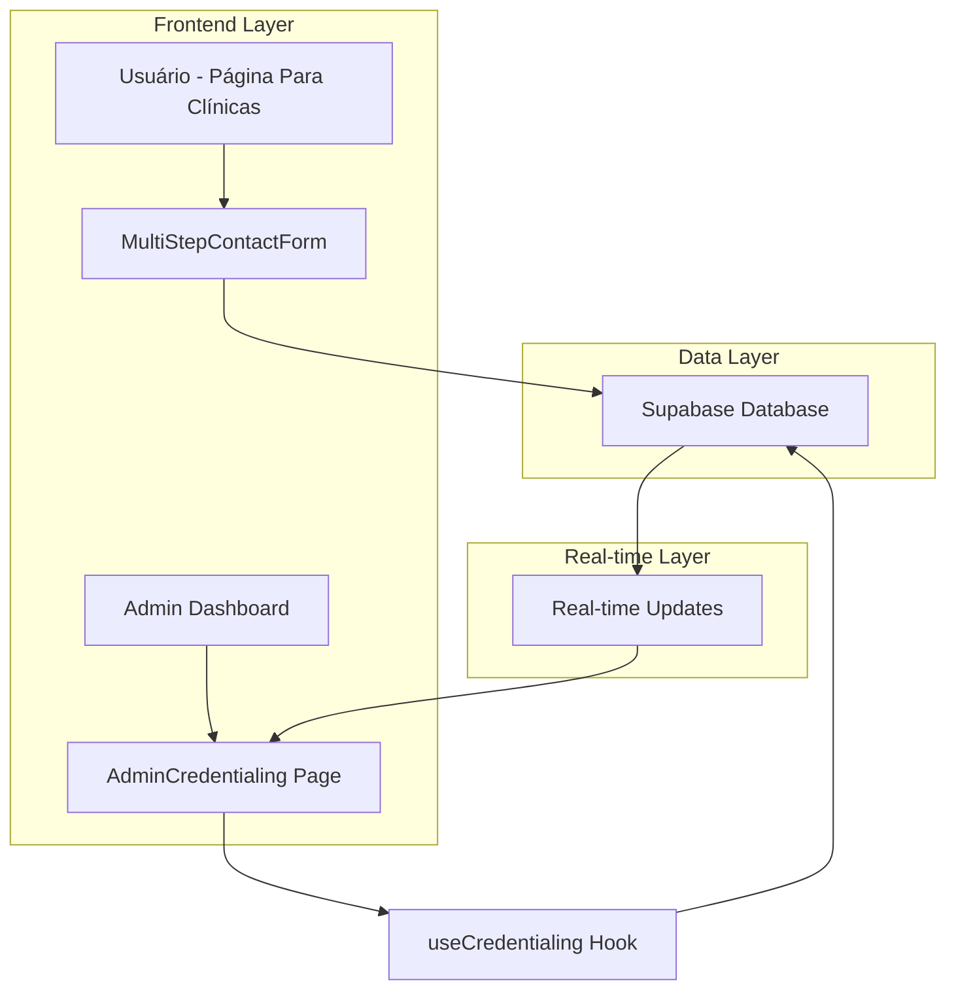

# Arquitetura Técnica - Sistema de Credenciamento de Clínicas

## 1. Arquitetura Geral



## 2. Stack Tecnológico

### 2.1 Frontend
- **React 18** com TypeScript
- **Tailwind CSS** para estilização
- **shadcn/ui** para componentes
- **React Router** para navegação
- **Lucide React** para ícones
- **React Hook Form** para formulários
- **Zustand** para gerenciamento de estado (se necessário)

### 2.2 Backend/Database
- **Supabase** (PostgreSQL + Real-time + Auth)
- **Row Level Security (RLS)** para controle de acesso
- **Supabase Storage** para arquivos CRO

### 2.3 Ferramentas de Build
- **Vite** para bundling
- **ESLint + Prettier** para code quality
- **TypeScript** para type safety

## 3. Estrutura de Rotas

| Rota | Componente | Propósito | Permissão |
|------|------------|-----------|----------|
| `/para-clinicas` | ParaClinicasPage | Página pública com formulário | Público |
| `/admin` | AdminDashboard | Dashboard principal do admin | Admin |
| `/admin/credentialing` | AdminCredentialing | Gerenciar solicitações | Admin |
| `/admin/credentialing/:id` | CredentialingDetail | Detalhes da solicitação | Admin |

## 4. APIs e Integrações

### 4.1 Supabase Client APIs

#### Inserção de Nova Solicitação
```typescript
// No MultiStepContactForm.tsx
const { data, error } = await supabase
  .from('clinic_leads')
  .insert({
    razao_social: formData.razaoSocial,
    cnpj: formData.cnpj,
    nome_fantasia: formData.nomeFantasia,
    uf: formData.uf,
    numero_cadeiras: formData.numeroCadeiras,
    email: formData.email,
    whatsapp: formData.whatsapp,
    especialidades: formData.especialidades,
    interesse_credito: formData.interesseCredito,
    cro_carteirinha: formData.croCarteirinha,
    status: 'pendente'
  })
  .select();
```

#### Busca de Solicitações (Admin)
```typescript
// No useCredentialing hook
const { data, error } = await supabase
  .from('clinic_leads')
  .select('*')
  .eq('status', filters.status)
  .ilike('razao_social', `%${filters.search}%`)
  .order('created_at', { ascending: false })
  .range(offset, offset + limit);
```

#### Atualização de Status
```typescript
// Aprovação/Rejeição
const { data, error } = await supabase
  .from('clinic_leads')
  .update({
    status: newStatus,
    admin_comments: comments,
    reviewed_by: adminUserId,
    reviewed_at: new Date().toISOString()
  })
  .eq('id', applicationId);
```

### 4.2 Real-time Subscriptions
```typescript
// Escutar mudanças em tempo real
const subscription = supabase
  .channel('clinic_leads_changes')
  .on(
    'postgres_changes',
    {
      event: '*',
      schema: 'public',
      table: 'clinic_leads'
    },
    (payload) => {
      // Atualizar estado local
      handleRealtimeUpdate(payload);
    }
  )
  .subscribe();
```

## 5. Modelo de Dados Detalhado

### 5.1 Esquema da Tabela clinic_leads
```sql
CREATE TABLE IF NOT EXISTS clinic_leads (
    id UUID PRIMARY KEY DEFAULT gen_random_uuid(),
    
    -- Dados da Clínica (Etapa 1)
    razao_social VARCHAR(255) NOT NULL,
    cnpj VARCHAR(18) NOT NULL,
    nome_fantasia VARCHAR(255),
    
    -- Perfil da Clínica (Etapa 2)
    uf VARCHAR(2) NOT NULL,
    numero_cadeiras INTEGER NOT NULL,
    especialidades TEXT[] DEFAULT '{}',
    
    -- Sobre Crédito (Etapa 3)
    interesse_credito BOOLEAN DEFAULT false,
    
    -- Dados de Contato (Etapa 4)
    email VARCHAR(255) NOT NULL,
    whatsapp VARCHAR(20) NOT NULL,
    cro_carteirinha TEXT, -- URL do arquivo no Supabase Storage
    
    -- Controle Administrativo
    status VARCHAR(20) DEFAULT 'pendente' CHECK (status IN ('pendente', 'aprovado', 'rejeitado')),
    admin_comments TEXT,
    reviewed_by UUID REFERENCES auth.users(id),
    reviewed_at TIMESTAMP WITH TIME ZONE,
    
    -- Timestamps
    created_at TIMESTAMP WITH TIME ZONE DEFAULT NOW(),
    updated_at TIMESTAMP WITH TIME ZONE DEFAULT NOW()
);

-- Índices para performance
CREATE INDEX idx_clinic_leads_status ON clinic_leads(status);
CREATE INDEX idx_clinic_leads_created_at ON clinic_leads(created_at DESC);
CREATE INDEX idx_clinic_leads_uf ON clinic_leads(uf);
CREATE INDEX idx_clinic_leads_reviewed_by ON clinic_leads(reviewed_by);

-- Trigger para updated_at
CREATE OR REPLACE FUNCTION update_updated_at_column()
RETURNS TRIGGER AS $$
BEGIN
    NEW.updated_at = NOW();
    RETURN NEW;
END;
$$ language 'plpgsql';

CREATE TRIGGER update_clinic_leads_updated_at
    BEFORE UPDATE ON clinic_leads
    FOR EACH ROW
    EXECUTE FUNCTION update_updated_at_column();
```

### 5.2 Políticas de Segurança (RLS)
```sql
-- Habilitar RLS
ALTER TABLE clinic_leads ENABLE ROW LEVEL SECURITY;

-- Política para inserção (formulário público)
CREATE POLICY "Anyone can insert clinic leads" ON clinic_leads
    FOR INSERT WITH CHECK (true);

-- Política para visualização (apenas admins)
CREATE POLICY "Admins can view all clinic leads" ON clinic_leads
    FOR SELECT USING (
        EXISTS (
            SELECT 1 FROM user_roles 
            WHERE user_id = auth.uid() 
            AND role = 'admin'
        )
    );

-- Política para atualização (apenas admins)
CREATE POLICY "Admins can update clinic leads" ON clinic_leads
    FOR UPDATE USING (
        EXISTS (
            SELECT 1 FROM user_roles 
            WHERE user_id = auth.uid() 
            AND role = 'admin'
        )
    );
```

## 6. Arquitetura de Componentes

### 6.1 Hierarquia de Componentes
```
AdminCredentialing
├── AdminHeader
├── CredentialingStats (cards de estatísticas)
├── CredentialingFilters
│   ├── StatusFilter
│   ├── DateRangeFilter
│   ├── UFFilter
│   └── SearchInput
├── CredentialingList
│   ├── CredentialingTable (desktop)
│   └── CredentialingCards (mobile)
└── CredentialingDetail (modal)
    ├── ApplicationInfo
    ├── DocumentViewer
    └── AdminActions
```

### 6.2 Props e Estados
```typescript
// AdminCredentialing.tsx
interface AdminCredentialingState {
  applications: CredentialingApplication[];
  loading: boolean;
  error: string | null;
  filters: CredentialingFilters;
  selectedApplication: CredentialingApplication | null;
  showDetailModal: boolean;
  pagination: {
    page: number;
    limit: number;
    total: number;
  };
}

// CredentialingList.tsx
interface CredentialingListProps {
  applications: CredentialingApplication[];
  loading: boolean;
  onSelectApplication: (app: CredentialingApplication) => void;
  onUpdateStatus: (id: string, status: string, comments?: string) => void;
}

// CredentialingDetail.tsx
interface CredentialingDetailProps {
  application: CredentialingApplication;
  open: boolean;
  onClose: () => void;
  onUpdateStatus: (status: string, comments?: string) => void;
}
```

## 7. Gerenciamento de Estado

### 7.1 Hook useCredentialing
```typescript
export const useCredentialing = () => {
  const [state, setState] = useState<CredentialingState>({
    applications: [],
    loading: false,
    error: null,
    filters: defaultFilters,
    pagination: defaultPagination
  });

  const fetchApplications = useCallback(async () => {
    setState(prev => ({ ...prev, loading: true, error: null }));
    
    try {
      const query = buildSupabaseQuery(state.filters, state.pagination);
      const { data, error, count } = await query;
      
      if (error) throw error;
      
      setState(prev => ({
        ...prev,
        applications: data || [],
        pagination: { ...prev.pagination, total: count || 0 },
        loading: false
      }));
    } catch (error) {
      setState(prev => ({
        ...prev,
        error: error.message,
        loading: false
      }));
    }
  }, [state.filters, state.pagination]);

  const updateStatus = useCallback(async (
    id: string, 
    status: string, 
    comments?: string
  ) => {
    try {
      const { error } = await supabase
        .from('clinic_leads')
        .update({
          status,
          admin_comments: comments,
          reviewed_by: user?.id,
          reviewed_at: new Date().toISOString()
        })
        .eq('id', id);

      if (error) throw error;
      
      // Atualizar estado local
      setState(prev => ({
        ...prev,
        applications: prev.applications.map(app =>
          app.id === id 
            ? { ...app, status, admin_comments: comments }
            : app
        )
      }));
      
      toast.success('Status atualizado com sucesso!');
    } catch (error) {
      toast.error('Erro ao atualizar status');
    }
  }, [user]);

  return {
    ...state,
    fetchApplications,
    updateStatus,
    setFilters: (filters) => setState(prev => ({ ...prev, filters })),
    setPagination: (pagination) => setState(prev => ({ ...prev, pagination }))
  };
};
```

## 8. Otimizações de Performance

### 8.1 Lazy Loading
```typescript
// Lazy loading de componentes
const AdminCredentialing = lazy(() => import('./AdminCredentialing'));
const CredentialingDetail = lazy(() => import('./CredentialingDetail'));

// Uso com Suspense
<Suspense fallback={<LoadingSpinner />}>
  <AdminCredentialing />
</Suspense>
```

### 8.2 Memoização
```typescript
// Memoizar componentes pesados
const CredentialingList = memo(({ applications, onSelect }) => {
  return (
    <div>
      {applications.map(app => (
        <CredentialingCard key={app.id} application={app} onSelect={onSelect} />
      ))}
    </div>
  );
});

// Memoizar cálculos
const filteredApplications = useMemo(() => {
  return applications.filter(app => 
    matchesFilters(app, filters)
  );
}, [applications, filters]);
```

### 8.3 Paginação Otimizada
```typescript
// Paginação server-side
const buildSupabaseQuery = (filters: CredentialingFilters, pagination: Pagination) => {
  let query = supabase
    .from('clinic_leads')
    .select('*', { count: 'exact' });

  // Aplicar filtros
  if (filters.status?.length) {
    query = query.in('status', filters.status);
  }
  
  if (filters.uf?.length) {
    query = query.in('uf', filters.uf);
  }
  
  if (filters.search) {
    query = query.or(`razao_social.ilike.%${filters.search}%,nome_fantasia.ilike.%${filters.search}%`);
  }

  // Paginação
  const offset = (pagination.page - 1) * pagination.limit;
  query = query.range(offset, offset + pagination.limit - 1);
  
  // Ordenação
  query = query.order('created_at', { ascending: false });

  return query;
};
```

## 9. Tratamento de Erros

### 9.1 Error Boundaries
```typescript
class CredentialingErrorBoundary extends Component {
  constructor(props) {
    super(props);
    this.state = { hasError: false, error: null };
  }

  static getDerivedStateFromError(error) {
    return { hasError: true, error };
  }

  componentDidCatch(error, errorInfo) {
    console.error('Credentialing Error:', error, errorInfo);
    // Enviar para serviço de monitoramento
  }

  render() {
    if (this.state.hasError) {
      return (
        <div className="p-8 text-center">
          <h2>Algo deu errado</h2>
          <p>Erro ao carregar solicitações de credenciamento.</p>
          <Button onClick={() => window.location.reload()}>
            Recarregar Página
          </Button>
        </div>
      );
    }

    return this.props.children;
  }
}
```

### 9.2 Validação de Dados
```typescript
// Validação com Zod
import { z } from 'zod';

const CredentialingApplicationSchema = z.object({
  razao_social: z.string().min(1, 'Razão social é obrigatória'),
  cnpj: z.string().regex(/^\d{2}\.\d{3}\.\d{3}\/\d{4}-\d{2}$/, 'CNPJ inválido'),
  email: z.string().email('Email inválido'),
  whatsapp: z.string().min(10, 'WhatsApp deve ter pelo menos 10 dígitos'),
  numero_cadeiras: z.number().min(1, 'Deve ter pelo menos 1 cadeira'),
  uf: z.string().length(2, 'UF deve ter 2 caracteres')
});

// Uso na validação
const validateApplication = (data: unknown) => {
  try {
    return CredentialingApplicationSchema.parse(data);
  } catch (error) {
    throw new Error('Dados inválidos: ' + error.message);
  }
};
```

## 10. Monitoramento e Logs

### 10.1 Logging de Ações
```typescript
// Hook para logging
const useAuditLog = () => {
  const logAction = useCallback(async (action: string, details: any) => {
    try {
      await supabase.from('audit_logs').insert({
        user_id: user?.id,
        action,
        details,
        timestamp: new Date().toISOString(),
        module: 'credentialing'
      });
    } catch (error) {
      console.error('Failed to log action:', error);
    }
  }, [user]);

  return { logAction };
};

// Uso no componente
const handleApprove = async (id: string, comments: string) => {
  await updateStatus(id, 'aprovado', comments);
  await logAction('approve_application', { applicationId: id, comments });
};
```

### 10.2 Métricas de Performance
```typescript
// Hook para métricas
const usePerformanceMetrics = () => {
  const trackPageLoad = useCallback(() => {
    const loadTime = performance.now();
    // Enviar métrica para serviço de monitoramento
    analytics.track('credentialing_page_load', { loadTime });
  }, []);

  const trackAction = useCallback((action: string, duration: number) => {
    analytics.track('credentialing_action', { action, duration });
  }, []);

  return { trackPageLoad, trackAction };
};
```

## 11. Testes

### 11.1 Testes de Componentes
```typescript
// CredentialingList.test.tsx
import { render, screen, fireEvent } from '@testing-library/react';
import { CredentialingList } from './CredentialingList';

const mockApplications = [
  {
    id: '1',
    razao_social: 'Clínica Teste',
    status: 'pendente',
    created_at: '2024-01-01'
  }
];

describe('CredentialingList', () => {
  it('should render applications list', () => {
    render(
      <CredentialingList 
        applications={mockApplications}
        loading={false}
        onSelectApplication={jest.fn()}
        onUpdateStatus={jest.fn()}
      />
    );
    
    expect(screen.getByText('Clínica Teste')).toBeInTheDocument();
  });

  it('should call onSelectApplication when clicking on application', () => {
    const onSelect = jest.fn();
    render(
      <CredentialingList 
        applications={mockApplications}
        loading={false}
        onSelectApplication={onSelect}
        onUpdateStatus={jest.fn()}
      />
    );
    
    fireEvent.click(screen.getByText('Clínica Teste'));
    expect(onSelect).toHaveBeenCalledWith(mockApplications[0]);
  });
});
```

### 11.2 Testes de Integração
```typescript
// useCredentialing.test.tsx
import { renderHook, act } from '@testing-library/react';
import { useCredentialing } from './useCredentialing';

// Mock Supabase
jest.mock('@/lib/supabase', () => ({
  supabase: {
    from: jest.fn(() => ({
      select: jest.fn(() => ({
        eq: jest.fn(() => ({
          order: jest.fn(() => Promise.resolve({ data: [], error: null }))
        }))
      }))
    }))
  }
}));

describe('useCredentialing', () => {
  it('should fetch applications on mount', async () => {
    const { result } = renderHook(() => useCredentialing());
    
    await act(async () => {
      await result.current.fetchApplications();
    });
    
    expect(result.current.loading).toBe(false);
    expect(result.current.applications).toEqual([]);
  });
});
```

Esta arquitetura fornece uma base sólida e escalável para o sistema de credenciamento de clínicas, com foco em performance, segurança e experiência do usuário.