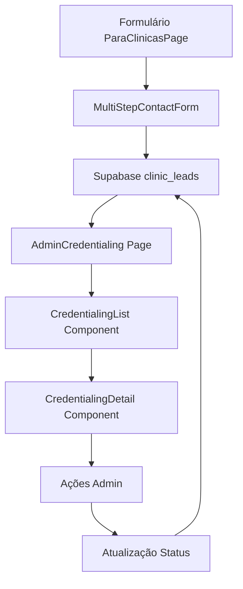

# Implementação da Página de Solicitação de Credenciamento no Admin

## 1. Visão Geral do Projeto

Este documento detalha a implementação de uma nova funcionalidade no painel administrativo para gerenciar solicitações de credenciamento de clínicas. O sistema permitirá que administradores visualizem, analisem e processem as solicitações enviadas através do formulário da página "Para Clínicas".

## 2. Funcionalidades Principais

### 2.1 Página de Solicitações de Credenciamento

* **Listagem completa** de todas as solicitações recebidas

* **Filtros avançados** por status, data, UF, especialidades

* **Visualização detalhada** de cada solicitação

* **Sistema de aprovação/rejeição** com comentários

* **Download de documentos** anexados (CRO)

* **Exportação de dados** para relatórios

### 2.2 Integração com Formulário Existente

* Manutenção da estrutura atual do `MultiStepContactForm`

* Envio automático para tabela `clinic_leads` no Supabase

* Notificações em tempo real para administradores

## 3. Arquitetura Técnica

### 3.1 Estrutura de Arquivos

```
src/
├── pages/admin/
│   └── AdminCredentialing.tsx          # Nova página principal
├── components/admin/
│   ├── AdminSidebar.tsx                 # Atualizar menu
│   ├── credentialing/
│   │   ├── CredentialingList.tsx        # Lista de solicitações
│   │   ├── CredentialingDetail.tsx      # Detalhes da solicitação
│   │   ├── CredentialingFilters.tsx     # Filtros e busca
│   │   └── CredentialingActions.tsx     # Ações de aprovação/rejeição
├── hooks/
│   └── useCredentialing.tsx             # Hook para gerenciar dados
└── types/
    └── credentialing.ts                 # Tipos TypeScript
```

### 3.2 Fluxo de Dados



## 4. Estrutura de Dados

### 4.1 Tabela clinic\_leads (Existente)

A tabela já existe e contém os seguintes campos:

| Campo              | Tipo      | Descrição               |
| ------------------ | --------- | ----------------------- |
| id                 | UUID      | Identificador único     |
| razao\_social      | VARCHAR   | Razão social da clínica |
| cnpj               | VARCHAR   | CNPJ da clínica         |
| nome\_fantasia     | VARCHAR   | Nome fantasia           |
| uf                 | VARCHAR   | Estado                  |
| numero\_cadeiras   | INTEGER   | Número de cadeiras      |
| email              | VARCHAR   | Email de contato        |
| whatsapp           | VARCHAR   | WhatsApp                |
| especialidades     | TEXT\[]   | Array de especialidades |
| interesse\_credito | BOOLEAN   | Interesse em crédito    |
| cro\_carteirinha   | VARCHAR   | URL do arquivo CRO      |
| created\_at        | TIMESTAMP | Data de criação         |
| updated\_at        | TIMESTAMP | Data de atualização     |

### 4.2 Novos Campos Necessários

```sql
-- Adicionar campos de controle administrativo
ALTER TABLE clinic_leads ADD COLUMN IF NOT EXISTS status VARCHAR(20) DEFAULT 'pendente';
ALTER TABLE clinic_leads ADD COLUMN IF NOT EXISTS admin_comments TEXT;
ALTER TABLE clinic_leads ADD COLUMN IF NOT EXISTS reviewed_by UUID REFERENCES auth.users(id);
ALTER TABLE clinic_leads ADD COLUMN IF NOT EXISTS reviewed_at TIMESTAMP;

-- Criar índices para performance
CREATE INDEX IF NOT EXISTS idx_clinic_leads_status ON clinic_leads(status);
CREATE INDEX IF NOT EXISTS idx_clinic_leads_created_at ON clinic_leads(created_at DESC);
CREATE INDEX IF NOT EXISTS idx_clinic_leads_uf ON clinic_leads(uf);
```

## 5. Componentes Detalhados

### 5.1 AdminCredentialing.tsx

**Funcionalidades:**

* Layout principal da página

* Integração com AdminSidebar e AdminHeader

* Gerenciamento de estado global

* Controle de permissões de acesso

**Estrutura:**

```typescript
interface AdminCredentialingProps {
  // Props do componente
}

const AdminCredentialing = () => {
  // Estados: filtros, paginação, seleção
  // Hooks: useCredentialing, useAuth
  // Renderização: header, filtros, lista, modal de detalhes
}
```

### 5.2 CredentialingList.tsx

**Funcionalidades:**

* Tabela responsiva com todas as solicitações

* Paginação e ordenação

* Ações rápidas (aprovar/rejeitar)

* Indicadores visuais de status

**Colunas da Tabela:**

* Data de solicitação

* Razão social / Nome fantasia

* UF / Cidade

* Número de cadeiras

* Especialidades (badges)

* Status (badge colorido)

* Ações (visualizar, aprovar, rejeitar)

### 5.3 CredentialingDetail.tsx

**Funcionalidades:**

* Modal ou página de detalhes completos

* Visualização de todos os campos do formulário

* Preview/download do arquivo CRO

* Formulário de aprovação/rejeição com comentários

* Histórico de alterações

### 5.4 CredentialingFilters.tsx

**Filtros Disponíveis:**

* Status (pendente, aprovado, rejeitado)

* Data de solicitação (período)

* UF (dropdown)

* Especialidades (multi-select)

* Interesse em crédito (sim/não)

* Busca por texto (razão social, CNPJ, email)

## 6. Atualização do Menu Admin

### 6.1 AdminSidebar.tsx

Adicionar novo item no array `menuItems`:

```typescript
const menuItems = [
  // ... itens existentes
  { 
    icon: FileCheck, 
    label: 'Solicitação de credenciamento', 
    path: '/admin/credentialing' 
  },
  // ... demais itens
];
```

### 6.2 Roteamento

Adicionar nova rota no sistema de roteamento:

```typescript
// Em App.tsx ou router config
<Route path="/admin/credentialing" element={<AdminCredentialing />} />
```

## 7. Hook useCredentialing

### 7.1 Funcionalidades

```typescript
interface UseCredentialingReturn {
  // Dados
  applications: CredentialingApplication[];
  loading: boolean;
  error: string | null;
  
  // Filtros e paginação
  filters: CredentialingFilters;
  pagination: PaginationState;
  
  // Ações
  fetchApplications: () => Promise<void>;
  updateStatus: (id: string, status: string, comments?: string) => Promise<void>;
  downloadDocument: (url: string) => void;
  exportData: (format: 'csv' | 'excel') => void;
  
  // Filtros
  setFilters: (filters: Partial<CredentialingFilters>) => void;
  resetFilters: () => void;
}
```

### 7.2 Integração com Supabase

* Queries otimizadas com filtros

* Real-time subscriptions para atualizações

* Controle de permissões (apenas admins)

* Cache inteligente para performance

## 8. Tipos TypeScript

### 8.1 credentialing.ts

```typescript
export interface CredentialingApplication {
  id: string;
  razao_social: string;
  cnpj: string;
  nome_fantasia: string;
  uf: string;
  numero_cadeiras: number;
  email: string;
  whatsapp: string;
  especialidades: string[];
  interesse_credito: boolean;
  cro_carteirinha?: string;
  status: 'pendente' | 'aprovado' | 'rejeitado';
  admin_comments?: string;
  reviewed_by?: string;
  reviewed_at?: string;
  created_at: string;
  updated_at: string;
}

export interface CredentialingFilters {
  status?: string[];
  uf?: string[];
  especialidades?: string[];
  interesse_credito?: boolean;
  date_from?: string;
  date_to?: string;
  search?: string;
}

export interface CredentialingStats {
  total: number;
  pendentes: number;
  aprovados: number;
  rejeitados: number;
  este_mes: number;
}
```

## 9. Interface de Usuário

### 9.1 Design System

* **Cores de Status:**

  * Pendente: `bg-yellow-100 text-yellow-800`

  * Aprovado: `bg-green-100 text-green-800`

  * Rejeitado: `bg-red-100 text-red-800`

* **Componentes UI:**

  * Tabelas responsivas com shadcn/ui

  * Modais para detalhes e ações

  * Badges para especialidades e status

  * Filtros com dropdowns e date pickers

### 9.2 Responsividade

* **Desktop:** Tabela completa com todas as colunas

* **Tablet:** Colunas essenciais + menu de ações

* **Mobile:** Cards empilhados com informações principais

## 10. Permissões e Segurança

### 10.1 Controle de Acesso

* Apenas usuários com role 'admin' podem acessar

* Verificação de permissões no frontend e backend

* Logs de auditoria para todas as ações

### 10.2 Políticas RLS (Row Level Security)

```sql
-- Política para admins visualizarem todas as solicitações
CREATE POLICY "Admins can view all clinic leads" ON clinic_leads
  FOR SELECT USING (
    EXISTS (
      SELECT 1 FROM user_roles 
      WHERE user_id = auth.uid() 
      AND role = 'admin'
    )
  );

-- Política para admins atualizarem status
CREATE POLICY "Admins can update clinic leads" ON clinic_leads
  FOR UPDATE USING (
    EXISTS (
      SELECT 1 FROM user_roles 
      WHERE user_id = auth.uid() 
      AND role = 'admin'
    )
  );
```

## 11. Implementação por Etapas

### 11.1 Fase 1: Estrutura Base

1. Criar migração para novos campos na tabela
2. Atualizar AdminSidebar com novo menu
3. Criar página AdminCredentialing básica
4. Implementar roteamento

### 11.2 Fase 2: Funcionalidades Core

1. Desenvolver CredentialingList com dados básicos
2. Implementar hook useCredentialing
3. Adicionar filtros básicos (status, data)
4. Criar modal de detalhes

### 11.3 Fase 3: Funcionalidades Avançadas

1. Sistema de aprovação/rejeição
2. Filtros avançados e busca
3. Exportação de dados
4. Notificações em tempo real

### 11.4 Fase 4: Otimizações

1. Performance e cache
2. Testes automatizados
3. Documentação de usuário
4. Monitoramento e logs

## 12. Considerações de Performance

### 12.1 Otimizações

* Paginação server-side para grandes volumes

* Índices de banco otimizados

* Cache de consultas frequentes

* Lazy loading de componentes

### 12.2 Monitoramento

* Métricas de tempo de resposta

* Logs de erros e exceções

* Análise de uso por administradores

* Alertas para volumes altos de solicitações

## 13. Testes

### 13.1 Testes Unitários

* Componentes React com Jest/Testing Library

* Hooks customizados

* Funções utilitárias

### 13.2 Testes de Integração

* Fluxo completo de aprovação/rejeição

* Filtros e busca

* Exportação de dados

### 13.3 Testes E2E

* Jornada completa do administrador

* Diferentes cenários de uso

* Responsividade em diferentes dispositivos

