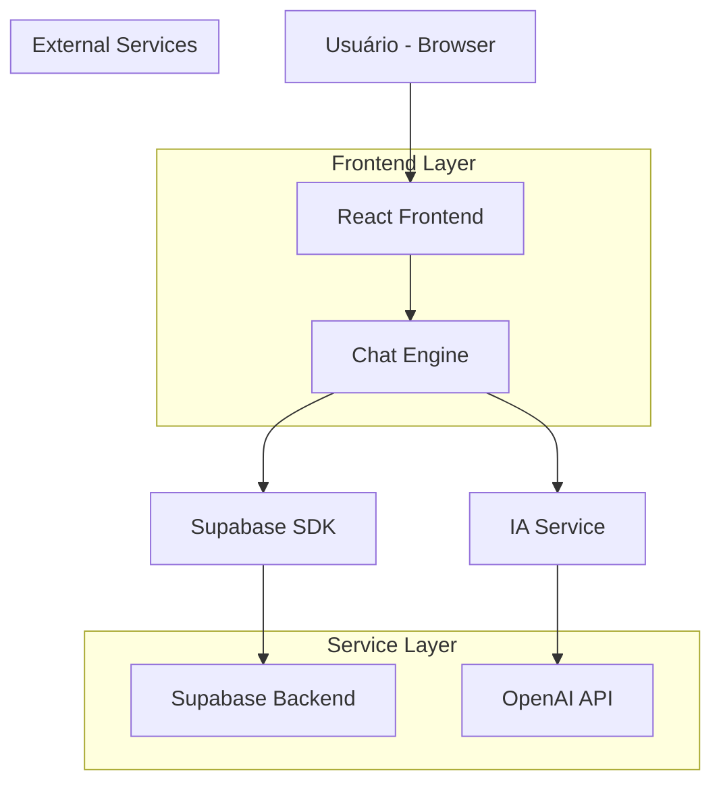
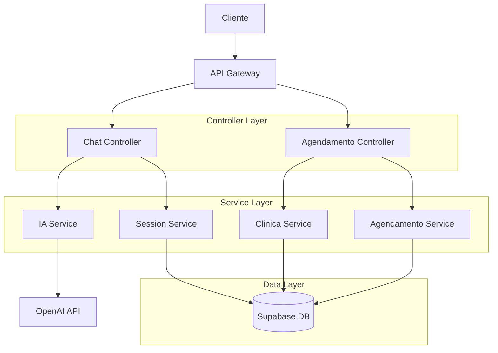
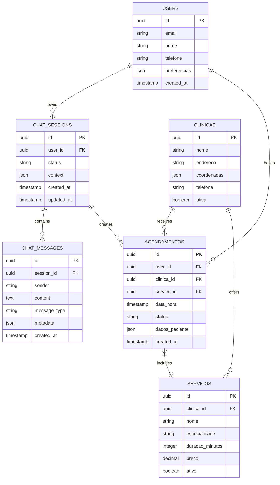

# Arquitetura Técnica - Chat de Agendamento Melhorado

## 1. Arquitetura do Sistema



## 2. Descrição das Tecnologias

* **Frontend**: React\@18 + TypeScript + TailwindCSS\@3 + Vite

* **Backend**: Supabase (PostgreSQL + Auth + Real-time)

* **IA**: OpenAI GPT-4 para processamento de linguagem natural

* **Estado**: Zustand para gerenciamento de estado do chat

* **UI**: Radix UI + Lucide Icons para componentes acessíveis

## 3. Definições de Rotas

| Rota          | Propósito                                      |
| ------------- | ---------------------------------------------- |
| /chat         | Interface principal do chat de agendamento     |
| /agendamentos | Painel de visualização de consultas marcadas   |
| /faq          | Base de conhecimento com respostas automáticas |
| /perfil       | Configurações do usuário e preferências        |

## 4. Definições de API

### 4.1 APIs Principais

**Processamento de Mensagem com IA**

```
POST /api/chat/process
```

Request:

| Nome do Parâmetro | Tipo   | Obrigatório | Descrição            |
| ----------------- | ------ | ----------- | -------------------- |
| message           | string | true        | Mensagem do usuário  |
| sessionId         | string | true        | ID da sessão do chat |
| context           | object | false       | Contexto da conversa |

Response:

| Nome do Parâmetro | Tipo   | Descrição                                     |
| ----------------- | ------ | --------------------------------------------- |
| response          | string | Resposta da IA                                |
| intent            | string | Intenção detectada (agendamento, duvida, etc) |
| buttons           | array  | Botões de ação sugeridos                      |
| nextStep          | string | Próximo passo no fluxo                        |

Exemplo:

```json
{
  "message": "Quero agendar uma consulta",
  "sessionId": "sess_123",
  "context": {
    "step": "inicio",
    "userId": "user_456"
  }
}
```

**Buscar Clínicas Disponíveis**

```
GET /api/clinicas/disponiveis
```

Request:

| Nome do Parâmetro | Tipo   | Obrigatório | Descrição                   |
| ----------------- | ------ | ----------- | --------------------------- |
| especialidade     | string | true        | Especialidade médica        |
| localizacao       | object | false       | Coordenadas do usuário      |
| data              | string | false       | Data preferida (YYYY-MM-DD) |

Response:

| Nome do Parâmetro | Tipo   | Descrição                     |
| ----------------- | ------ | ----------------------------- |
| clinicas          | array  | Lista de clínicas disponíveis |
| total             | number | Total de clínicas encontradas |

**Criar Agendamento**

```
POST /api/agendamentos
```

Request:

| Nome do Parâmetro | Tipo   | Obrigatório | Descrição                   |
| ----------------- | ------ | ----------- | --------------------------- |
| clinicaId         | string | true        | ID da clínica selecionada   |
| servicoId         | string | true        | ID do serviço/especialidade |
| dataHora          | string | true        | Data e hora (ISO 8601)      |
| pacienteId        | string | true        | ID do paciente              |

Response:

| Nome do Parâmetro | Tipo   | Descrição                |
| ----------------- | ------ | ------------------------ |
| agendamentoId     | string | ID do agendamento criado |
| status            | string | Status da criação        |
| confirmacao       | object | Dados de confirmação     |

## 5. Arquitetura do Servidor



## 6. Modelo de Dados

### 6.1 Definição do Modelo de Dados



### 6.2 Linguagem de Definição de Dados

**Tabela de Sessões de Chat (chat\_sessions)**

```sql
-- Criar tabela
CREATE TABLE chat_sessions (
    id UUID PRIMARY KEY DEFAULT gen_random_uuid(),
    user_id UUID REFERENCES auth.users(id),
    status VARCHAR(20) DEFAULT 'active' CHECK (status IN ('active', 'completed', 'abandoned')),
    context JSONB DEFAULT '{}',
    created_at TIMESTAMP WITH TIME ZONE DEFAULT NOW(),
    updated_at TIMESTAMP WITH TIME ZONE DEFAULT NOW()
);

-- Criar índices
CREATE INDEX idx_chat_sessions_user_id ON chat_sessions(user_id);
CREATE INDEX idx_chat_sessions_status ON chat_sessions(status);
CREATE INDEX idx_chat_sessions_created_at ON chat_sessions(created_at DESC);

-- Políticas RLS
ALTER TABLE chat_sessions ENABLE ROW LEVEL SECURITY;
CREATE POLICY "Users can view own sessions" ON chat_sessions FOR SELECT USING (auth.uid() = user_id);
CREATE POLICY "Users can create own sessions" ON chat_sessions FOR INSERT WITH CHECK (auth.uid() = user_id);
CREATE POLICY "Users can update own sessions" ON chat_sessions FOR UPDATE USING (auth.uid() = user_id);
```

**Tabela de Mensagens do Chat (chat\_messages)**

```sql
-- Criar tabela
CREATE TABLE chat_messages (
    id UUID PRIMARY KEY DEFAULT gen_random_uuid(),
    session_id UUID REFERENCES chat_sessions(id) ON DELETE CASCADE,
    sender VARCHAR(10) CHECK (sender IN ('user', 'bot', 'system')),
    content TEXT NOT NULL,
    message_type VARCHAR(20) DEFAULT 'text' CHECK (message_type IN ('text', 'buttons', 'quick_reply', 'system')),
    metadata JSONB DEFAULT '{}',
    created_at TIMESTAMP WITH TIME ZONE DEFAULT NOW()
);

-- Criar índices
CREATE INDEX idx_chat_messages_session_id ON chat_messages(session_id);
CREATE INDEX idx_chat_messages_created_at ON chat_messages(created_at DESC);

-- Políticas RLS
ALTER TABLE chat_messages ENABLE ROW LEVEL SECURITY;
CREATE POLICY "Users can view messages from own sessions" ON chat_messages FOR SELECT 
USING (EXISTS (SELECT 1 FROM chat_sessions WHERE id = session_id AND user_id = auth.uid()));
CREATE POLICY "Users can create messages in own sessions" ON chat_messages FOR INSERT 
WITH CHECK (EXISTS (SELECT 1 FROM chat_sessions WHERE id = session_id AND user_id = auth.uid()));
```

**Tabela de Agendamentos Melhorada**

```sql
-- Adicionar campos para integração com chat
ALTER TABLE agendamentos ADD COLUMN IF NOT EXISTS chat_session_id UUID REFERENCES chat_sessions(id);
ALTER TABLE agendamentos ADD COLUMN IF NOT EXISTS dados_coletados_chat JSONB DEFAULT '{}';

-- Criar índice
CREATE INDEX IF NOT EXISTS idx_agendamentos_chat_session ON agendamentos(chat_session_id);

-- Dados iniciais para FAQ
INSERT INTO faq_items (categoria, pergunta, resposta) VALUES
('agendamento', 'Como agendar uma consulta?', 'Você pode agendar através do nosso chat! Basta dizer "quero agendar" e eu te ajudo passo a passo.'),
('agendamento', 'Posso cancelar minha consulta?', 'Sim! Você pode cancelar até 24 horas antes da consulta através do chat ou na área de agendamentos.'),
('preparo', 'Preciso de preparo para exames?', 'Depende do tipo de exame. Vou te informar todos os preparos necessários após o agendamento.'),
('pagamento', 'Quais formas de pagamento aceitas?', 'Aceitamos dinheiro, cartão de débito/crédito, PIX e convênios médicos.');
```

## 7. Componentes de IA

### 7.1 Processamento de Linguagem Natural

* **Detecção de Intenção**: Classificar mensagens como agendamento, dúvida, cancelamento

* **Extração de Entidades**: Identificar especialidades, datas, horários mencionados

* **Geração de Respostas**: Criar respostas contextuais e naturais

* **Validação de Dados**: Verificar informações coletadas durante o agendamento

### 7.2 Sistema de Fallback

* **Dúvidas Não Relacionadas**: Redirecionamento educado para tópicos fora do escopo

* **Escalação Humana**: Transferir para atendente quando necessário

* **Recuperação de Erro**: Lidar com falhas na comunicação com APIs externas

* **Timeout de Sessão**: Salvar progresso e permitir retomada posterior

## 8. Segurança e Performance

### 8.1 Segurança

* **Autenticação**: JWT tokens via Supabase Auth

* **Autorização**: RLS policies para isolamento de dados

* **Sanitização**: Validação e limpeza de inputs do usuário

* **Rate Limiting**: Controle de frequência de mensagens

### 8.2 Performance

* **Cache**: Redis para sessões ativas e respostas frequentes

* **Lazy Loading**: Carregamento sob demanda de histórico de mensagens

* **Debouncing**: Evitar múltiplas chamadas durante digitação

* **Compressão**: Otimização de payloads de API

