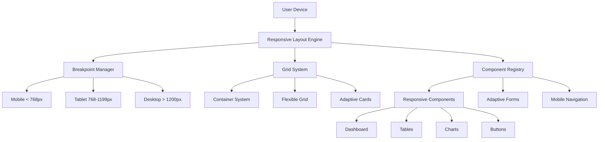

# Arquitetura Técnica: Sistema de Responsividade Completo

## 1. Visão Arquitetural

### 1.1 Objetivo
Implementar um sistema de responsividade escalável e consistente para todo o ecossistema doutorizze, garantindo experiência otimizada em todos os dispositivos e tamanhos de tela.

### 1.2 Escopo
- Dashboard da Clínica (foco inicial)
- Todas as páginas do sistema
- Componentes reutilizáveis
- Hooks e utilitários responsivos

## 2. Arquitetura de Componentes



## 3. Sistema de Breakpoints

### 3.1 Definições de Breakpoints

```typescript
// src/constants/breakpoints.ts
export const BREAKPOINTS = {
  MOBILE: {
    max: 767,
    className: 'mobile',
    container: 'max-w-full',
    grid: 'grid-cols-1'
  },
  TABLET: {
    min: 768,
    max: 1199,
    className: 'tablet',
    container: 'max-w-3xl',
    grid: 'grid-cols-2'
  },
  DESKTOP: {
    min: 1200,
    className: 'desktop',
    container: 'max-w-7xl',
    grid: 'grid-cols-4'
  }
} as const;

export type BreakpointType = keyof typeof BREAKPOINTS;
```

### 3.2 Hook de Breakpoint

```typescript
// src/hooks/useBreakpoint.ts
import { useState, useEffect } from 'react';
import { BREAKPOINTS, BreakpointType } from '@/constants/breakpoints';

export const useBreakpoint = (): BreakpointType => {
  const [breakpoint, setBreakpoint] = useState<BreakpointType>('DESKTOP');

  useEffect(() => {
    const checkBreakpoint = () => {
      const width = window.innerWidth;
      
      if (width <= BREAKPOINTS.MOBILE.max) {
        setBreakpoint('MOBILE');
      } else if (width >= BREAKPOINTS.TABLET.min && width <= BREAKPOINTS.TABLET.max) {
        setBreakpoint('TABLET');
      } else {
        setBreakpoint('DESKTOP');
      }
    };

    checkBreakpoint();
    window.addEventListener('resize', checkBreakpoint);
    
    return () => window.removeEventListener('resize', checkBreakpoint);
  }, []);

  return breakpoint;
};
```

## 4. Componentes Base Responsivos

### 4.1 Container Responsivo

```typescript
// src/components/responsive/ResponsiveContainer.tsx
import React from 'react';
import { cn } from '@/lib/utils';
import { useBreakpoint } from '@/hooks/useBreakpoint';

interface ResponsiveContainerProps {
  children: React.ReactNode;
  className?: string;
  maxWidth?: 'sm' | 'md' | 'lg' | 'xl' | 'full';
  centered?: boolean;
  padding?: boolean;
}

export const ResponsiveContainer: React.FC<ResponsiveContainerProps> = ({
  children,
  className,
  maxWidth = 'xl',
  centered = false,
  padding = true
}) => {
  const breakpoint = useBreakpoint();
  
  const maxWidthClasses = {
    sm: 'max-w-2xl',
    md: 'max-w-4xl',
    lg: 'max-w-6xl',
    xl: 'max-w-7xl',
    full: 'max-w-full'
  };

  const paddingClasses = {
    MOBILE: 'px-4 py-6',
    TABLET: 'px-6 py-8',
    DESKTOP: 'px-8 py-12'
  };

  return (
    <div className={cn(
      'w-full mx-auto',
      maxWidthClasses[maxWidth],
      padding && paddingClasses[breakpoint],
      centered && 'flex items-center justify-center min-h-screen',
      className
    )}>
      <div className={cn(
        'w-full',
        centered && 'max-w-md'
      )}>
        {children}
      </div>
    </div>
  );
};
```

### 4.2 Grid Responsivo

```typescript
// src/components/responsive/ResponsiveGrid.tsx
import React from 'react';
import { cn } from '@/lib/utils';
import { useBreakpoint } from '@/hooks/useBreakpoint';

interface ResponsiveGridProps {
  children: React.ReactNode;
  className?: string;
  cols?: {
    mobile?: number;
    tablet?: number;
    desktop?: number;
  };
  gap?: {
    mobile?: number;
    tablet?: number;
    desktop?: number;
  };
}

export const ResponsiveGrid: React.FC<ResponsiveGridProps> = ({
  children,
  className,
  cols = { mobile: 1, tablet: 2, desktop: 4 },
  gap = { mobile: 4, tablet: 6, desktop: 8 }
}) => {
  const breakpoint = useBreakpoint();
  
  const getGridCols = () => {
    switch (breakpoint) {
      case 'MOBILE':
        return `grid-cols-${cols.mobile}`;
      case 'TABLET':
        return `grid-cols-${cols.tablet}`;
      case 'DESKTOP':
        return `grid-cols-${cols.desktop}`;
      default:
        return 'grid-cols-1';
    }
  };

  const getGap = () => {
    switch (breakpoint) {
      case 'MOBILE':
        return `gap-${gap.mobile}`;
      case 'TABLET':
        return `gap-${gap.tablet}`;
      case 'DESKTOP':
        return `gap-${gap.desktop}`;
      default:
        return 'gap-4';
    }
  };

  return (
    <div className={cn(
      'grid',
      getGridCols(),
      getGap(),
      className
    )}>
      {children}
    </div>
  );
};
```

## 5. Dashboard da Clínica - Implementação

### 5.1 Estrutura Principal

```typescript
// src/pages/clinic/ClinicDashboard.tsx
import React from 'react';
import { ResponsiveContainer } from '@/components/responsive/ResponsiveContainer';
import { ResponsiveGrid } from '@/components/responsive/ResponsiveGrid';
import { ResponsiveCard } from '@/components/responsive/ResponsiveCard';
import { ResponsiveTable } from '@/components/responsive/ResponsiveTable';
import { useBreakpoint } from '@/hooks/useBreakpoint';

export const ClinicDashboard: React.FC = () => {
  const breakpoint = useBreakpoint();
  
  return (
    <div className="min-h-screen bg-gray-50">
      <ResponsiveContainer>
        {/* Header */}
        <div className="mb-8">
          <h1 className={cn(
            "text-2xl sm:text-3xl lg:text-4xl font-bold text-gray-900 mb-2",
            "text-center sm:text-left"
          )}>
            Dashboard da Clínica
          </h1>
          <p className="text-gray-600 text-center sm:text-left">
            Gerencie suas operações e acompanhe o desempenho
          </p>
        </div>

        {/* Métricas */}
        <ResponsiveGrid cols={{ mobile: 1, tablet: 2, desktop: 4 }}>
          <MetricCard title="Total de Pacientes" value="1,234" change="+12%" />
          <MetricCard title="Consultas Hoje" value="24" change="+5%" />
          <MetricCard title="Faturamento" value="R$ 45,6K" change="+18%" />
          <MetricCard title="Taxa de Ocupação" value="85%" change="+3%" />
        </ResponsiveGrid>

        {/* Tabela de Solicitações */}
        <div className="mt-8">
          <h2 className="text-xl font-semibold text-gray-900 mb-4">
            Solicitações de Crédito
          </h2>
          <ResponsiveTable data={creditRequests} />
        </div>
      </ResponsiveContainer>
    </div>
  );
};
```

### 5.2 Card de Métricas Responsivo

```typescript
// src/components/responsive/MetricCard.tsx
import React from 'react';
import { cn } from '@/lib/utils';
import { useBreakpoint } from '@/hooks/useBreakpoint';

interface MetricCardProps {
  title: string;
  value: string;
  change: string;
  trend?: 'up' | 'down' | 'neutral';
}

export const MetricCard: React.FC<MetricCardProps> = ({
  title,
  value,
  change,
  trend = 'up'
}) => {
  const breakpoint = useBreakpoint();
  
  const trendColors = {
    up: 'text-green-600',
    down: 'text-red-600',
    neutral: 'text-gray-600'
  };

  const trendIcons = {
    up: '↗',
    down: '↘',
    neutral: '→'
  };

  return (
    <div className={cn(
      "bg-white rounded-lg shadow-sm border border-gray-200",
      "p-4 sm:p-6 lg:p-8",
      "hover:shadow-md transition-shadow duration-200",
      "flex flex-col items-center justify-center text-center"
    )}>
      <h3 className={cn(
        "text-sm sm:text-base font-medium text-gray-600 mb-2",
        "text-center"
      )}>
        {title}
      </h3>
      
      <div className={cn(
        "text-2xl sm:text-3xl lg:text-4xl font-bold text-gray-900 mb-2",
        "text-center"
      )}>
        {value}
      </div>
      
      <div className={cn(
        "flex items-center justify-center space-x-1",
        "text-sm font-medium",
        trendColors[trend]
      )}>
        <span>{trendIcons[trend]}</span>
        <span>{change}</span>
      </div>
    </div>
  );
};
```

## 6. Tabela Responsiva Avançada

```typescript
// src/components/responsive/ResponsiveTable.tsx
import React from 'react';
import { cn } from '@/lib/utils';
import { useBreakpoint } from '@/hooks/useBreakpoint';

interface ResponsiveTableProps {
  data: any[];
  columns: {
    key: string;
    label: string;
    mobile?: boolean;
    tablet?: boolean;
    desktop?: boolean;
    width?: string;
  }[];
}

export const ResponsiveTable: React.FC<ResponsiveTableProps> = ({
  data,
  columns
}) => {
  const breakpoint = useBreakpoint();
  
  const getVisibleColumns = () => {
    return columns.filter(col => {
      switch (breakpoint) {
        case 'MOBILE':
          return col.mobile !== false;
        case 'TABLET':
          return col.tablet !== false;
        case 'DESKTOP':
          return true;
        default:
          return true;
      }
    });
  };

  const visibleColumns = getVisibleColumns();

  return (
    <div className="w-full overflow-x-auto rounded-lg border border-gray-200">
      <div className="min-w-full">
        <table className="w-full bg-white">
          <thead className="bg-gray-50 border-b border-gray-200">
            <tr>
              {visibleColumns.map((column) => (
                <th
                  key={column.key}
                  className={cn(
                    "px-4 py-3 text-left text-xs font-medium text-gray-500 uppercase tracking-wider",
                    column.width
                  )}
                >
                  {column.label}
                </th>
              ))}
              <th className="px-4 py-3 text-right text-xs font-medium text-gray-500 uppercase tracking-wider min-w-[120px]">
                Ações
              </th>
            </tr>
          </thead>
          <tbody className="bg-white divide-y divide-gray-200">
            {data.map((row, index) => (
              <tr key={index} className="hover:bg-gray-50">
                {visibleColumns.map((column) => (
                  <td key={column.key} className="px-4 py-4 whitespace-nowrap">
                    <div className="text-sm text-gray-900">
                      {row[column.key]}
                    </div>
                  </td>
                ))}
                <td className="px-4 py-4 whitespace-nowrap text-right">
                  <div className="flex justify-end space-x-2">
                    <button className="text-blue-600 hover:text-blue-900 text-sm font-medium">
                      Ver
                    </button>
                    <button className="text-gray-600 hover:text-gray-900 text-sm font-medium">
                      Editar
                    </button>
                  </div>
                </td>
              </tr>
            ))}
          </tbody>
        </table>
      </div>
    </div>
  );
};
```

## 7. Navegação Responsiva

```typescript
// src/components/responsive/ResponsiveNavigation.tsx
import React, { useState } from 'react';
import { cn } from '@/lib/utils';
import { useBreakpoint } from '@/hooks/useBreakpoint';
import { Menu, X, Home, Users, CreditCard, Settings } from 'lucide-react';

const menuItems = [
  { icon: Home, label: 'Dashboard', href: '/clinic/dashboard' },
  { icon: Users, label: 'Pacientes', href: '/clinic/patients' },
  { icon: CreditCard, label: 'Crédito Odonto', href: '/clinic/credit' },
  { icon: Settings, label: 'Configurações', href: '/clinic/settings' }
];

export const ResponsiveNavigation: React.FC = () => {
  const [isOpen, setIsOpen] = useState(false);
  const breakpoint = useBreakpoint();
  const isMobile = breakpoint === 'MOBILE';

  return (
    <>
      {/* Mobile Menu Button */}
      {isMobile && (
        <button
          onClick={() => setIsOpen(!isOpen)}
          className="fixed top-4 left-4 z-50 p-2 bg-white rounded-lg shadow-md"
        >
          {isOpen ? <X className="w-6 h-6" /> : <Menu className="w-6 h-6" />}
        </button>
      )}

      {/* Sidebar */}
      <div className={cn(
        "fixed lg:relative inset-y-0 left-0 z-40",
        "w-64 bg-white shadow-lg transform transition-transform duration-300",
        isMobile ? (isOpen ? "translate-x-0" : "-translate-x-full") : "translate-x-0",
        "lg:translate-x-0 lg:w-64 lg:shadow-none"
      )}>
        <div className="p-6">
          <h2 className="text-lg font-semibold text-gray-900 mb-6">Menu</h2>
          <nav className="space-y-2">
            {menuItems.map((item) => (
              <a
                key={item.href}
                href={item.href}
                className={cn(
                  "flex items-center space-x-3 px-3 py-2 rounded-lg text-sm font-medium",
                  "text-gray-700 hover:bg-gray-100 hover:text-gray-900",
                  "transition-colors duration-200"
                )}
              >
                <item.icon className="w-5 h-5" />
                <span>{item.label}</span>
              </a>
            ))}
          </nav>
        </div>
      </div>

      {/* Overlay for mobile */}
      {isMobile && isOpen && (
        <div
          className="fixed inset-0 bg-black bg-opacity-50 z-30 lg:hidden"
          onClick={() => setIsOpen(false)}
        />
      )}
    </>
  );
};
```

## 8. Performance e Otimização

### 8.1 Lazy Loading de Componentes

```typescript
// src/components/responsive/LazyComponent.tsx
import React, { Suspense, lazy } from 'react';

const ChartComponent = lazy(() => import('./ChartComponent'));
const DataTable = lazy(() => import('./DataTable'));

export const LazyDashboardContent: React.FC = () => {
  return (
    <Suspense fallback={<DashboardSkeleton />}>
      <div className="space-y-8">
        <ChartComponent />
        <DataTable />
      </div>
    </Suspense>
  );
};

const DashboardSkeleton: React.FC = () => (
  <div className="animate-pulse space-y-4">
    <div className="h-32 bg-gray-200 rounded-lg"></div>
    <div className="h-64 bg-gray-200 rounded-lg"></div>
  </div>
);
```

### 8.2 Otimização de Imagens

```typescript
// src/components/responsive/ResponsiveImage.tsx
import React from 'react';
import { useBreakpoint } from '@/hooks/useBreakpoint';

interface ResponsiveImageProps {
  src: string;
  alt: string;
  className?: string;
  sizes?: {
    mobile?: string;
    tablet?: string;
    desktop?: string;
  };
}

export const ResponsiveImage: React.FC<ResponsiveImageProps> = ({
  src,
  alt,
  className,
  sizes = {
    mobile: '400w',
    tablet: '600w',
    desktop: '800w'
  }
}) => {
  const breakpoint = useBreakpoint();
  
  const getImageSize = () => {
    switch (breakpoint) {
      case 'MOBILE':
        return sizes.mobile || '400w';
      case 'TABLET':
        return sizes.tablet || '600w';
      case 'DESKTOP':
        return sizes.desktop || '800w';
      default:
        return '600w';
    }
  };

  return (
    
  );
};
```

## 9. Testes e Validação

### 9.1 Suite de Testes Responsivos

```typescript
// src/tests/responsive.test.ts
import { render, screen } from '@testing-library/react';
import { ClinicDashboard } from '@/pages/clinic/ClinicDashboard';
import { ResponsiveContainer } from '@/components/responsive/ResponsiveContainer';

describe('Responsive Components', () => {
  describe('ClinicDashboard', () => {
    it('should render correctly on mobile', () => {
      window.innerWidth = 375;
      render(<ClinicDashboard />);
      
      expect(screen.getByText('Dashboard da Clínica')).toBeInTheDocument();
      expect(screen.getByRole('grid')).toHaveClass('grid-cols-1');
    });

    it('should render correctly on tablet', () => {
      window.innerWidth = 768;
      render(<ClinicDashboard />);
      
      expect(screen.getByRole('grid')).toHaveClass('grid-cols-2');
    });

    it('should render correctly on desktop', () => {
      window.innerWidth = 1200;
      render(<ClinicDashboard />);
      
      expect(screen.getByRole('grid')).toHaveClass('grid-cols-4');
    });
  });

  describe('ResponsiveContainer', () => {
    it('should apply correct padding for mobile', () => {
      window.innerWidth = 375;
      render(<ResponsiveContainer>Content</ResponsiveContainer>);
      
      expect(screen.getByText('Content').parentElement).toHaveClass('px-4 py-6');
    });

    it('should apply correct padding for tablet', () => {
      window.innerWidth = 768;
      render(<ResponsiveContainer>Content</ResponsiveContainer>);
      
      expect(screen.getByText('Content').parentElement).toHaveClass('px-6 py-8');
    });

    it('should apply correct padding for desktop', () => {
      window.innerWidth = 1200;
      render(<ResponsiveContainer>Content</ResponsiveContainer>);
      
      expect(screen.getByText('Content').parentElement).toHaveClass('px-8 py-12');
    });
  });
});
```

### 9.2 Testes de Performance

```typescript
// src/tests/performance.test.ts
import { measurePerformance } from '@/utils/performance';

describe('Performance Tests', () => {
  it('should load dashboard in under 2 seconds on 3G', async () => {
    const startTime = performance.now();
    
    // Simulate 3G connection
    await measurePerformance.simulate3G();
    
    // Load dashboard
    await page.goto('/clinic/dashboard');
    await page.waitForLoadState('networkidle');
    
    const loadTime = performance.now() - startTime;
    expect(loadTime).toBeLessThan(2000); // 2 seconds
  });

  it('should achieve Lighthouse score > 90', async () => {
    const lighthouse = await measurePerformance.runLighthouse('http://localhost:5174/clinic/dashboard');
    
    expect(lighthouse.scores.performance).toBeGreaterThan(90);
    expect(lighthouse.scores.accessibility).toBeGreaterThan(90);
    expect(lighthouse.scores.bestPractices).toBeGreaterThan(90);
    expect(lighthouse.scores.seo).toBeGreaterThan(90);
  });
});
```

## 10. Documentação e Manutenção

### 10.1 Guia de Estilos Responsivos

```markdown
# Guia de Estilos Responsivos

## Princípios Fundamentais
1. **Mobile First**: Sempre comece projetando para mobile
2. **Progressive Enhancement**: Adicione recursos conforme a tela aumenta
3. **Content Priority**: Mantenha o conteúdo mais importante sempre visível
4. **Touch Friendly**: Áreas de toque mínimas de 44x44px
5. **Performance**: Otimize para carregamento rápido em todas as plataformas

## Breakpoints Padrão
- Mobile: < 768px
- Tablet: 768px - 1199px
- Desktop: > 1200px

## Componentes Reutilizáveis
- ResponsiveContainer
- ResponsiveGrid
- ResponsiveTable
- ResponsiveNavigation
- ResponsiveCard

## Testes Necessários
- [ ] Layout em todas as resoluções
- [ ] Funcionalidade de touch
- [ ] Performance em 3G
- [ ] Acessibilidade WCAG 2.1 AA
- [ ] Cross-browser compatibility
```

### 10.2 Checklist de Implementação

```markdown
# Checklist de Implementação de Responsividade

## Antes de Começar
- [ ] Definir breakpoints do projeto
- [ ] Identificar conteúdo prioritário
- [ ] Criar wireframes mobile/desktop
- [ ] Estabelecer métricas de sucesso

## Durante Implementação
- [ ] Usar componentes responsivos base
- [ ] Testar em dispositivos reais
- [ ] Verificar performance
- [ ] Garantir acessibilidade
- [ ] Documentar decisões

## Pós-Implementação
- [ ] Executar suite de testes
- [ ] Validar com usuários
- [ ] Monitorar métricas
- [ ] Documentar aprendizados
- [ ] Planejar melhorias
```

## Conclusão

Esta arquitetura fornece uma base sólida e escalável para implementação de responsividade em todo o sistema doutorizze. A abordagem baseada em componentes reutilizáveis garante consistência, manutenibilidade e facilidade de expansão para novas funcionalidades.