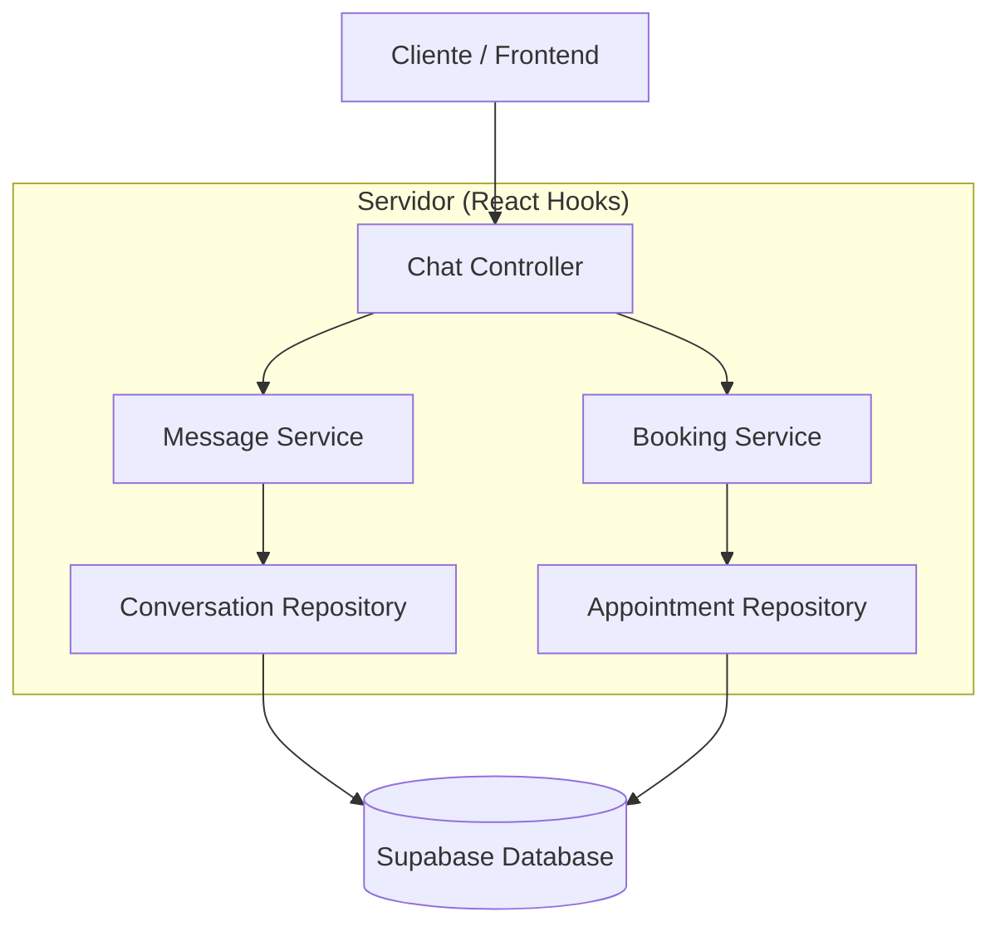
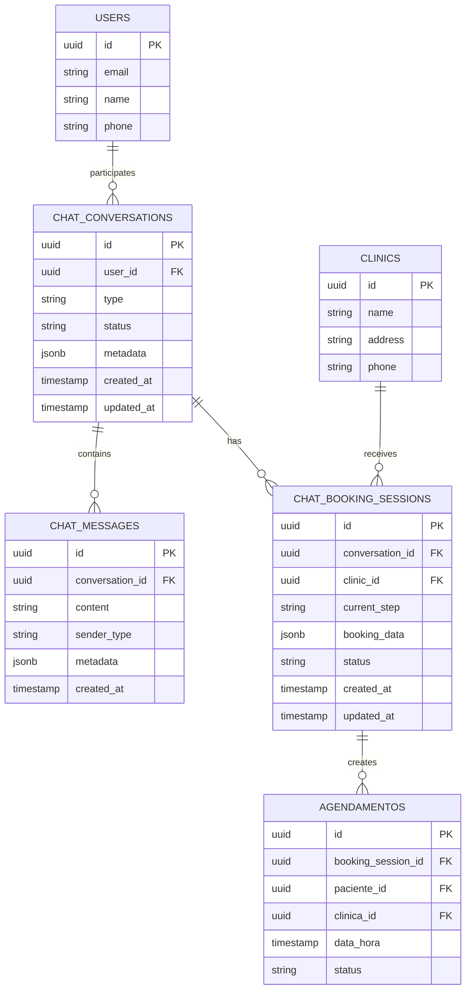

# Arquitetura Técnica - Sistema de Chat com Agendamento

## 1. Design da Arquitetura

```mermaid
graph TD
    A[Navegador do Usuário] --> B[React Frontend Application]
    B --> C[Chat Widget Component]
    B --> D[Booking Integration Layer]
    D --> E[Supabase SDK]
    E --> F[Supabase Service]
    
    subgraph "Frontend Layer"
        B
        C
        D
    end
    
    subgraph "Service Layer (Supabase)"
        F
        G[Real-time Subscriptions]
        H[Database (PostgreSQL)]
        I[Authentication]
    end
    
    F --> G
    F --> H
    F --> I
```

## 2. Descrição das Tecnologias

- **Frontend**: React@18 + TypeScript + TailwindCSS@3 + Vite
- **Backend**: Supabase (PostgreSQL + Real-time + Auth)
- **Estado**: React Context API + Custom Hooks
- **UI Components**: Shadcn/ui + Lucide React Icons
- **Styling**: TailwindCSS com design system customizado

## 3. Definições de Rotas

| Rota | Propósito |
|------|----------|
| / | Página inicial com widget de chat disponível |
| /booking/:clinicId | Página de agendamento tradicional (mantida para compatibilidade) |
| /chat-history | Histórico completo de conversas do chat |
| /agendamentos | Lista de agendamentos do paciente |

## 4. Definições de API

### 4.1 APIs Principais

**Gerenciamento de Conversas**
```typescript
// Criar nova conversa
POST /api/chat/conversations
```

Request:
| Nome do Parâmetro | Tipo | Obrigatório | Descrição |
|-------------------|------|-------------|----------|
| user_id | string | true | ID do usuário autenticado |
| type | string | true | Tipo da conversa ('agendamento', 'suporte') |

Response:
| Nome do Parâmetro | Tipo | Descrição |
|-------------------|------|----------|
| id | string | ID único da conversa |
| created_at | timestamp | Data de criação |
| status | string | Status da conversa |

**Envio de Mensagens**
```typescript
// Enviar mensagem
POST /api/chat/messages
```

Request:
| Nome do Parâmetro | Tipo | Obrigatório | Descrição |
|-------------------|------|-------------|----------|
| conversation_id | string | true | ID da conversa |
| content | string | true | Conteúdo da mensagem |
| sender_type | string | true | 'user' ou 'bot' |
| metadata | object | false | Dados adicionais (botões, cards) |

**Processamento de Agendamento**
```typescript
// Processar etapa do agendamento
POST /api/chat/booking/process
```

Request:
| Nome do Parâmetro | Tipo | Obrigatório | Descrição |
|-------------------|------|-------------|----------|
| conversation_id | string | true | ID da conversa |
| step | string | true | Etapa atual ('specialty', 'clinic', 'date', 'time') |
| data | object | true | Dados da etapa |

Exemplo:
```json
{
  "conversation_id": "conv_123",
  "step": "specialty",
  "data": {
    "specialty_id": "odontologia",
    "location": "São Paulo, SP"
  }
}
```

## 5. Arquitetura do Servidor



## 6. Modelo de Dados

### 6.1 Definição do Modelo de Dados



### 6.2 Linguagem de Definição de Dados

**Tabela de Conversas do Chat (chat_conversations)**
```sql
-- Criar tabela
CREATE TABLE chat_conversations (
    id UUID PRIMARY KEY DEFAULT gen_random_uuid(),
    user_id UUID REFERENCES auth.users(id) ON DELETE CASCADE,
    type VARCHAR(50) NOT NULL DEFAULT 'agendamento',
    status VARCHAR(50) NOT NULL DEFAULT 'active',
    metadata JSONB DEFAULT '{}',
    created_at TIMESTAMP WITH TIME ZONE DEFAULT NOW(),
    updated_at TIMESTAMP WITH TIME ZONE DEFAULT NOW()
);

-- Criar índices
CREATE INDEX idx_chat_conversations_user_id ON chat_conversations(user_id);
CREATE INDEX idx_chat_conversations_status ON chat_conversations(status);
CREATE INDEX idx_chat_conversations_created_at ON chat_conversations(created_at DESC);

-- Políticas RLS
ALTER TABLE chat_conversations ENABLE ROW LEVEL SECURITY;

CREATE POLICY "Users can view own conversations" ON chat_conversations
    FOR SELECT USING (auth.uid() = user_id);

CREATE POLICY "Users can create own conversations" ON chat_conversations
    FOR INSERT WITH CHECK (auth.uid() = user_id);
```

**Tabela de Mensagens do Chat (chat_messages)**
```sql
-- Criar tabela
CREATE TABLE chat_messages (
    id UUID PRIMARY KEY DEFAULT gen_random_uuid(),
    conversation_id UUID REFERENCES chat_conversations(id) ON DELETE CASCADE,
    content TEXT NOT NULL,
    sender_type VARCHAR(20) NOT NULL CHECK (sender_type IN ('user', 'bot', 'system')),
    metadata JSONB DEFAULT '{}',
    created_at TIMESTAMP WITH TIME ZONE DEFAULT NOW()
);

-- Criar índices
CREATE INDEX idx_chat_messages_conversation_id ON chat_messages(conversation_id);
CREATE INDEX idx_chat_messages_created_at ON chat_messages(created_at DESC);

-- Políticas RLS
ALTER TABLE chat_messages ENABLE ROW LEVEL SECURITY;

CREATE POLICY "Users can view messages from own conversations" ON chat_messages
    FOR SELECT USING (
        conversation_id IN (
            SELECT id FROM chat_conversations WHERE user_id = auth.uid()
        )
    );

CREATE POLICY "Users can create messages in own conversations" ON chat_messages
    FOR INSERT WITH CHECK (
        conversation_id IN (
            SELECT id FROM chat_conversations WHERE user_id = auth.uid()
        )
    );
```

**Tabela de Sessões de Agendamento (chat_booking_sessions)**
```sql
-- Criar tabela
CREATE TABLE chat_booking_sessions (
    id UUID PRIMARY KEY DEFAULT gen_random_uuid(),
    conversation_id UUID REFERENCES chat_conversations(id) ON DELETE CASCADE,
    clinic_id UUID REFERENCES clinics(id),
    current_step VARCHAR(50) NOT NULL DEFAULT 'specialty',
    booking_data JSONB DEFAULT '{}',
    status VARCHAR(50) NOT NULL DEFAULT 'in_progress',
    created_at TIMESTAMP WITH TIME ZONE DEFAULT NOW(),
    updated_at TIMESTAMP WITH TIME ZONE DEFAULT NOW()
);

-- Criar índices
CREATE INDEX idx_chat_booking_sessions_conversation_id ON chat_booking_sessions(conversation_id);
CREATE INDEX idx_chat_booking_sessions_status ON chat_booking_sessions(status);

-- Políticas RLS
ALTER TABLE chat_booking_sessions ENABLE ROW LEVEL SECURITY;

CREATE POLICY "Users can view own booking sessions" ON chat_booking_sessions
    FOR SELECT USING (
        conversation_id IN (
            SELECT id FROM chat_conversations WHERE user_id = auth.uid()
        )
    );

-- Dados iniciais
INSERT INTO chat_conversations (user_id, type, status)
SELECT id, 'agendamento', 'active'
FROM auth.users
LIMIT 1;
```