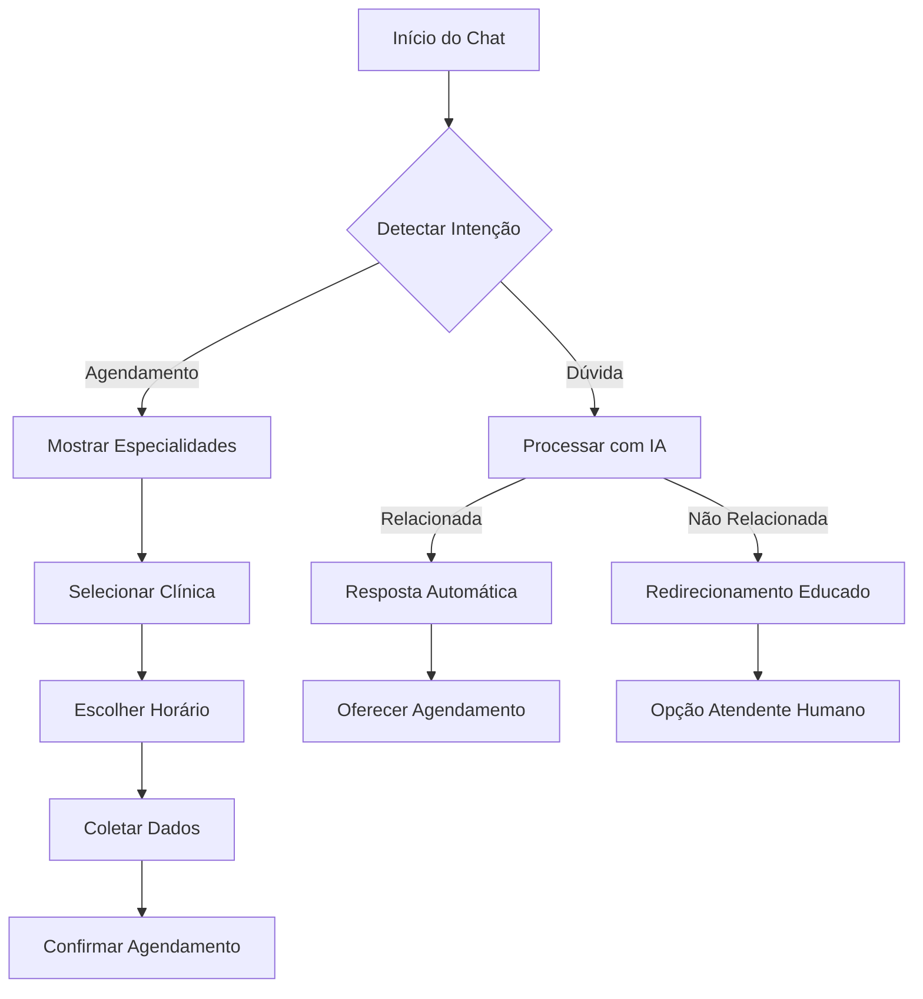

# Sistema de Chat de Agendamento Melhorado

## 1. Visão Geral do Produto

Sistema de chat inteligente focado exclusivamente em agendamentos médicos, com interface conversacional intuitiva e botões de ação rápida.

O produto resolve a complexidade do processo de agendamento através de um assistente virtual que guia o usuário passo a passo, oferecendo opções claras e respondendo dúvidas específicas sobre agendamentos.

## 2. Funcionalidades Principais

### 2.1 Papéis de Usuário

| Papel | Método de Registro | Permissões Principais |
|-------|-------------------|----------------------|
| Paciente | Registro por email/telefone | Pode agendar consultas, visualizar histórico, cancelar agendamentos |
| Clínica | Convite administrativo | Pode gerenciar horários, confirmar agendamentos, visualizar agenda |

### 2.2 Módulos de Funcionalidade

Nosso sistema de chat de agendamento consiste nas seguintes páginas principais:

1. **Chat Principal**: interface conversacional, botões de ação rápida, histórico de mensagens
2. **Painel de Agendamentos**: visualização de consultas marcadas, opções de cancelamento
3. **FAQ Inteligente**: respostas automáticas para dúvidas frequentes

### 2.3 Detalhes das Páginas

| Nome da Página | Nome do Módulo | Descrição da Funcionalidade |
|----------------|----------------|-----------------------------|
| Chat Principal | Interface Conversacional | Iniciar conversa, detectar intenção de agendamento, apresentar opções em botões |
| Chat Principal | Botões de Ação Rápida | Exibir clínicas próximas, mostrar especialidades, selecionar horários disponíveis |
| Chat Principal | Assistente IA | Responder dúvidas sobre agendamentos, explicar procedimentos, orientar sobre preparos |
| Chat Principal | Fluxo de Agendamento | Coletar dados do paciente, confirmar informações, finalizar agendamento |
| Painel de Agendamentos | Visualização de Consultas | Listar agendamentos ativos, mostrar detalhes da consulta, exibir status |
| Painel de Agendamentos | Gerenciamento | Cancelar consultas, reagendar horários, enviar lembretes |
| FAQ Inteligente | Base de Conhecimento | Buscar respostas automáticas, categorizar dúvidas, escalar para atendimento humano |

## 3. Processo Principal

### Fluxo do Paciente
1. Usuário inicia conversa no chat
2. Sistema detecta intenção de agendamento
3. Apresenta botões com opções de especialidades
4. Usuário seleciona especialidade desejada
5. Sistema mostra clínicas disponíveis em botões
6. Usuário escolhe clínica preferida
7. Sistema exibe horários disponíveis
8. Usuário seleciona data e horário
9. Sistema coleta dados pessoais
10. Confirmação final do agendamento

### Fluxo de Dúvidas
1. Usuário faz pergunta no chat
2. IA analisa a pergunta
3. Se relacionada a agendamento: resposta automática
4. Se não relacionada: redirecionamento educado
5. Opção de falar com atendente humano

## 4. Design da Interface do Usuário

### 4.1 Estilo de Design

- **Cores Primárias**: Azul médico (#2563EB), Verde saúde (#10B981)
- **Cores Secundárias**: Cinza claro (#F3F4F6), Branco (#FFFFFF)
- **Estilo de Botões**: Arredondados com sombra sutil, efeito hover
- **Fonte**: Inter ou Roboto, tamanhos 14px (corpo), 16px (botões), 18px (títulos)
- **Layout**: Design em cards, navegação por abas, chat em coluna única
- **Ícones**: Estilo outline, cores consistentes, tamanho 20px

### 4.2 Visão Geral do Design das Páginas

| Nome da Página | Nome do Módulo | Elementos da UI |
|----------------|----------------|----------------|
| Chat Principal | Interface Conversacional | Balões de mensagem azuis/cinzas, avatar do assistente, indicador de digitação |
| Chat Principal | Botões de Ação Rápida | Botões em grid 2x2, ícones representativos, texto descritivo, cores diferenciadas |
| Chat Principal | Entrada de Mensagem | Campo de texto com placeholder, botão enviar, sugestões rápidas |
| Painel de Agendamentos | Lista de Consultas | Cards com informações da consulta, status colorido, botões de ação |
| FAQ Inteligente | Busca Inteligente | Campo de busca com autocomplete, categorias em chips, respostas expandíveis |

### 4.3 Responsividade

O produto é mobile-first com adaptação para desktop. Otimizado para interação touch com botões de tamanho adequado (mínimo 44px) e gestos intuitivos como swipe para navegar entre agendamentos.

## 5. Especificações Técnicas

### 5.1 Integração com IA

- **Processamento de Linguagem Natural**: Detectar intenções de agendamento
- **Base de Conhecimento**: FAQ sobre procedimentos, preparos, políticas
- **Fallback Inteligente**: Redirecionamento educado para tópicos não relacionados
- **Aprendizado**: Melhoria contínua baseada em interações

### 5.2 Sistema de Botões

- **Botões Dinâmicos**: Gerados baseados no contexto da conversa
- **Quick Replies**: Respostas rápidas para perguntas frequentes
- **Botões de Ação**: Confirmar, cancelar, reagendar, mais informações
- **Navegação**: Voltar, avançar, menu principal

### 5.3 Fluxo Conversacional

- **Estados de Conversa**: Início, coletando dados, confirmando, finalizado
- **Validação de Dados**: Verificação em tempo real de informações
- **Recuperação de Sessão**: Manter contexto entre sessões
- **Timeout Inteligente**: Salvar progresso e permitir retomada

## 6. Melhorias de UX

### 6.1 Feedback Visual

- Indicadores de progresso durante o agendamento
- Confirmações visuais para cada etapa completada
- Animações suaves entre transições
- Estados de loading com mensagens informativas

### 6.2 Personalização

- Saudações personalizadas com nome do usuário
- Histórico de preferências (clínicas, horários)
- Sugestões baseadas em agendamentos anteriores
- Lembretes automáticos configuráveis

### 6.3 Acessibilidade

- Suporte a leitores de tela
- Contraste adequado para baixa visão
- Navegação por teclado
- Textos alternativos para ícones