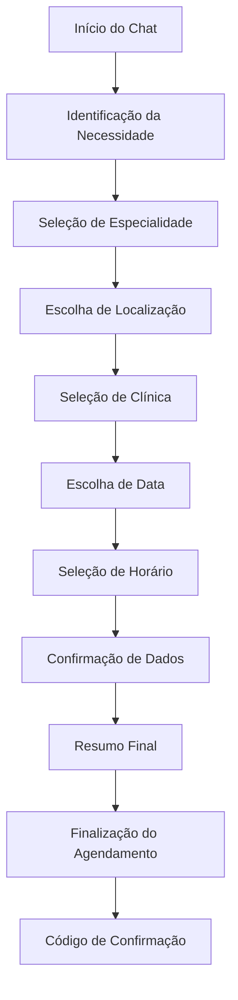

# Sistema de Chat com Agendamento Integrado

## 1. Visão Geral do Produto

Sistema de chat fixo que permite aos pacientes agendar consultas através de conversação natural, integrando-se perfeitamente com o sistema de agendamento existente da plataforma Doutorizze.

O chat oferece uma experiência conversacional intuitiva para agendamento de consultas, eliminando a necessidade de navegar por múltiplas páginas e simplificando o processo para o usuário final.

## 2. Funcionalidades Principais

### 2.1 Papéis de Usuário

| Papel | Método de Registro | Permissões Principais |
|-------|-------------------|----------------------|
| Paciente | Login existente ou registro via chat | Pode agendar consultas, visualizar histórico, cancelar agendamentos |
| Visitante | Acesso anônimo limitado | Pode iniciar processo de agendamento, deve se registrar para finalizar |

### 2.2 Módulos de Funcionalidades

Nosso sistema de chat com agendamento consiste nas seguintes páginas principais:

1. **Widget de Chat**: interface de chat fixo, histórico de conversas, indicadores de status
2. **Fluxo de Agendamento**: seleção de especialidade, escolha de clínica, seleção de data/horário
3. **Confirmação**: validação de dados, resumo do agendamento, finalização

### 2.3 Detalhes das Páginas

| Nome da Página | Nome do Módulo | Descrição da Funcionalidade |
|----------------|----------------|-----------------------------|
| Widget de Chat | Interface Principal | Exibir chat fixo no canto inferior direito, alternar entre minimizado/expandido, mostrar notificações |
| Widget de Chat | Sistema de Mensagens | Enviar/receber mensagens, exibir typing indicators, suporte a quick replies |
| Widget de Chat | Histórico | Manter histórico de conversas, recuperar contexto de agendamentos anteriores |
| Fluxo de Agendamento | Seleção de Especialidade | Listar especialidades disponíveis, filtrar por localização, mostrar clínicas próximas |
| Fluxo de Agendamento | Escolha de Clínica | Exibir clínicas disponíveis, mostrar informações básicas, verificar disponibilidade |
| Fluxo de Agendamento | Seleção de Data/Horário | Mostrar calendário interativo, exibir horários disponíveis, validar seleções |
| Confirmação | Validação de Dados | Confirmar dados do paciente, validar informações de contato, solicitar dados faltantes |
| Confirmação | Resumo do Agendamento | Exibir resumo completo, mostrar valor da consulta, permitir edições finais |
| Confirmação | Finalização | Processar agendamento, gerar código de confirmação, enviar notificações |

## 3. Processo Principal

### Fluxo do Paciente

1. **Início da Conversa**: Paciente clica no widget de chat e inicia conversa
2. **Identificação da Necessidade**: Sistema identifica intenção de agendamento através de palavras-chave
3. **Seleção de Especialidade**: Chat oferece opções de especialidades ou permite busca por sintomas
4. **Escolha de Localização**: Sistema solicita localização ou permite busca por cidade/bairro
5. **Seleção de Clínica**: Apresenta clínicas disponíveis com informações básicas
6. **Escolha de Data**: Exibe calendário com datas disponíveis
7. **Seleção de Horário**: Mostra horários livres para a data escolhida
8. **Confirmação de Dados**: Valida informações do paciente (nome, telefone, email)
9. **Resumo Final**: Apresenta resumo completo do agendamento
10. **Finalização**: Confirma agendamento e gera código de confirmação

## 4. Design da Interface do Usuário

### 4.1 Estilo de Design

- **Cores Primárias**: Azul (#3B82F6) para elementos principais, Verde (#10B981) para confirmações
- **Cores Secundárias**: Cinza (#6B7280) para texto secundário, Branco (#FFFFFF) para fundos
- **Estilo de Botões**: Arredondados com bordas suaves, efeitos de hover sutis
- **Fonte**: Inter ou system fonts, tamanhos de 14px a 16px para texto principal
- **Layout**: Design de cards para mensagens, layout responsivo com breakpoints
- **Ícones**: Lucide React icons, estilo minimalista e consistente

### 4.2 Visão Geral do Design das Páginas

| Nome da Página | Nome do Módulo | Elementos da UI |
|----------------|----------------|----------------|
| Widget de Chat | Container Principal | Posição fixa bottom-right, z-index alto, sombra suave, bordas arredondadas |
| Widget de Chat | Cabeçalho | Logo Doutorizze, status online, botão minimizar/fechar |
| Widget de Chat | Área de Mensagens | Scroll automático, mensagens do bot (esquerda), mensagens do usuário (direita) |
| Widget de Chat | Input de Mensagem | Campo de texto expansível, botão enviar, indicador de digitação |
| Widget de Chat | Quick Replies | Botões de resposta rápida, grid responsivo, cores diferenciadas |
| Fluxo de Agendamento | Cards de Especialidade | Grid 2x2 em mobile, 3x3 em desktop, ícones representativos |
| Fluxo de Agendamento | Lista de Clínicas | Cards verticais, foto da clínica, rating, distância |
| Fluxo de Agendamento | Calendário | Componente de calendário interativo, destaque para datas disponíveis |
| Confirmação | Resumo | Card centralizado, informações organizadas, botões de ação |

### 4.3 Responsividade

O sistema é mobile-first com adaptação para desktop. O widget de chat ocupa:
- **Mobile**: 90% da largura da tela quando expandido
- **Tablet**: 400px de largura fixa
- **Desktop**: 380px de largura fixa

Interações touch otimizadas para dispositivos móveis com áreas de toque adequadas (mínimo 44px).