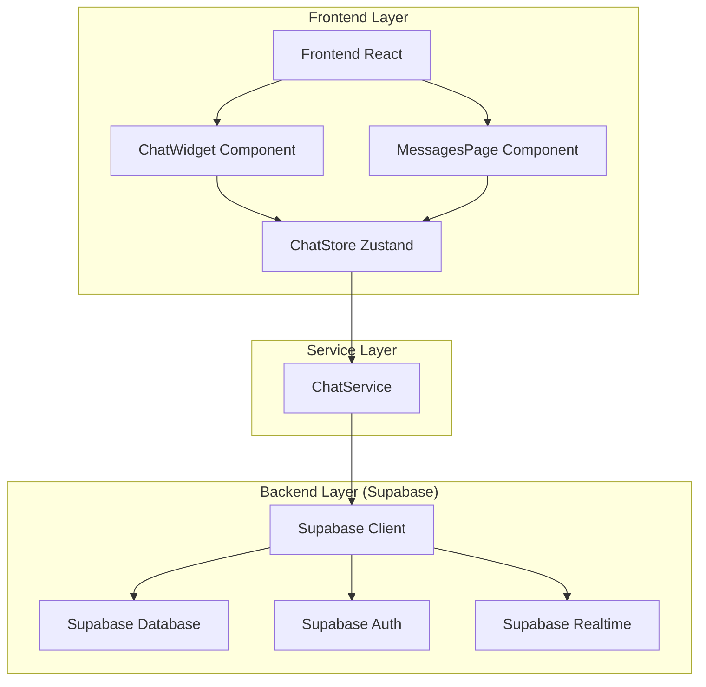
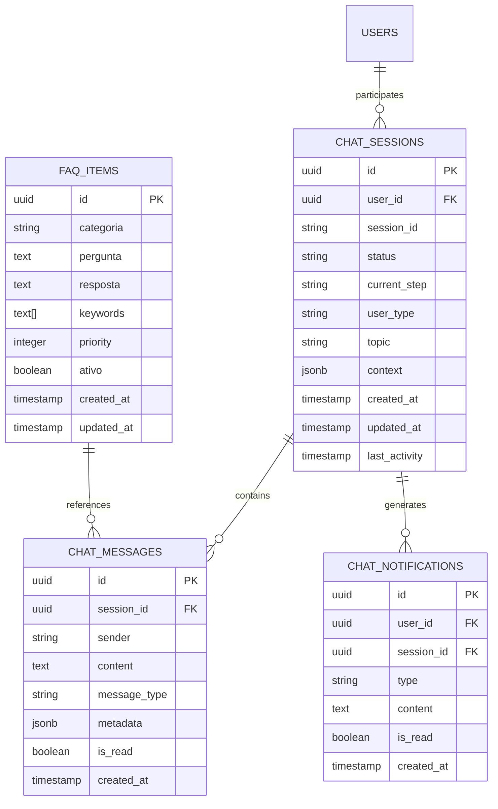

# Sistema de Chat de Suporte Doutorizze - Arquitetura Técnica

## 1. Arquitetura Geral



## 2. Stack Tecnológica

* **Frontend**: React\@18 + TypeScript + Tailwind CSS + Vite

* **Estado Global**: Zustand para gerenciamento de estado do chat

* **Backend**: Supabase (PostgreSQL + Auth + Realtime)

* **Componentes UI**: Shadcn/ui + Lucide React para ícones

* **Validação**: Zod para validação de dados

## 3. Definições de Rotas

| Rota             | Propósito                                            |
| ---------------- | ---------------------------------------------------- |
| `/messages`      | Central de mensagens - histórico e chat ativo        |
| `/chat-demo`     | Página de demonstração do chat (opcional)            |
| Widget integrado | Disponível em todas as páginas via componente global |

## 4. Componentes Principais

### 4.1 Estrutura de Componentes

```
src/components/chat/
├── ChatWidget.tsx          # Widget principal flutuante
├── ChatMessage.tsx         # Componente de mensagem individual
├── ChatInput.tsx           # Campo de input com validação
├── ChatButtons.tsx         # Botões interativos do chat
├── QuickReplies.tsx        # Respostas rápidas
├── TypingIndicator.tsx     # Indicador de digitação
├── InteractiveButtons.tsx  # Botões de ação
└── NotificationBadge.tsx   # Badge de notificações (novo)
```

### 4.2 Stores e Serviços

```
src/stores/
└── chatStore.ts            # Estado global do chat (existente)

src/services/
├── chatService.ts          # Lógica de negócio do chat (existente)
├── notificationService.ts  # Serviço de notificações (novo)
└── faqService.ts          # Serviço de FAQ inteligente (novo)
```

## 5. APIs e Integrações

### 5.1 APIs do Chat

**Buscar conversas do usuário**

```
GET /api/chat/conversations
```

Request Headers:

| Header        | Type   | Required | Description             |
| ------------- | ------ | -------- | ----------------------- |
| Authorization | string | true     | Bearer token do usuário |

Response:

| Field         | Type   | Description                   |
| ------------- | ------ | ----------------------------- |
| conversations | array  | Lista de conversas do usuário |
| unread\_count | number | Total de mensagens não lidas  |

**Enviar mensagem**

```
POST /api/chat/messages
```

Request:

| Field         | Type   | Required | Description                            |
| ------------- | ------ | -------- | -------------------------------------- |
| session\_id   | string | true     | ID da sessão de chat                   |
| content       | string | true     | Conteúdo da mensagem                   |
| message\_type | string | false    | Tipo da mensagem (text, button\_click) |

Response:

| Field         | Type   | Description                               |
| ------------- | ------ | ----------------------------------------- |
| message       | object | Mensagem criada                           |
| bot\_response | object | Resposta automática do bot (se aplicável) |

**Buscar FAQ**

```
GET /api/chat/faq/search?q={query}&category={category}
```

Request Parameters:

| Parameter | Type   | Required | Description                              |
| --------- | ------ | -------- | ---------------------------------------- |
| q         | string | true     | Termo de busca                           |
| category  | string | false    | Categoria específica (paciente, clinica) |

Response:

| Field       | Type  | Description             |
| ----------- | ----- | ----------------------- |
| results     | array | Resultados da busca FAQ |
| suggestions | array | Sugestões relacionadas  |

### 5.2 Integração com Supabase Realtime

```typescript
// Subscription para mensagens em tempo real
const subscription = supabase
  .channel('chat_messages')
  .on('postgres_changes', {
    event: 'INSERT',
    schema: 'public',
    table: 'chat_messages',
    filter: `session_id=eq.${sessionId}`
  }, (payload) => {
    // Atualizar estado do chat
    addNewMessage(payload.new);
  })
  .subscribe();
```

## 6. Modelo de Dados

### 6.1 Schema do Banco de Dados



### 6.2 DDL - Extensões das Tabelas Existentes

```sql
-- Adicionar campos para notificações na tabela chat_sessions
ALTER TABLE chat_sessions ADD COLUMN IF NOT EXISTS last_activity TIMESTAMP WITH TIME ZONE DEFAULT NOW();
ALTER TABLE chat_sessions ADD COLUMN IF NOT EXISTS user_type VARCHAR(20) CHECK (user_type IN ('paciente', 'clinica', 'anonimo'));

-- Adicionar campo is_read na tabela chat_messages
ALTER TABLE chat_messages ADD COLUMN IF NOT EXISTS is_read BOOLEAN DEFAULT FALSE;

-- Criar tabela de notificações
CREATE TABLE IF NOT EXISTS chat_notifications (
    id UUID PRIMARY KEY DEFAULT gen_random_uuid(),
    user_id UUID REFERENCES auth.users(id),
    session_id UUID REFERENCES chat_sessions(id),
    type VARCHAR(50) NOT NULL CHECK (type IN ('new_message', 'escalation', 'resolution')),
    content TEXT NOT NULL,
    is_read BOOLEAN DEFAULT FALSE,
    created_at TIMESTAMP WITH TIME ZONE DEFAULT NOW()
);

-- Criar índices para performance
CREATE INDEX IF NOT EXISTS idx_chat_notifications_user_id ON chat_notifications(user_id);
CREATE INDEX IF NOT EXISTS idx_chat_notifications_unread ON chat_notifications(user_id, is_read) WHERE is_read = FALSE;
CREATE INDEX IF NOT EXISTS idx_chat_messages_unread ON chat_messages(session_id, is_read) WHERE is_read = FALSE;

-- Atualizar FAQ com categorias específicas
INSERT INTO faq_items (categoria, pergunta, resposta, keywords, priority) VALUES
-- FAQ para Pacientes
('paciente_financiamento', 'Como funciona o financiamento odontológico?', 'O financiamento odontológico permite parcelar seu tratamento em até 24x. Analisamos sua proposta em tempo real e você recebe a resposta na hora.', ARRAY['financiamento', 'parcelamento', 'credito', 'pagar'], 1),
('paciente_documentos', 'Quais documentos preciso para o financiamento?', 'Você precisa de: RG, CPF, comprovante de renda e comprovante de residência. Tudo pode ser enviado digitalmente.', ARRAY['documentos', 'rg', 'cpf', 'comprovante'], 2),
('paciente_aprovacao', 'Quanto tempo demora a aprovação?', 'A análise é feita em tempo real! Em poucos minutos você já sabe se foi aprovado e pode iniciar seu tratamento.', ARRAY['aprovacao', 'tempo', 'demora', 'analise'], 3),

-- FAQ para Clínicas
('clinica_propostas', 'Como acompanhar as propostas de crédito?', 'No seu dashboard você pode ver todas as propostas em tempo real, com status de aprovação e valores detalhados.', ARRAY['propostas', 'dashboard', 'acompanhar', 'status'], 1),
('clinica_fidc', 'Como configurar os FIDCs disponíveis?', 'Você pode configurar quais instituições financeiras oferecer aos seus pacientes através das configurações do seu perfil.', ARRAY['fidc', 'configurar', 'instituicoes', 'financeiras'], 2),
('clinica_comissao', 'Como funciona a comissão das clínicas?', 'As clínicas recebem uma comissão sobre os financiamentos aprovados. Os valores são creditados automaticamente.', ARRAY['comissao', 'pagamento', 'credito', 'automatico'], 3);

-- Trigger para atualizar last_activity
CREATE OR REPLACE FUNCTION update_chat_activity()
RETURNS TRIGGER AS $$
BEGIN
    UPDATE chat_sessions 
    SET last_activity = NOW() 
    WHERE id = NEW.session_id;
    RETURN NEW;
END;
$$ LANGUAGE plpgsql;

CREATE TRIGGER trigger_update_chat_activity
    AFTER INSERT ON chat_messages
    FOR EACH ROW
    EXECUTE FUNCTION update_chat_activity();

-- RLS Policies para chat_notifications
ALTER TABLE chat_notifications ENABLE ROW LEVEL SECURITY;

CREATE POLICY "Users can view own notifications" ON chat_notifications
    FOR SELECT USING (auth.uid() = user_id);

CREATE POLICY "System can insert notifications" ON chat_notifications
    FOR INSERT WITH CHECK (true);

CREATE POLICY "Users can update own notifications" ON chat_notifications
    FOR UPDATE USING (auth.uid() = user_id);
```

## 7. Fluxos de Integração

### 7.1 Integração com Autenticação

```typescript
// Hook personalizado para integração com auth
export const useChatAuth = () => {
  const { user } = useAuth();
  const { initializeChat } = useChatStore();
  
  useEffect(() => {
    if (user) {
      // Usuário autenticado
      initializeChat(user.id);
    } else {
      // Usuário anônimo
      const sessionId = localStorage.getItem('anonymous_session') || generateSessionId();
      localStorage.setItem('anonymous_session', sessionId);
      initializeChat(undefined, sessionId);
    }
  }, [user]);
};
```

### 7.2 Sistema de Notificações

```typescript
// Serviço de notificações em tempo real
export class NotificationService {
  private subscription: RealtimeChannel | null = null;
  
  async subscribeToNotifications(userId: string) {
    this.subscription = supabase
      .channel('notifications')
      .on('postgres_changes', {
        event: 'INSERT',
        schema: 'public',
        table: 'chat_notifications',
        filter: `user_id=eq.${userId}`
      }, (payload) => {
        this.handleNewNotification(payload.new);
      })
      .subscribe();
  }
  
  private handleNewNotification(notification: any) {
    // Atualizar badge de notificações
    // Mostrar toast se necessário
    // Reproduzir som de notificação
  }
}
```

## 8. Configurações de Deploy

### 8.1 Variáveis de Ambiente

```env
# Supabase
VITE_SUPABASE_URL=your_supabase_url
VITE_SUPABASE_ANON_KEY=your_supabase_anon_key

# Chat Configuration
VITE_CHAT_ENABLED=true
VITE_CHAT_MAX_MESSAGES=100
VITE_CHAT_TYPING_TIMEOUT=3000
```

### 8.2 Build e Deploy

O sistema de chat será deployado junto com a aplicação principal. Não requer configurações adicionais de infraestrutura, utilizando completamente os recursos do Supabase.

## 9. Monitoramento e Logs

### 9.1 Métricas Técnicas

* Latência de mensagens

* Taxa de erro nas APIs

* Uso de recursos do Supabase

* Performance dos componentes React

### 9.2 Logs de Auditoria

* Todas as mensagens são logadas no banco

* Escalações para atendimento humano são registradas

* Erros de sistema são capturados via Sentry (se configurado)

## 10. Segurança

### 10.1 Validação de Dados

* Sanitização de input do usuário

* Validação de schema com Zod

* Rate limiting para prevenir spam

### 10.2 Políticas RLS

* Usuários só acessam suas próprias conversas

* Mensagens são filtradas por sessão

* Notificações são privadas por usuário

### 10.3 Autenticação

* Integração com Supabase Auth

* Suporte a sessões anônimas seguras

* Tokens JWT para autenticação de APIs

