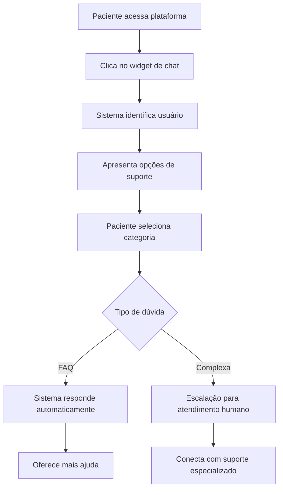
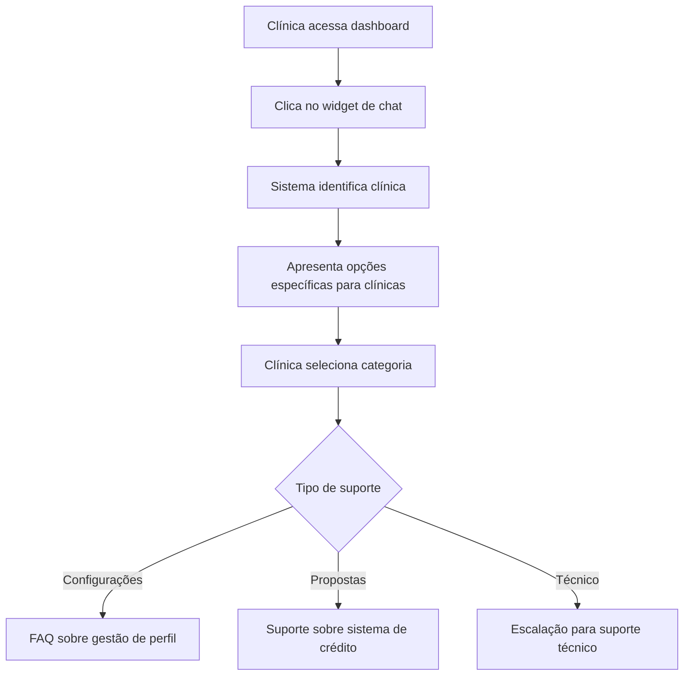

# Sistema de Chat de Suporte Doutorizze - Requisitos do Produto

## 1. Visão Geral do Produto

O Sistema de Chat de Suporte Doutorizze é uma funcionalidade integrada que permite pacientes e clínicas tirarem dúvidas sobre a plataforma, obterem suporte técnico e serem direcionados para atendimento humano quando necessário. O sistema aproveitará a infraestrutura de chat já existente, reativando e expandindo suas funcionalidades para atender especificamente às necessidades de suporte da plataforma.

## 2. Funcionalidades Principais

### 2.1 Papéis de Usuário

| Papel | Método de Acesso | Permissões Principais |
|-------|------------------|----------------------|
| Paciente | Login na plataforma ou acesso anônimo | Pode tirar dúvidas sobre cadastro, agendamentos, financiamento e usar funcionalidades básicas |
| Clínica | Login na plataforma | Pode obter suporte sobre gestão de perfil, propostas de crédito, configurações e funcionalidades avançadas |
| Usuário Anônimo | Acesso direto sem login | Pode obter informações gerais sobre a plataforma e processo de cadastro |

### 2.2 Módulos Funcionais

O sistema de chat de suporte será composto pelos seguintes módulos principais:

1. **Widget de Chat Integrado**: Widget flutuante disponível em todas as páginas principais
2. **Central de Mensagens**: Página dedicada para histórico e gestão de conversas
3. **Sistema de FAQ Inteligente**: Respostas automáticas baseadas em palavras-chave
4. **Escalação para Atendimento Humano**: Redirecionamento para suporte especializado
5. **Notificações em Tempo Real**: Alertas de novas mensagens e respostas

### 2.3 Detalhes das Páginas

| Página | Módulo | Descrição da Funcionalidade |
|--------|--------|------------------------------|
| **Dashboard Clínica** | Widget de Chat | Widget flutuante no canto inferior direito. Permite acesso rápido ao suporte para dúvidas sobre propostas, configurações e funcionalidades |
| **Dashboard Paciente** | Widget de Chat | Widget flutuante para suporte sobre agendamentos, financiamento e dúvidas gerais |
| **Central de Mensagens** | Histórico de Conversas | Lista todas as conversas anteriores, permite busca e continuação de chats |
| **Central de Mensagens** | Chat Ativo | Interface principal de conversa com suporte a texto, botões interativos e quick replies |
| **Todas as Páginas** | Sistema de Notificações | Indicadores visuais de novas mensagens e respostas do suporte |

## 3. Fluxos Principais de Uso

### Fluxo do Paciente:

### Fluxo da Clínica:

## 4. Design da Interface

### 4.1 Estilo de Design

- **Cores Primárias**: Azul (#3B82F6) para elementos principais, Verde (#10B981) para status online
- **Cores Secundárias**: Cinza (#6B7280) para texto secundário, Branco (#FFFFFF) para fundo
- **Estilo dos Botões**: Arredondados com sombra sutil, hover com transição suave
- **Tipografia**: Inter ou similar, tamanhos 14px para texto normal, 16px para títulos
- **Layout**: Design responsivo com foco mobile-first, widget flutuante não intrusivo
- **Ícones**: Lucide React para consistência, estilo outline preferencialmente

### 4.2 Elementos da Interface

| Página | Módulo | Elementos da Interface |
|--------|--------|------------------------|
| **Widget de Chat** | Botão Flutuante | Ícone de mensagem circular azul, badge de notificação vermelha, animação de pulse quando há mensagens |
| **Widget de Chat** | Janela de Chat | Cabeçalho com título "Suporte Doutorizze", área de mensagens com scroll, campo de input com botão enviar |
| **Central de Mensagens** | Lista de Conversas | Cards com avatar do suporte, última mensagem, timestamp, badge de não lidas |
| **Central de Mensagens** | Chat Interface | Bolhas de mensagem diferenciadas por cor, botões interativos estilizados, typing indicator animado |

### 4.3 Responsividade

O sistema será mobile-first com adaptações para desktop. O widget de chat se ajustará automaticamente ao tamanho da tela, ocupando mais espaço em dispositivos móveis e mantendo-se compacto em desktops.

## 5. Categorias de Suporte

### 5.1 Para Pacientes:
- **Cadastro e Login**: Como se cadastrar, recuperar senha, atualizar dados
- **Agendamentos**: Como agendar, cancelar, remarcar consultas
- **Financiamento**: Entender propostas de crédito, documentação necessária, aprovação
- **Pagamentos**: Formas de pagamento, parcelamento, dúvidas sobre valores
- **Problemas Técnicos**: Erros na plataforma, problemas de acesso, bugs

### 5.2 Para Clínicas:
- **Gestão de Perfil**: Editar informações, adicionar especialidades, configurar horários
- **Sistema de Crédito**: Entender propostas, configurar FIDCs, acompanhar solicitações
- **Relatórios**: Acessar dados de agendamentos, relatórios financeiros
- **Configurações**: Personalizar perfil, gerenciar equipe, configurações de notificação
- **Suporte Técnico**: Problemas com a plataforma, integrações, funcionalidades avançadas

## 6. Integrações Necessárias

### 6.1 Sistema de Autenticação
- Integração com Supabase Auth para identificar usuários
- Suporte a sessões anônimas para visitantes
- Persistência de conversas por usuário

### 6.2 Banco de Dados
- Utilização das tabelas existentes: `chat_sessions`, `chat_messages`, `faq_items`
- Extensão do schema para suporte a categorias e escalação
- Histórico completo de conversas

### 6.3 Notificações
- Notificações em tempo real via WebSocket
- Integração com sistema de emails para notificações offline
- Badge de contagem de mensagens não lidas

## 7. Métricas e Monitoramento

### 7.1 KPIs Principais
- Taxa de resolução automática via FAQ
- Tempo médio de resposta
- Satisfação do usuário (NPS)
- Volume de escalações para atendimento humano
- Taxa de abandono de conversas

### 7.2 Analytics
- Categorias de dúvidas mais frequentes
- Horários de maior demanda
- Efetividade das respostas automáticas
- Jornada do usuário no chat

## 8. Fases de Implementação

### Fase 1 - Reativação Básica (Sprint 1)
- Reativar ChatWidget nas páginas principais
- Conectar com sistema de autenticação atual
- Implementar FAQ básico para dúvidas comuns

### Fase 2 - Funcionalidades Avançadas (Sprint 2)
- Central de mensagens com dados reais
- Sistema de notificações
- Categorização de suporte por tipo de usuário

### Fase 3 - Otimizações (Sprint 3)
- Escalação inteligente para atendimento humano
- Analytics e métricas
- Melhorias na UX baseadas em feedback

## 9. Critérios de Sucesso

- ✅ Widget de chat funcional em todas as páginas principais
- ✅ Taxa de resolução automática > 70%
- ✅ Tempo médio de resposta < 30 segundos para FAQ
- ✅ Integração completa com sistema de autenticação
- ✅ Histórico de conversas persistente
- ✅ Sistema de notificações funcionando
- ✅ Interface responsiva e acessível
- ✅ Escalação para atendimento humano quando necessário