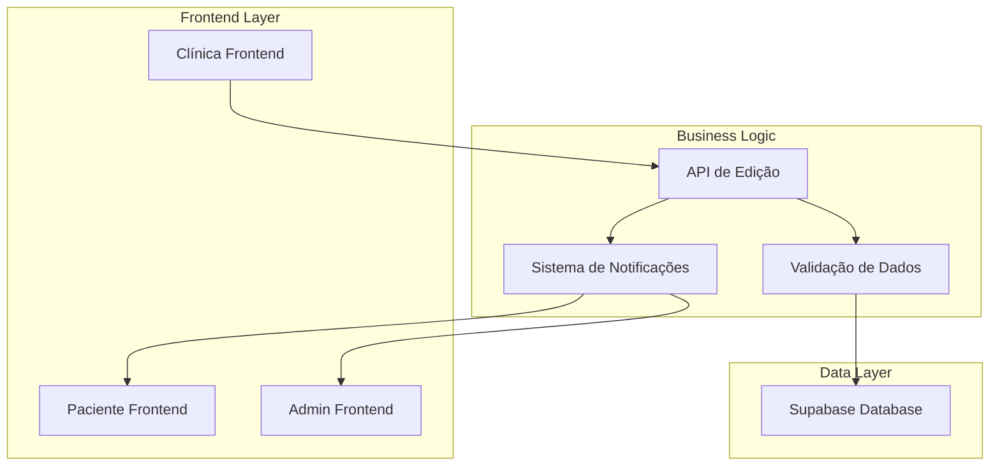
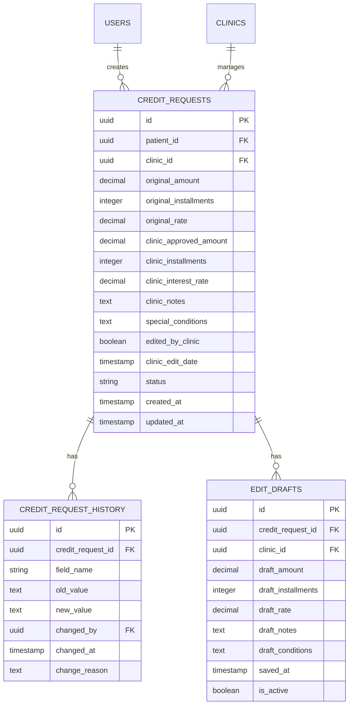

# Arquitetura Técnica - Edição de Valores pela Clínica

## 1. Arquitetura do Sistema



## 2. Tecnologias Utilizadas

- **Frontend**: React@18 + TypeScript + Tailwind CSS
- **Backend**: Supabase (PostgreSQL + Auth + Real-time)
- **Validação**: Zod para validação de schemas
- **Notificações**: Supabase Real-time subscriptions
- **Estado**: React hooks + Context API

## 3. Definições de Rotas

| Rota | Propósito | Componente |
|------|-----------|------------|
| /clinic-dashboard | Dashboard principal da clínica | ClinicDashboard.tsx |
| /clinic-dashboard/edit/:id | Modal de edição de valores | EditValueModal.tsx |
| /clinic-dashboard/history/:id | Histórico de alterações | EditHistoryModal.tsx |

## 4. APIs e Endpoints

### 4.1 APIs de Edição de Valores

**Buscar solicitação para edição**
```typescript
GET /api/credit-requests/:id/edit-details

Response:
{
  id: string;
  originalAmount: number;
  originalInstallments: number;
  originalRate: number;
  currentAmount: number;
  currentInstallments: number;
  currentRate: number;
  canEdit: boolean;
  editHistory: EditHistory[];
}
```

**Salvar alterações (rascunho)**
```typescript
POST /api/credit-requests/:id/save-draft

Request:
{
  newAmount: number;
  newInstallments: number;
  newRate: number;
  clinicNotes: string;
  specialConditions: string;
}

Response:
{
  success: boolean;
  draftId: string;
  calculatedValues: {
    monthlyPayment: number;
    totalAmount: number;
    totalInterest: number;
  }
}
```

**Enviar para admin**
```typescript
POST /api/credit-requests/:id/submit-to-admin

Request:
{
  finalAmount: number;
  finalInstallments: number;
  finalRate: number;
  clinicNotes: string;
  specialConditions: string;
}

Response:
{
  success: boolean;
  newStatus: string;
  submissionId: string;
}
```

### 4.2 APIs de Histórico

**Buscar histórico de alterações**
```typescript
GET /api/credit-requests/:id/edit-history

Response:
{
  history: [
    {
      id: string;
      fieldName: string;
      oldValue: string;
      newValue: string;
      changedBy: string;
      changedAt: string;
      changeReason: string;
    }
  ]
}
```

## 5. Estrutura do Banco de Dados

### 5.1 Modelo de Dados Atualizado



### 5.2 DDL - Criação das Tabelas

```sql
-- Adicionar campos à tabela existente credit_requests
ALTER TABLE credit_requests 
ADD COLUMN clinic_approved_amount DECIMAL(10,2),
ADD COLUMN clinic_installments INTEGER,
ADD COLUMN clinic_interest_rate DECIMAL(5,2) DEFAULT 2.5,
ADD COLUMN clinic_notes TEXT,
ADD COLUMN special_conditions TEXT,
ADD COLUMN edited_by_clinic BOOLEAN DEFAULT FALSE,
ADD COLUMN clinic_edit_date TIMESTAMP WITH TIME ZONE;

-- Criar tabela de histórico de alterações
CREATE TABLE credit_request_history (
    id UUID PRIMARY KEY DEFAULT gen_random_uuid(),
    credit_request_id UUID REFERENCES credit_requests(id) ON DELETE CASCADE,
    field_name VARCHAR(100) NOT NULL,
    old_value TEXT,
    new_value TEXT,
    changed_by UUID REFERENCES auth.users(id),
    changed_at TIMESTAMP WITH TIME ZONE DEFAULT NOW(),
    change_reason TEXT
);

-- Criar tabela de rascunhos
CREATE TABLE edit_drafts (
    id UUID PRIMARY KEY DEFAULT gen_random_uuid(),
    credit_request_id UUID REFERENCES credit_requests(id) ON DELETE CASCADE,
    clinic_id UUID REFERENCES clinics(id),
    draft_amount DECIMAL(10,2),
    draft_installments INTEGER,
    draft_rate DECIMAL(5,2),
    draft_notes TEXT,
    draft_conditions TEXT,
    saved_at TIMESTAMP WITH TIME ZONE DEFAULT NOW(),
    is_active BOOLEAN DEFAULT TRUE
);

-- Índices para performance
CREATE INDEX idx_credit_history_request_id ON credit_request_history(credit_request_id);
CREATE INDEX idx_credit_history_changed_at ON credit_request_history(changed_at DESC);
CREATE INDEX idx_edit_drafts_request_id ON edit_drafts(credit_request_id);
CREATE INDEX idx_edit_drafts_clinic_id ON edit_drafts(clinic_id);

-- RLS Policies
ALTER TABLE credit_request_history ENABLE ROW LEVEL SECURITY;
ALTER TABLE edit_drafts ENABLE ROW LEVEL SECURITY;

-- Política para histórico - apenas clínicas e admins podem ver
CREATE POLICY "Clinics can view history of their requests" ON credit_request_history
    FOR SELECT USING (
        EXISTS (
            SELECT 1 FROM credit_requests cr
            JOIN clinics c ON c.id = cr.clinic_id
            WHERE cr.id = credit_request_id
            AND c.master_user_id = auth.uid()
        )
    );

-- Política para rascunhos - apenas a clínica proprietária
CREATE POLICY "Clinics can manage their drafts" ON edit_drafts
    FOR ALL USING (
        EXISTS (
            SELECT 1 FROM clinics c
            WHERE c.id = clinic_id
            AND c.master_user_id = auth.uid()
        )
    );
```

## 6. Componentes Frontend

### 6.1 Estrutura de Componentes

```
src/components/clinic/
├── EditValueModal.tsx          # Modal principal de edição
├── ValueCalculator.tsx         # Calculadora de valores
├── EditHistory.tsx            # Histórico de alterações
├── DraftManager.tsx           # Gerenciador de rascunhos
└── EditValidation.tsx         # Validações de formulário
```

### 6.2 Interfaces TypeScript

```typescript
// Tipos para edição de valores
interface CreditRequestEdit {
  id: string;
  originalAmount: number;
  originalInstallments: number;
  originalRate: number;
  clinicApprovedAmount?: number;
  clinicInstallments?: number;
  clinicInterestRate?: number;
  clinicNotes?: string;
  specialConditions?: string;
  editedByClinic: boolean;
  clinicEditDate?: string;
}

// Tipos para histórico
interface EditHistory {
  id: string;
  fieldName: string;
  oldValue: string;
  newValue: string;
  changedBy: string;
  changedAt: string;
  changeReason: string;
}

// Tipos para rascunhos
interface EditDraft {
  id: string;
  creditRequestId: string;
  clinicId: string;
  draftAmount: number;
  draftInstallments: number;
  draftRate: number;
  draftNotes: string;
  draftConditions: string;
  savedAt: string;
  isActive: boolean;
}

// Tipos para cálculos
interface ValueCalculation {
  monthlyPayment: number;
  totalAmount: number;
  totalInterest: number;
  effectiveRate: number;
}
```

### 6.3 Hooks Customizados

```typescript
// Hook para edição de valores
const useEditValues = (creditRequestId: string) => {
  const [editData, setEditData] = useState<CreditRequestEdit | null>(null);
  const [isLoading, setIsLoading] = useState(false);
  const [calculations, setCalculations] = useState<ValueCalculation | null>(null);

  const loadEditData = async () => { /* ... */ };
  const saveDraft = async (values: Partial<CreditRequestEdit>) => { /* ... */ };
  const submitToAdmin = async (values: CreditRequestEdit) => { /* ... */ };
  const calculateValues = (amount: number, installments: number, rate: number) => { /* ... */ };

  return {
    editData,
    isLoading,
    calculations,
    loadEditData,
    saveDraft,
    submitToAdmin,
    calculateValues
  };
};

// Hook para histórico
const useEditHistory = (creditRequestId: string) => {
  const [history, setHistory] = useState<EditHistory[]>([]);
  const [isLoading, setIsLoading] = useState(false);

  const loadHistory = async () => { /* ... */ };
  const addHistoryEntry = async (entry: Omit<EditHistory, 'id' | 'changedAt'>) => { /* ... */ };

  return {
    history,
    isLoading,
    loadHistory,
    addHistoryEntry
  };
};
```

## 7. Validações e Regras de Negócio

### 7.1 Schema de Validação (Zod)

```typescript
import { z } from 'zod';

const EditValuesSchema = z.object({
  newAmount: z.number()
    .min(100, 'Valor mínimo é R$ 100,00')
    .max(50000, 'Valor máximo é R$ 50.000,00'),
  
  newInstallments: z.number()
    .int('Número de parcelas deve ser inteiro')
    .min(1, 'Mínimo 1 parcela')
    .max(60, 'Máximo 60 parcelas'),
  
  newRate: z.number()
    .min(0, 'Taxa não pode ser negativa')
    .max(15, 'Taxa máxima é 15% ao mês'),
  
  clinicNotes: z.string()
    .max(500, 'Máximo 500 caracteres'),
  
  specialConditions: z.string()
    .max(1000, 'Máximo 1000 caracteres')
});

type EditValuesForm = z.infer<typeof EditValuesSchema>;
```

### 7.2 Funções de Cálculo

```typescript
// Cálculo de parcela com juros compostos
const calculateMonthlyPayment = (
  amount: number, 
  installments: number, 
  monthlyRate: number
): number => {
  if (monthlyRate === 0) {
    return amount / installments;
  }
  
  const rate = monthlyRate / 100;
  const factor = Math.pow(1 + rate, installments);
  return (amount * rate * factor) / (factor - 1);
};

// Cálculo do total a pagar
const calculateTotalAmount = (
  monthlyPayment: number, 
  installments: number
): number => {
  return monthlyPayment * installments;
};

// Cálculo do total de juros
const calculateTotalInterest = (
  totalAmount: number, 
  principalAmount: number
): number => {
  return totalAmount - principalAmount;
};
```

## 8. Sistema de Notificações

### 8.1 Eventos de Notificação

```typescript
enum NotificationEvents {
  VALUES_EDITED = 'values_edited',
  SUBMITTED_TO_ADMIN = 'submitted_to_admin',
  ADMIN_APPROVED = 'admin_approved',
  ADMIN_REJECTED = 'admin_rejected'
}

interface NotificationPayload {
  creditRequestId: string;
  patientId: string;
  clinicId: string;
  event: NotificationEvents;
  data: {
    originalAmount?: number;
    newAmount?: number;
    changes?: string[];
  };
}
```

### 8.2 Implementação com Supabase Real-time

```typescript
// Subscription para notificações em tempo real
const useNotifications = () => {
  useEffect(() => {
    const subscription = supabase
      .channel('credit_request_changes')
      .on('postgres_changes', {
        event: 'UPDATE',
        schema: 'public',
        table: 'credit_requests',
        filter: `clinic_id=eq.${clinicId}`
      }, (payload) => {
        // Processar notificação
        handleNotification(payload);
      })
      .subscribe();

    return () => {
      subscription.unsubscribe();
    };
  }, [clinicId]);
};
```

## 9. Testes

### 9.1 Testes Unitários

```typescript
// Teste de cálculos
describe('Value Calculations', () => {
  test('should calculate monthly payment correctly', () => {
    const result = calculateMonthlyPayment(10000, 12, 2.5);
    expect(result).toBeCloseTo(906.62, 2);
  });

  test('should handle zero interest rate', () => {
    const result = calculateMonthlyPayment(12000, 12, 0);
    expect(result).toBe(1000);
  });
});

// Teste de validações
describe('Edit Validations', () => {
  test('should reject amount below minimum', () => {
    const result = EditValuesSchema.safeParse({
      newAmount: 50,
      newInstallments: 12,
      newRate: 2.5
    });
    expect(result.success).toBe(false);
  });
});
```

### 9.2 Testes de Integração

```typescript
// Teste do fluxo completo
describe('Edit Values Flow', () => {
  test('should complete edit and submit flow', async () => {
    // 1. Carregar dados para edição
    const editData = await loadEditData(creditRequestId);
    expect(editData).toBeDefined();

    // 2. Salvar rascunho
    const draftResult = await saveDraft({
      newAmount: 15000,
      newInstallments: 18,
      newRate: 2.0
    });
    expect(draftResult.success).toBe(true);

    // 3. Submeter para admin
    const submitResult = await submitToAdmin(editData);
    expect(submitResult.success).toBe(true);
    expect(submitResult.newStatus).toBe('Aguardando Admin');
  });
});
```

## 10. Performance e Otimização

### 10.1 Estratégias de Cache

- Cache de cálculos matemáticos
- Debounce em inputs de valores
- Lazy loading do histórico de alterações
- Paginação para histórico extenso

### 10.2 Otimizações de Banco

- Índices em campos de busca frequente
- Particionamento da tabela de histórico por data
- Limpeza automática de rascunhos antigos
- Compressão de dados de histórico

---

**Documento criado em**: 29/09/2025  
**Versão**: 1.0  
**Status**: Arquitetura Técnica Completa  
**Próximos Passos**: Implementação dos componentes frontend