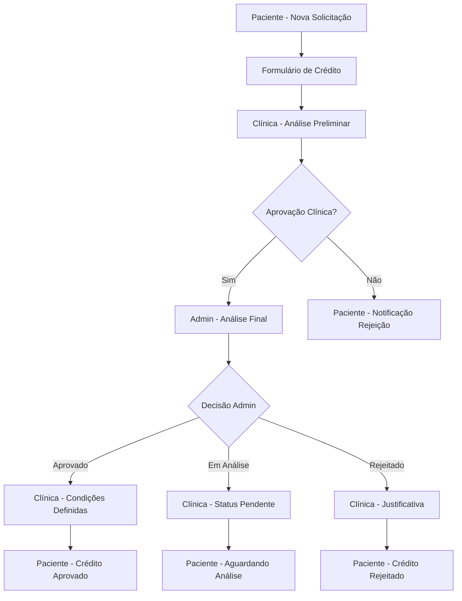

# Sistema de Solicitação de Crédito - Doutorizze

## 1. Product Overview

Sistema completo de solicitação e análise de crédito que conecta pacientes, clínicas e administradores em um fluxo estruturado de aprovação financeira.

O sistema resolve o problema de financiamento de tratamentos médicos, permitindo que pacientes solicitem crédito de forma digital, clínicas analisem preliminarmente as solicitações e administradores tomem decisões finais com base em critérios técnicos e financeiros.

O objetivo é democratizar o acesso a tratamentos médicos através de um processo de crédito transparente, ágil e seguro.

## 2. Core Features

### 2.1 User Roles

| Role | Registration Method | Core Permissions |
|------|---------------------|------------------|
| Paciente | Email + CPF + dados pessoais | Solicitar crédito, acompanhar status, visualizar histórico |
| Clínica | Convite do administrador + CNPJ | Analisar solicitações, aprovar/rejeitar, encaminhar para admin |
| Administrador | Acesso direto do sistema | Análise final, definir condições financeiras, aprovar/rejeitar |

### 2.2 Feature Module

Nosso sistema de crédito consiste nas seguintes páginas principais:

1. **Painel do Paciente**: dashboard de solicitações, formulário de nova solicitação, histórico de créditos.
2. **Painel da Clínica**: lista de solicitações recebidas, análise de dados do paciente, encaminhamento para administrador.
3. **Painel do Administrador**: fila de análise, definição de condições financeiras, aprovação/rejeição final.
4. **Sistema de Notificações**: alertas em tempo real, histórico de comunicações, status updates.
5. **Página de Detalhes da Solicitação**: visualização completa dos dados, histórico de alterações, comentários.

### 2.3 Page Details

| Page Name | Module Name | Feature description |
|-----------|-------------|---------------------|
| Painel do Paciente | Dashboard | Visualizar status de solicitações ativas, histórico de créditos anteriores |
| Painel do Paciente | Formulário de Solicitação | Preencher dados pessoais, financeiros, valor solicitado, finalidade do crédito |
| Painel do Paciente | Histórico | Acompanhar todas as solicitações com timeline detalhado |
| Painel da Clínica | Lista de Solicitações | Visualizar solicitações pendentes ordenadas por prioridade |
| Painel da Clínica | Análise Preliminar | Revisar dados do paciente, adicionar comentários, aprovar/rejeitar |
| Painel da Clínica | Encaminhamento | Enviar solicitação aprovada para análise do administrador |
| Painel do Administrador | Fila de Análise | Gerenciar solicitações por status e prioridade |
| Painel do Administrador | Análise Final | Definir taxas de juros, condições, prazo, valor aprovado |
| Painel do Administrador | Decisão Final | Aprovar com condições, manter em análise ou rejeitar com justificativa |
| Sistema de Notificações | Alertas | Notificações push e email para mudanças de status |
| Sistema de Notificações | Histórico | Registro completo de todas as comunicações |
| Detalhes da Solicitação | Visualização Completa | Todos os dados da solicitação, documentos anexados |
| Detalhes da Solicitação | Timeline | Histórico cronológico de todas as alterações e comentários |

## 3. Core Process

### Fluxo Principal do Paciente:
1. Paciente acessa o painel e clica em "Nova Solicitação de Crédito"
2. Preenche formulário completo com dados pessoais, financeiros e valor desejado
3. Anexa documentos necessários (RG, CPF, comprovante de renda)
4. Submete solicitação que é enviada automaticamente para a clínica
5. Acompanha status em tempo real através do painel
6. Recebe notificação final com resultado da análise

### Fluxo da Clínica:
1. Recebe notificação de nova solicitação no painel
2. Acessa detalhes completos da solicitação do paciente
3. Realiza análise preliminar dos dados e documentos
4. Adiciona comentários e observações internas
5. Aprova e encaminha para administrador ou rejeita com justificativa
6. Recebe retorno do administrador com decisão final
7. Encaminha resposta final para o paciente

### Fluxo do Administrador:
1. Recebe solicitações aprovadas pela clínica na fila de análise
2. Revisa dados completos e análise preliminar da clínica
3. Realiza análise técnica e financeira detalhada
4. Define condições financeiras (taxa de juros, prazo, valor)
5. Toma decisão final: aprovar, manter em análise ou rejeitar
6. Envia resposta de volta para a clínica com todas as especificações

## 4. User Interface Design

### 4.1 Design Style

- **Cores Primárias**: Azul (#2563EB) para ações principais, Verde (#10B981) para aprovações
- **Cores Secundárias**: Cinza (#6B7280) para textos, Vermelho (#EF4444) para rejeições, Amarelo (#F59E0B) para pendências
- **Estilo de Botões**: Arredondados com sombra sutil, estados hover bem definidos
- **Tipografia**: Inter ou similar, tamanhos 14px (corpo), 18px (subtítulos), 24px (títulos)
- **Layout**: Card-based com navegação lateral, design limpo e profissional
- **Ícones**: Outline style, consistentes com tema médico/financeiro

### 4.2 Page Design Overview

| Page Name | Module Name | UI Elements |
|-----------|-------------|-------------|
| Painel do Paciente | Dashboard | Cards com status coloridos, progress bars, botão CTA destacado |
| Formulário de Solicitação | Form Steps | Wizard multi-step, validação em tempo real, upload de documentos |
| Painel da Clínica | Lista de Solicitações | Tabela responsiva, filtros, badges de status, ações rápidas |
| Análise Preliminar | Review Interface | Layout split-screen, dados à esquerda, ações à direita |
| Painel do Administrador | Analytics Dashboard | KPIs no topo, fila de análise, gráficos de performance |
| Análise Final | Decision Interface | Formulário de condições, calculadora de juros, botões de decisão |
| Notificações | Alert System | Toast notifications, centro de notificações, badges de contagem |
| Timeline | Activity Feed | Lista cronológica, ícones de status, expandir/colapsar detalhes |

### 4.3 Responsiveness

Sistema desktop-first com adaptação completa para mobile. Navegação lateral colapsa em menu hambúrguer, tabelas se transformam em cards empilhados, formulários mantêm usabilidade em telas pequenas com otimização para touch.