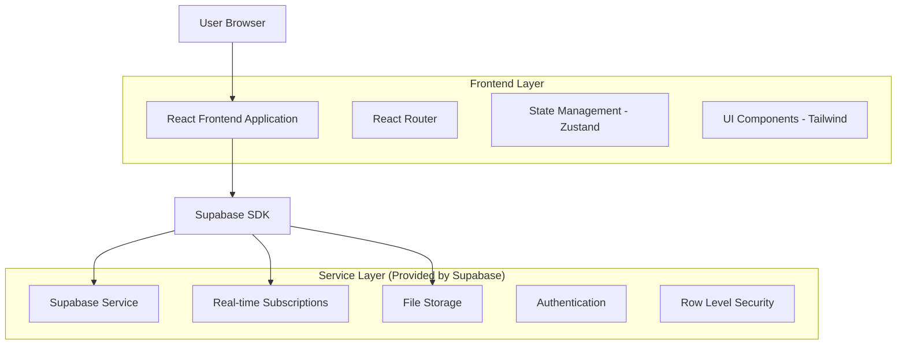
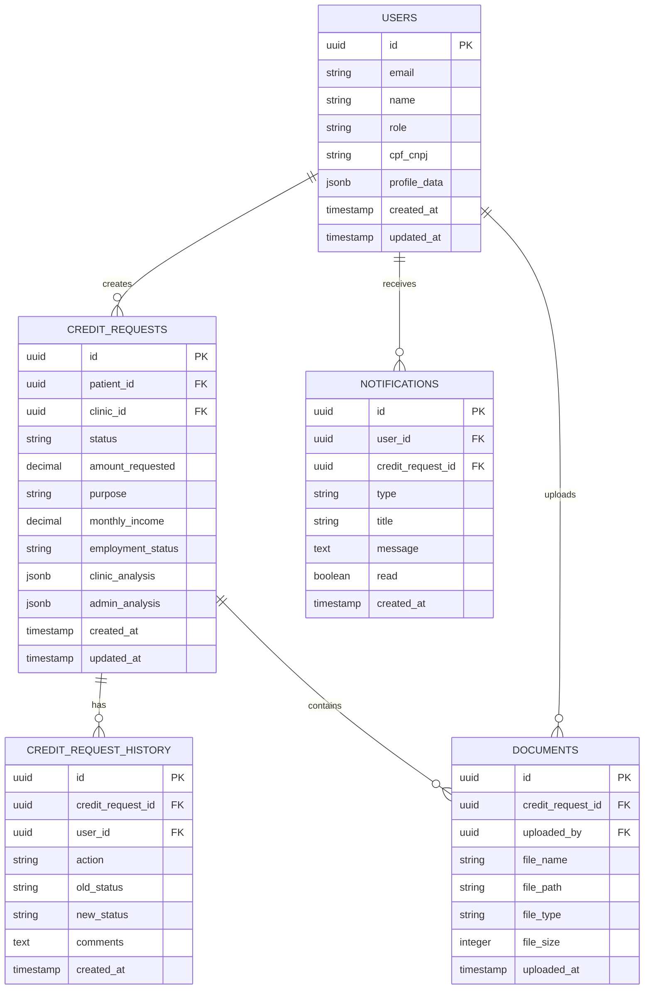

# Arquitetura Técnica - Sistema de Solicitação de Crédito

## 1. Architecture Design



## 2. Technology Description

- Frontend: React@18 + TypeScript + Tailwind CSS@3 + Vite + Zustand
- Backend: Supabase (PostgreSQL + Real-time + Auth + Storage)
- Notifications: Supabase Real-time + Email notifications
- File Upload: Supabase Storage para documentos

## 3. Route Definitions

| Route | Purpose |
|-------|----------|
| /paciente/dashboard | Dashboard principal do paciente com solicitações |
| /paciente/nova-solicitacao | Formulário de nova solicitação de crédito |
| /paciente/historico | Histórico completo de solicitações |
| /clinica/dashboard | Dashboard da clínica com solicitações pendentes |
| /clinica/analise/:id | Página de análise detalhada da solicitação |
| /clinica/notificacoes | Centro de notificações da clínica |
| /admin/dashboard | Dashboard administrativo com KPIs |
| /admin/fila-analise | Fila de solicitações para análise final |
| /admin/analise/:id | Interface de análise e decisão final |
| /solicitacao/:id | Página de detalhes da solicitação (compartilhada) |

## 4. API Definitions

### 4.1 Core Types

```typescript
type CreditRequestStatus = 
  | 'rascunho'
  | 'enviado'
  | 'em_analise_clinica'
  | 'aprovado_clinica'
  | 'rejeitado_clinica'
  | 'em_analise_admin'
  | 'aprovado_final'
  | 'rejeitado_final'
  | 'em_analise_pendente';

type UserRole = 'paciente' | 'clinica' | 'admin';

interface CreditRequest {
  id: string;
  patient_id: string;
  clinic_id: string;
  status: CreditRequestStatus;
  amount_requested: number;
  purpose: string;
  monthly_income: number;
  employment_status: string;
  documents: string[]; // URLs dos documentos
  clinic_analysis?: ClinicAnalysis;
  admin_analysis?: AdminAnalysis;
  created_at: string;
  updated_at: string;
}

interface ClinicAnalysis {
  approved: boolean;
  comments: string;
  risk_assessment: 'baixo' | 'medio' | 'alto';
  recommended_amount?: number;
  analyst_id: string;
  analyzed_at: string;
}

interface AdminAnalysis {
  decision: 'aprovado' | 'rejeitado' | 'em_analise';
  approved_amount?: number;
  interest_rate?: number;
  installments?: number;
  monthly_payment?: number;
  conditions?: string;
  rejection_reason?: string;
  analyst_id: string;
  analyzed_at: string;
}

interface Notification {
  id: string;
  user_id: string;
  credit_request_id: string;
  type: 'status_change' | 'new_request' | 'decision_made';
  title: string;
  message: string;
  read: boolean;
  created_at: string;
}
```

### 4.2 Supabase Functions

```sql
-- Função para criar nova solicitação
CREATE OR REPLACE FUNCTION create_credit_request(
  p_patient_id UUID,
  p_clinic_id UUID,
  p_amount_requested DECIMAL,
  p_purpose TEXT,
  p_monthly_income DECIMAL,
  p_employment_status TEXT
) RETURNS UUID AS $$
DECLARE
  new_request_id UUID;
BEGIN
  INSERT INTO credit_requests (
    patient_id, clinic_id, amount_requested, purpose,
    monthly_income, employment_status, status
  ) VALUES (
    p_patient_id, p_clinic_id, p_amount_requested, p_purpose,
    p_monthly_income, p_employment_status, 'enviado'
  ) RETURNING id INTO new_request_id;
  
  -- Criar notificação para a clínica
  PERFORM create_notification(
    p_clinic_id,
    new_request_id,
    'new_request',
    'Nova Solicitação de Crédito',
    'Uma nova solicitação de crédito foi recebida para análise.'
  );
  
  RETURN new_request_id;
END;
$$ LANGUAGE plpgsql;

-- Função para análise da clínica
CREATE OR REPLACE FUNCTION clinic_analyze_request(
  p_request_id UUID,
  p_analyst_id UUID,
  p_approved BOOLEAN,
  p_comments TEXT,
  p_risk_assessment TEXT,
  p_recommended_amount DECIMAL DEFAULT NULL
) RETURNS VOID AS $$
BEGIN
  UPDATE credit_requests SET
    clinic_analysis = jsonb_build_object(
      'approved', p_approved,
      'comments', p_comments,
      'risk_assessment', p_risk_assessment,
      'recommended_amount', p_recommended_amount,
      'analyst_id', p_analyst_id,
      'analyzed_at', NOW()
    ),
    status = CASE 
      WHEN p_approved THEN 'aprovado_clinica'
      ELSE 'rejeitado_clinica'
    END,
    updated_at = NOW()
  WHERE id = p_request_id;
  
  -- Notificar paciente e admin (se aprovado)
  IF p_approved THEN
    PERFORM notify_admin_new_request(p_request_id);
  END IF;
  
  PERFORM notify_patient_status_change(p_request_id);
END;
$$ LANGUAGE plpgsql;

-- Função para decisão final do admin
CREATE OR REPLACE FUNCTION admin_final_decision(
  p_request_id UUID,
  p_analyst_id UUID,
  p_decision TEXT,
  p_approved_amount DECIMAL DEFAULT NULL,
  p_interest_rate DECIMAL DEFAULT NULL,
  p_installments INTEGER DEFAULT NULL,
  p_conditions TEXT DEFAULT NULL,
  p_rejection_reason TEXT DEFAULT NULL
) RETURNS VOID AS $$
BEGIN
  UPDATE credit_requests SET
    admin_analysis = jsonb_build_object(
      'decision', p_decision,
      'approved_amount', p_approved_amount,
      'interest_rate', p_interest_rate,
      'installments', p_installments,
      'monthly_payment', CASE 
        WHEN p_approved_amount IS NOT NULL AND p_installments IS NOT NULL 
        THEN calculate_monthly_payment(p_approved_amount, p_interest_rate, p_installments)
        ELSE NULL
      END,
      'conditions', p_conditions,
      'rejection_reason', p_rejection_reason,
      'analyst_id', p_analyst_id,
      'analyzed_at', NOW()
    ),
    status = CASE p_decision
      WHEN 'aprovado' THEN 'aprovado_final'
      WHEN 'rejeitado' THEN 'rejeitado_final'
      ELSE 'em_analise_pendente'
    END,
    updated_at = NOW()
  WHERE id = p_request_id;
  
  -- Notificar clínica e paciente
  PERFORM notify_clinic_admin_decision(p_request_id);
  PERFORM notify_patient_status_change(p_request_id);
END;
$$ LANGUAGE plpgsql;
```

## 5. Data Model

### 5.1 Data Model Definition



### 5.2 Data Definition Language

```sql
-- Tabela de usuários (estende auth.users do Supabase)
CREATE TABLE public.users (
    id UUID PRIMARY KEY REFERENCES auth.users(id) ON DELETE CASCADE,
    email VARCHAR(255) UNIQUE NOT NULL,
    name VARCHAR(255) NOT NULL,
    role VARCHAR(20) NOT NULL CHECK (role IN ('paciente', 'clinica', 'admin')),
    cpf_cnpj VARCHAR(20),
    profile_data JSONB DEFAULT '{}',
    created_at TIMESTAMP WITH TIME ZONE DEFAULT NOW(),
    updated_at TIMESTAMP WITH TIME ZONE DEFAULT NOW()
);

-- Tabela de solicitações de crédito
CREATE TABLE credit_requests (
    id UUID PRIMARY KEY DEFAULT gen_random_uuid(),
    patient_id UUID NOT NULL REFERENCES public.users(id),
    clinic_id UUID NOT NULL REFERENCES public.users(id),
    status VARCHAR(30) NOT NULL DEFAULT 'rascunho' CHECK (
        status IN (
            'rascunho', 'enviado', 'em_analise_clinica', 
            'aprovado_clinica', 'rejeitado_clinica', 
            'em_analise_admin', 'aprovado_final', 
            'rejeitado_final', 'em_analise_pendente'
        )
    ),
    amount_requested DECIMAL(12,2) NOT NULL,
    purpose TEXT NOT NULL,
    monthly_income DECIMAL(12,2) NOT NULL,
    employment_status VARCHAR(50) NOT NULL,
    clinic_analysis JSONB,
    admin_analysis JSONB,
    created_at TIMESTAMP WITH TIME ZONE DEFAULT NOW(),
    updated_at TIMESTAMP WITH TIME ZONE DEFAULT NOW()
);

-- Tabela de notificações
CREATE TABLE notifications (
    id UUID PRIMARY KEY DEFAULT gen_random_uuid(),
    user_id UUID NOT NULL REFERENCES public.users(id),
    credit_request_id UUID REFERENCES credit_requests(id),
    type VARCHAR(20) NOT NULL CHECK (type IN ('status_change', 'new_request', 'decision_made')),
    title VARCHAR(255) NOT NULL,
    message TEXT NOT NULL,
    read BOOLEAN DEFAULT FALSE,
    created_at TIMESTAMP WITH TIME ZONE DEFAULT NOW()
);

-- Tabela de histórico
CREATE TABLE credit_request_history (
    id UUID PRIMARY KEY DEFAULT gen_random_uuid(),
    credit_request_id UUID NOT NULL REFERENCES credit_requests(id),
    user_id UUID NOT NULL REFERENCES public.users(id),
    action VARCHAR(50) NOT NULL,
    old_status VARCHAR(30),
    new_status VARCHAR(30),
    comments TEXT,
    created_at TIMESTAMP WITH TIME ZONE DEFAULT NOW()
);

-- Tabela de documentos
CREATE TABLE documents (
    id UUID PRIMARY KEY DEFAULT gen_random_uuid(),
    credit_request_id UUID NOT NULL REFERENCES credit_requests(id),
    uploaded_by UUID NOT NULL REFERENCES public.users(id),
    file_name VARCHAR(255) NOT NULL,
    file_path VARCHAR(500) NOT NULL,
    file_type VARCHAR(50) NOT NULL,
    file_size INTEGER NOT NULL,
    uploaded_at TIMESTAMP WITH TIME ZONE DEFAULT NOW()
);

-- Índices para performance
CREATE INDEX idx_credit_requests_patient_id ON credit_requests(patient_id);
CREATE INDEX idx_credit_requests_clinic_id ON credit_requests(clinic_id);
CREATE INDEX idx_credit_requests_status ON credit_requests(status);
CREATE INDEX idx_credit_requests_created_at ON credit_requests(created_at DESC);
CREATE INDEX idx_notifications_user_id ON notifications(user_id);
CREATE INDEX idx_notifications_read ON notifications(read);
CREATE INDEX idx_documents_credit_request_id ON documents(credit_request_id);

-- Row Level Security (RLS)
ALTER TABLE public.users ENABLE ROW LEVEL SECURITY;
ALTER TABLE credit_requests ENABLE ROW LEVEL SECURITY;
ALTER TABLE notifications ENABLE ROW LEVEL SECURITY;
ALTER TABLE credit_request_history ENABLE ROW LEVEL SECURITY;
ALTER TABLE documents ENABLE ROW LEVEL SECURITY;

-- Políticas de segurança
-- Usuários podem ver apenas seus próprios dados
CREATE POLICY "Users can view own profile" ON public.users
    FOR SELECT USING (auth.uid() = id);

CREATE POLICY "Users can update own profile" ON public.users
    FOR UPDATE USING (auth.uid() = id);

-- Solicitações de crédito
CREATE POLICY "Patients can view own requests" ON credit_requests
    FOR SELECT USING (
        auth.uid() = patient_id OR 
        auth.uid() = clinic_id OR 
        EXISTS (SELECT 1 FROM public.users WHERE id = auth.uid() AND role = 'admin')
    );

CREATE POLICY "Patients can create requests" ON credit_requests
    FOR INSERT WITH CHECK (auth.uid() = patient_id);

CREATE POLICY "Clinics and admins can update requests" ON credit_requests
    FOR UPDATE USING (
        auth.uid() = clinic_id OR 
        EXISTS (SELECT 1 FROM public.users WHERE id = auth.uid() AND role