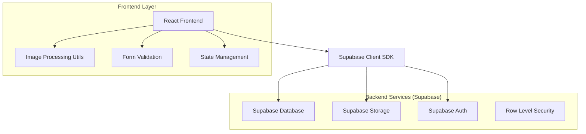
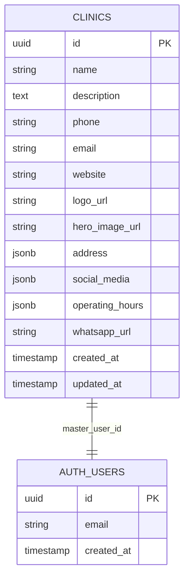

# Editor de Perfil Completo da Clínica - Arquitetura Técnica

## 1. Architecture design



## 2. Technology Description

* **Frontend**: React\@18 + TypeScript + Tailwind CSS + Vite

* **Backend**: Supabase (PostgreSQL + Storage + Auth)

* **Image Processing**: Canvas API + File API para resize e crop

* **Form Validation**: React Hook Form + Zod

* **State Management**: React useState + useEffect

* **Upload**: Supabase Storage com progress tracking

## 3. Route definitions

| Route                   | Purpose                              |
| ----------------------- | ------------------------------------ |
| /clinic/dashboard       | Dashboard principal da clínica       |
| /clinic/profile/edit    | Editor completo de perfil da clínica |
| /clinic/profile/preview | Preview do perfil público da clínica |

## 4. API definitions

### 4.1 Core API

**Buscar dados da clínica**

```
GET /rest/v1/clinics?select=*&id=eq.{clinic_id}
```

Request Headers:

| Header Name   | Header Type | isRequired | Description               |
| ------------- | ----------- | ---------- | ------------------------- |
| Authorization | string      | true       | Bearer token do Supabase  |
| apikey        | string      | true       | Chave pública do Supabase |

Response:

| Param Name       | Param Type | Description               |
| ---------------- | ---------- | ------------------------- |
| id               | uuid       | ID único da clínica       |
| name             | string     | Nome da clínica           |
| description      | string     | Descrição detalhada       |
| phone            | string     | Telefone da clínica       |
| email            | string     | Email da clínica          |
| website          | string     | Website da clínica        |
| logo\_url        | string     | URL do logo               |
| hero\_image\_url | string     | URL da imagem de capa     |
| address          | jsonb      | Endereço completo         |
| social\_media    | jsonb      | Links das redes sociais   |
| operating\_hours | jsonb      | Horários de funcionamento |
| whatsapp\_url    | string     | Link do WhatsApp          |

**Atualizar dados da clínica**

```
PATCH /rest/v1/clinics?id=eq.{clinic_id}
```

Request:

| Param Name       | Param Type | isRequired | Description                  |
| ---------------- | ---------- | ---------- | ---------------------------- |
| name             | string     | false      | Nome da clínica              |
| description      | string     | false      | Descrição da clínica         |
| phone            | string     | false      | Telefone formatado           |
| email            | string     | false      | Email válido                 |
| website          | string     | false      | URL do website               |
| address          | jsonb      | false      | Objeto com endereço completo |
| social\_media    | jsonb      | false      | Objeto com redes sociais     |
| operating\_hours | jsonb      | false      | Objeto com horários          |
| whatsapp\_url    | string     | false      | URL do WhatsApp              |

**Upload de imagens**

```
POST /storage/v1/object/clinic-images/{filename}
```

Request:

| Param Name | Param Type | isRequired | Description                        |
| ---------- | ---------- | ---------- | ---------------------------------- |
| file       | File       | true       | Arquivo de imagem (PNG, JPG, WebP) |

Response:

| Param Name | Param Type | Description                   |
| ---------- | ---------- | ----------------------------- |
| Key        | string     | Caminho do arquivo no storage |
| Id         | string     | ID único do arquivo           |

## 5. Data model

### 5.1 Data model definition



### 5.2 Data Definition Language

**Estrutura da tabela clinics (campos relevantes para o editor)**

```sql
-- Campos básicos
ALTER TABLE clinics 
ADD COLUMN IF NOT EXISTS description TEXT,
ADD COLUMN IF NOT EXISTS phone VARCHAR(20),
ADD COLUMN IF NOT EXISTS email VARCHAR(255),
ADD COLUMN IF NOT EXISTS website TEXT,
ADD COLUMN IF NOT EXISTS whatsapp_url TEXT;

-- Campos de imagem
ALTER TABLE clinics 
ADD COLUMN IF NOT EXISTS logo_url TEXT,
ADD COLUMN IF NOT EXISTS hero_image_url TEXT;

-- Campos JSON para dados estruturados
ALTER TABLE clinics 
ADD COLUMN IF NOT EXISTS address JSONB DEFAULT '{}',
ADD COLUMN IF NOT EXISTS social_media JSONB DEFAULT '{}',
ADD COLUMN IF NOT EXISTS operating_hours JSONB DEFAULT '{}';

-- Índices para performance
CREATE INDEX IF NOT EXISTS idx_clinics_email ON clinics(email);
CREATE INDEX IF NOT EXISTS idx_clinics_phone ON clinics(phone);

-- Estrutura do campo address
-- {
--   "street": "Rua das Flores",
--   "number": "123",
--   "neighborhood": "Centro",
--   "city": "São Paulo",
--   "state": "SP",
--   "zip_code": "01234-567"
-- }

-- Estrutura do campo social_media
-- {
--   "instagram": "https://instagram.com/clinica",
--   "facebook": "https://facebook.com/clinica",
--   "linkedin": "https://linkedin.com/company/clinica"
-- }

-- Estrutura do campo operating_hours
-- {
--   "monday": {"open": "08:00", "close": "18:00", "closed": false},
--   "tuesday": {"open": "08:00", "close": "18:00", "closed": false},
--   "wednesday": {"open": "08:00", "close": "18:00", "closed": false},
--   "thursday": {"open": "08:00", "close": "18:00", "closed": false},
--   "friday": {"open": "08:00", "close": "18:00", "closed": false},
--   "saturday": {"open": "08:00", "close": "12:00", "closed": false},
--   "sunday": {"closed": true}
-- }

-- Políticas RLS para segurança
CREATE POLICY "Clinics can view own profile" ON clinics
  FOR SELECT USING (master_user_id = auth.uid() OR owner_id = auth.uid());

CREATE POLICY "Clinics can update own profile" ON clinics
  FOR UPDATE USING (master_user_id = auth.uid() OR owner_id = auth.uid());

-- Configuração do storage para imagens
INSERT INTO storage.buckets (id, name, public) 
VALUES ('clinic-images', 'clinic-images', true)
ON CONFLICT (id) DO NOTHING;

-- Política para upload de imagens
CREATE POLICY "Clinics can upload images" ON storage.objects
  FOR INSERT WITH CHECK (
    bucket_id = 'clinic-images' AND
    auth.role() = 'authenticated'
  );

CREATE POLICY "Anyone can view clinic images" ON storage.objects
  FOR SELECT USING (bucket_id = 'clinic-images');
```

