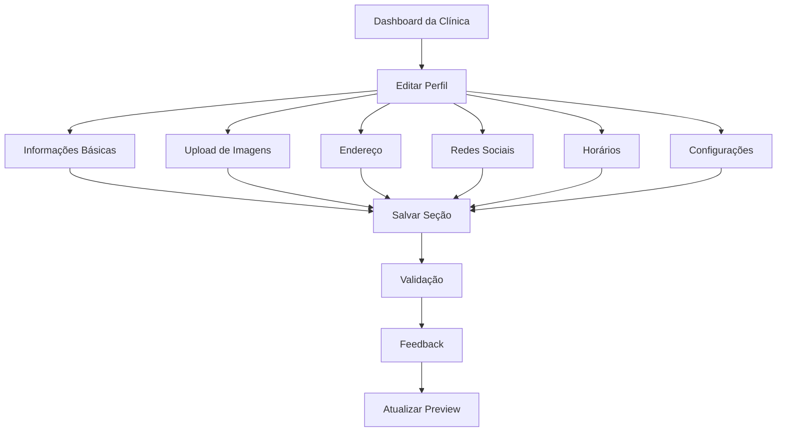

# Editor de Perfil Completo da Clínica - PRD

## 1. Product Overview

Sistema completo de edição de perfil para clínicas odontológicas que permite configurar todos os dados necessários para operação profissional em produção. O editor oferece interface moderna e intuitiva para gerenciar informações básicas, imagens, contatos, redes sociais e horários de funcionamento.

- **Objetivo**: Fornecer um editor de perfil completo e profissional que permita às clínicas configurar totalmente sua presença digital na plataforma.
- **Valor de mercado**: Essencial para viabilizar o lançamento em produção, permitindo que clínicas apresentem-se de forma profissional e completa aos pacientes.

## 2. Core Features

### 2.1 User Roles

| Role | Registration Method | Core Permissions |
|------|---------------------|------------------|
| Clínica Owner | Login com credenciais da clínica | Pode editar todos os dados do perfil da clínica |
| Clínica Admin | Convite do owner | Pode editar dados básicos (exceto configurações críticas) |

### 2.2 Feature Module

O editor de perfil da clínica consiste nas seguintes seções principais:

1. **Informações Básicas**: nome, descrição, telefone, email, website
2. **Imagens**: logo da clínica, imagem de capa/hero
3. **Endereço Completo**: rua, número, bairro, cidade, estado, CEP
4. **Redes Sociais**: Instagram, Facebook, LinkedIn, WhatsApp
5. **Horários de Funcionamento**: configuração para cada dia da semana
6. **Configurações de Conta**: alteração de senha

### 2.3 Page Details

| Page Name | Module Name | Feature description |
|-----------|-------------|---------------------|
| Editor de Perfil | Informações Básicas | Editar nome da clínica, descrição detalhada, telefone com máscara, email com validação, website com validação de URL |
| Editor de Perfil | Upload de Imagens | Upload de logo (quadrado, até 5MB), upload de imagem de capa (16:9, até 10MB), preview em tempo real, crop automático |
| Editor de Perfil | Endereço Completo | Formulário completo com rua, número, bairro, cidade, estado (dropdown), CEP com máscara e validação |
| Editor de Perfil | Redes Sociais | Links para Instagram, Facebook, LinkedIn, WhatsApp com validação de URL e preview |
| Editor de Perfil | Horários de Funcionamento | Configuração individual para cada dia da semana, horário de abertura/fechamento, opção "fechado" |
| Editor de Perfil | Configurações de Conta | Alteração de senha com confirmação, validação de força da senha |

## 3. Core Process

**Fluxo Principal do Editor de Perfil:**

1. Clínica acessa o dashboard e clica em "Editar Perfil"
2. Sistema carrega dados atuais da clínica
3. Clínica navega entre as seções do editor
4. Para cada seção, clínica pode:
   - Visualizar dados atuais
   - Editar campos específicos
   - Salvar alterações individualmente
   - Ver feedback de sucesso/erro
5. Sistema valida dados em tempo real
6. Alterações são salvas no banco de dados
7. Preview é atualizado automaticamente

## 4. User Interface Design

### 4.1 Design Style

- **Cores Primárias**: Azul (#2563eb), Verde (#16a34a) para sucesso, Vermelho (#dc2626) para erros
- **Cores Secundárias**: Cinza (#64748b) para textos secundários, Branco (#ffffff) para fundos
- **Estilo de Botões**: Rounded (border-radius: 8px), com estados hover e loading
- **Fontes**: Inter ou system fonts, tamanhos 14px (corpo), 16px (labels), 24px (títulos)
- **Layout**: Card-based com espaçamento consistente, navegação por abas ou seções
- **Ícones**: Lucide React icons, tamanho 20px para botões, 24px para títulos

### 4.2 Page Design Overview

| Page Name | Module Name | UI Elements |
|-----------|-------------|-------------|
| Editor de Perfil | Informações Básicas | Cards com formulários, inputs com labels flutuantes, textarea para descrição, validação em tempo real com ícones |
| Editor de Perfil | Upload de Imagens | Drag & drop areas, preview circular para logo, preview retangular para capa, progress bars, crop modal |
| Editor de Perfil | Endereço | Grid responsivo 2 colunas, dropdown estilizado para estados, máscara automática para CEP |
| Editor de Perfil | Redes Sociais | Inputs com ícones das redes sociais, preview dos links, validação de URL |
| Editor de Perfil | Horários | Toggle switches para dias, time pickers, layout em grid, indicador visual de "fechado" |
| Editor de Perfil | Configurações | Inputs de senha com toggle de visibilidade, indicador de força da senha, confirmação |

### 4.3 Responsiveness

- **Desktop-first** com adaptação para mobile
- **Breakpoints**: 768px (tablet), 640px (mobile)
- **Mobile**: Layout em coluna única, botões maiores (44px altura mínima), navegação por abas na parte inferior
- **Touch optimization**: Áreas de toque adequadas, gestos de swipe para navegação entre seções