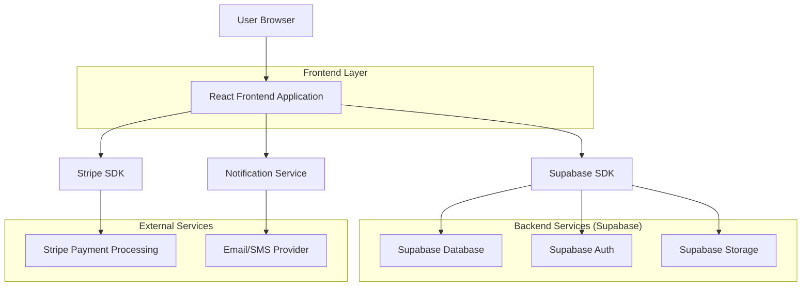
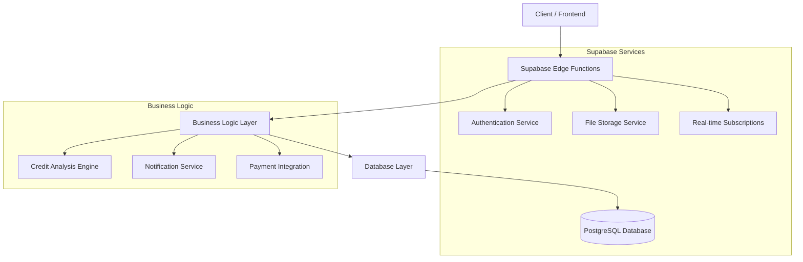
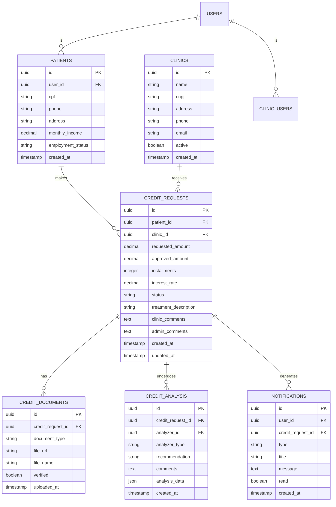

# Arquitetura Técnica - Sistema de Crédito Doutorizze

## 1. Architecture Design



## 2. Technology Description

* Frontend: React\@18 + TypeScript + TailwindCSS + Vite

* Backend: Supabase (PostgreSQL + Auth + Storage)

* Payment: Stripe SDK

* Notifications: Supabase Functions + Email/SMS providers

* File Storage: Supabase Storage

## 3. Route Definitions

| Route                    | Purpose                                 |
| ------------------------ | --------------------------------------- |
| /                        | Página inicial com simulador de crédito |
| /login-paciente          | Login/cadastro do paciente              |
| /patient/dashboard       | Dashboard do paciente com solicitações  |
| /patient/credit-request  | Formulário de solicitação de crédito    |
| /patient/documents       | Upload de documentos                    |
| /clinic/dashboard        | Dashboard da clínica                    |
| /clinic/credit-analysis  | Análise de solicitações de crédito      |
| /admin/dashboard         | Dashboard administrativo                |
| /admin/credit-management | Gestão de crédito e aprovações          |
| /notifications           | Centro de notificações                  |

## 4. API Definitions

### 4.1 Core API

**Solicitação de Crédito**

```
POST /api/credit-requests
```

Request:

| Param Name             | Param Type | isRequired | Description                  |
| ---------------------- | ---------- | ---------- | ---------------------------- |
| patient\_id            | uuid       | true       | ID do paciente               |
| clinic\_id             | uuid       | true       | ID da clínica                |
| amount                 | decimal    | true       | Valor solicitado             |
| installments           | integer    | true       | Número de parcelas           |
| treatment\_description | string     | true       | Descrição do tratamento      |
| documents              | array      | true       | Lista de documentos enviados |

Response:

| Param Name  | Param Type | Description              |
| ----------- | ---------- | ------------------------ |
| id          | uuid       | ID da solicitação        |
| status      | string     | Status inicial (pending) |
| created\_at | timestamp  | Data de criação          |

**Análise da Clínica**

```
PUT /api/credit-requests/{id}/clinic-analysis
```

Request:

| Param Name             | Param Type | isRequired | Description                          |
| ---------------------- | ---------- | ---------- | ------------------------------------ |
| clinic\_comments       | text       | true       | Comentários da clínica               |
| clinic\_recommendation | string     | true       | Recomendação (approve/reject/review) |
| patient\_history       | text       | false      | Histórico do paciente na clínica     |

**Análise Administrativa**

```
PUT /api/credit-requests/{id}/admin-decision
```

Request:

| Param Name          | Param Type | isRequired | Description                               |
| ------------------- | ---------- | ---------- | ----------------------------------------- |
| decision            | string     | true       | Decisão (approved/rejected/under\_review) |
| admin\_comments     | text       | true       | Comentários do administrador              |
| approved\_amount    | decimal    | false      | Valor aprovado (se diferente)             |
| interest\_rate      | decimal    | false      | Taxa de juros aplicada                    |
| payment\_conditions | json       | false      | Condições de pagamento                    |

## 5. Server Architecture Diagram



## 6. Data Model

### 6.1 Data Model Definition



### 6.2 Data Definition Language

**Credit Requests Table**

```sql
-- Tabela principal de solicitações de crédito
CREATE TABLE credit_requests (
    id UUID PRIMARY KEY DEFAULT gen_random_uuid(),
    patient_id UUID NOT NULL REFERENCES patients(id),
    clinic_id UUID NOT NULL REFERENCES clinics(id),
    requested_amount DECIMAL(10,2) NOT NULL,
    approved_amount DECIMAL(10,2),
    installments INTEGER NOT NULL,
    interest_rate DECIMAL(5,2),
    status VARCHAR(20) DEFAULT 'pending' CHECK (status IN ('pending', 'clinic_analysis', 'admin_review', 'approved', 'rejected', 'under_review')),
    treatment_description TEXT NOT NULL,
    clinic_comments TEXT,
    admin_comments TEXT,
    payment_conditions JSONB,
    created_at TIMESTAMP WITH TIME ZONE DEFAULT NOW(),
    updated_at TIMESTAMP WITH TIME ZONE DEFAULT NOW()
);

-- Índices para performance
CREATE INDEX idx_credit_requests_patient_id ON credit_requests(patient_id);
CREATE INDEX idx_credit_requests_clinic_id ON credit_requests(clinic_id);
CREATE INDEX idx_credit_requests_status ON credit_requests(status);
CREATE INDEX idx_credit_requests_created_at ON credit_requests(created_at DESC);
```

**Credit Documents Table**

```sql
-- Tabela de documentos anexados
CREATE TABLE credit_documents (
    id UUID PRIMARY KEY DEFAULT gen_random_uuid(),
    credit_request_id UUID NOT NULL REFERENCES credit_requests(id) ON DELETE CASCADE,
    document_type VARCHAR(50) NOT NULL CHECK (document_type IN ('cpf', 'income_proof', 'address_proof', 'photo', 'other')),
    file_url TEXT NOT NULL,
    file_name VARCHAR(255) NOT NULL,
    file_size INTEGER,
    mime_type VARCHAR(100),
    verified BOOLEAN DEFAULT FALSE,
    uploaded_at TIMESTAMP WITH TIME ZONE DEFAULT NOW()
);

CREATE INDEX idx_credit_documents_request_id ON credit_documents(credit_request_id);
CREATE INDEX idx_credit_documents_type ON credit_documents(document_type);
```

**Credit Analysis Table**

```sql
-- Tabela de análises (clínica e administrativa)
CREATE TABLE credit_analysis (
    id UUID PRIMARY KEY DEFAULT gen_random_uuid(),
    credit_request_id UUID NOT NULL REFERENCES credit_requests(id) ON DELETE CASCADE,
    analyzer_id UUID NOT NULL REFERENCES auth.users(id),
    analyzer_type VARCHAR(20) NOT NULL CHECK (analyzer_type IN ('clinic', 'admin')),
    recommendation VARCHAR(20) NOT NULL CHECK (recommendation IN ('approve', 'reject', 'review', 'request_docs')),
    comments TEXT,
    analysis_data JSONB,
    created_at TIMESTAMP WITH TIME ZONE DEFAULT NOW()
);

CREATE INDEX idx_credit_analysis_request_id ON credit_analysis(credit_request_id);
CREATE INDEX idx_credit_analysis_analyzer ON credit_analysis(analyzer_id);
```

**Notifications Table**

```sql
-- Tabela de notificações
CREATE TABLE notifications (
    id UUID PRIMARY KEY DEFAULT gen_random_uuid(),
    user_id UUID NOT NULL REFERENCES auth.users(id),
    credit_request_id UUID REFERENCES credit_requests(id),
    type VARCHAR(50) NOT NULL,
    title VARCHAR(255) NOT NULL,
    message TEXT NOT NULL,
    read BOOLEAN DEFAULT FALSE,
    metadata JSONB,
    created_at TIMESTAMP WITH TIME ZONE DEFAULT NOW()
);

CREATE INDEX idx_notifications_user_id ON notifications(user_id);
CREATE INDEX idx_notifications_read ON notifications(read);
CREATE INDEX idx_notifications_created_at ON notifications(created_at DESC);
```

**RLS Policies**

```sql
-- Políticas de segurança
ALTER TABLE credit_requests ENABLE ROW LEVEL SECURITY;
ALTER TABLE credit_documents ENABLE ROW LEVEL SECURITY;
ALTER TABLE credit_analysis ENABLE ROW LEVEL SECURITY;
ALTER TABLE notifications ENABLE ROW LEVEL SECURITY;

-- Pacientes podem ver apenas suas próprias solicitações
CREATE POLICY "Patients can view own credit requests" ON credit_requests
    FOR SELECT USING (patient_id IN (
        SELECT id FROM patients WHERE user_id = auth.uid()
    ));

-- Clínicas podem ver solicitações direcionadas a elas
CREATE POLICY "Clinics can view assigned credit requests" ON credit_requests
    FOR SELECT USING (clinic_id IN (
        SELECT clinic_id FROM clinic_users WHERE user_id = auth.uid()
    ));

-- Administradores podem ver todas as solicitações
CREATE POLICY "Admins can view all credit requests" ON credit_requests
    FOR ALL USING (EXISTS (
        SELECT 1 FROM user_roles WHERE user_id = auth.uid() AND role = 'admin'
    ));
```

**Triggers para atualização automática**

```sql
-- Trigger para atualizar timestamp
CREATE OR REPLACE FUNCTION update_updated_at_column()
RETURNS TRIGGER AS $$
BEGIN
    NEW.updated_at = NOW();
    RETURN NEW;
END;
$$ language 'plpgsql';

CREATE TRIGGER update_credit_requests_updated_at
    BEFORE UPDATE ON credit_requests
    FOR EACH ROW
    EXECUTE FUNCTION update_updated_at_column();
```

**Dados Iniciais**

```sql
-- Status padrão para solicitações
INSERT INTO credit_request_statuses (status, description) VALUES
('pending', 'Aguardando análise da clínica'),
('clinic_analysis', 'Em análise pela clínica'),
('admin_review', 'Em análise administrativa'),
('approved', 'Aprovado'),
('rejected', 'Rejeitado'),
('under_review', 'Em análise adicional');

-- Tipos de documento aceitos
INSERT INTO document_types (type, description, required) VALUES
('cpf', 'Documento de identidade (CPF)', true),
('income_proof', 'Comprovante de renda', true),
('address_proof', 'Comprovante de endereço', true),
('photo', 'Foto do paciente', false),
('other', 'Outros documentos', false);
```

