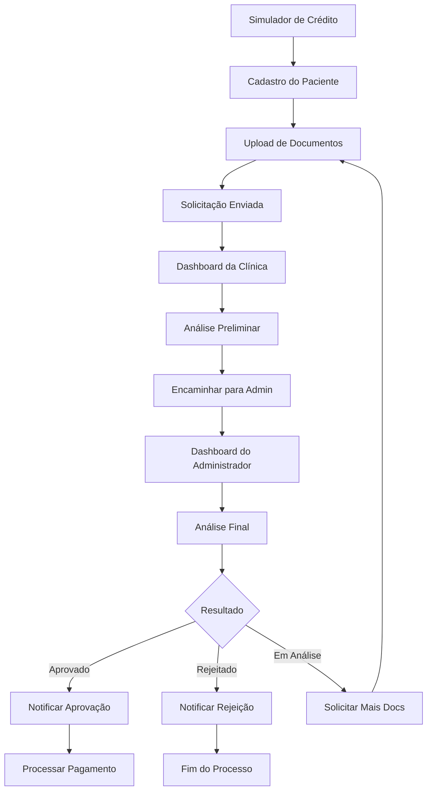

# Sistema de Solicitação de Crédito - Doutorizze

## 1. Product Overview

Sistema completo de solicitação e análise de crédito para financiamento de tratamentos odontológicos, conectando pacientes, clínicas e administradores em um fluxo estruturado de aprovação.

O sistema resolve a necessidade de financiamento acessível para tratamentos odontológicos, permitindo que pacientes solicitem crédito de forma simples e que clínicas e administradores gerenciem essas solicitações de forma eficiente.

Objetivo: Facilitar o acesso a tratamentos odontológicos através de um sistema de crédito transparente e eficiente, aumentando a conversão de pacientes e a receita das clínicas parceiras.

## 2. Core Features

### 2.1 User Roles

| Role | Registration Method | Core Permissions |
|------|---------------------|------------------|
| Paciente | Email/telefone + verificação | Solicitar crédito, acompanhar status, visualizar histórico |
| Clínica | Convite administrativo + verificação | Analisar solicitações, encaminhar para admin, notificar pacientes |
| Administrador | Acesso interno do sistema | Análise final de crédito, aprovação/rejeição, configurações do sistema |

### 2.2 Feature Module

Nosso sistema de crédito consiste nas seguintes páginas principais:

1. **Simulador de Crédito**: interface de simulação, cálculo de parcelas, redirecionamento para cadastro.
2. **Dashboard do Paciente**: histórico de solicitações, status atual, documentos enviados.
3. **Dashboard da Clínica**: lista de solicitações, análise preliminar, encaminhamento para admin.
4. **Dashboard do Administrador**: análise final, aprovação/rejeição, configurações de crédito.
5. **Sistema de Notificações**: alertas em tempo real, histórico de comunicações.
6. **Página de Upload de Documentos**: envio de comprovantes, validação de arquivos.

### 2.3 Page Details

| Page Name | Module Name | Feature description |
|-----------|-------------|---------------------|
| Simulador de Crédito | Interface de Simulação | Calcular parcelas baseado em valor e prazo, exibir taxas de juros, redirecionar para cadastro após simulação |
| Dashboard do Paciente | Gestão de Solicitações | Visualizar status das solicitações, fazer upload de documentos, acompanhar histórico de comunicações |
| Dashboard da Clínica | Análise Preliminar | Listar solicitações pendentes, analisar perfil do paciente, adicionar comentários, encaminhar para administrador |
| Dashboard do Administrador | Análise Final | Revisar análise da clínica, verificar documentos, aprovar/rejeitar/colocar em análise, definir condições de pagamento |
| Sistema de Notificações | Comunicação | Enviar notificações por email/SMS, registrar histórico de comunicações, alertas em tempo real |
| Upload de Documentos | Gestão de Arquivos | Fazer upload de CPF, comprovante de renda, fotos, validar formatos, organizar por solicitação |

## 3. Core Process

**Fluxo Principal do Paciente:**
1. Paciente acessa simulador de crédito na página inicial
2. Insere valor do tratamento e prazo desejado
3. Visualiza simulação com parcelas e taxas
4. É redirecionado para página de cadastro/login
5. Preenche dados pessoais e faz upload de documentos
6. Submete solicitação de crédito
7. Acompanha status através do dashboard
8. Recebe notificações sobre mudanças de status

**Fluxo da Clínica:**
1. Recebe notificação de nova solicitação
2. Acessa dashboard e visualiza dados do paciente
3. Analisa perfil e documentos enviados
4. Adiciona comentários sobre o paciente/tratamento
5. Encaminha solicitação para análise administrativa
6. Recebe retorno do administrador
7. Notifica paciente com resultado final

**Fluxo do Administrador:**
1. Recebe solicitações encaminhadas pelas clínicas
2. Revisa análise preliminar da clínica
3. Verifica documentos e dados do paciente
4. Realiza análise de crédito final
5. Define resultado: Aprovado/Em Análise/Rejeitado
6. Se aprovado, define condições de pagamento
7. Retorna resultado para a clínica

## 4. User Interface Design

### 4.1 Design Style

- **Cores Primárias**: Azul (#2563eb) e Verde (#16a34a) para aprovações
- **Cores Secundárias**: Cinza (#6b7280) e Vermelho (#dc2626) para rejeições
- **Estilo de Botões**: Arredondados com sombra sutil, efeito hover
- **Tipografia**: Inter ou similar, tamanhos 14px (corpo), 18px (subtítulos), 24px (títulos)
- **Layout**: Cards com bordas arredondadas, navegação lateral para dashboards
- **Ícones**: Lucide React, estilo outline, cores consistentes com o tema

### 4.2 Page Design Overview

| Page Name | Module Name | UI Elements |
|-----------|-------------|-------------|
| Simulador de Crédito | Interface Principal | Card centralizado, inputs numéricos, slider para prazo, botão CTA azul, resultado em destaque |
| Dashboard do Paciente | Lista de Solicitações | Cards de status com cores indicativas, timeline de progresso, botões de ação secundários |
| Dashboard da Clínica | Tabela de Análise | Tabela responsiva, filtros por status, botões de ação rápida, modal para detalhes |
| Dashboard do Administrador | Painel de Controle | Layout em grid, métricas em cards, lista priorizada, formulário de análise detalhado |
| Sistema de Notificações | Centro de Mensagens | Lista cronológica, badges de status, botões de marcar como lida |
| Upload de Documentos | Área de Drag & Drop | Zona de upload visual, preview de arquivos, validação em tempo real, progress bar |

### 4.3 Responsiveness

Sistema mobile-first com adaptação para desktop. Otimizado para touch em dispositivos móveis, com navegação por tabs em telas menores e sidebar em desktop. Breakpoints: 768px (tablet) e 1024px (desktop).