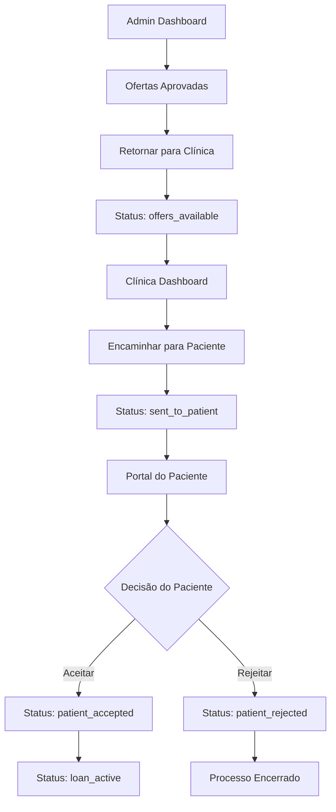

# Fluxo de Retorno de Ofertas Bancárias

## 1. Visão Geral do Produto

Sistema completo de gestão do fluxo de ofertas bancárias para empréstimos odontológicos, permitindo que administradores retornem ofertas aprovadas para clínicas, que por sua vez encaminham para pacientes tomarem decisões finais sobre os empréstimos.

O sistema resolve o problema de comunicação entre múltiplos stakeholders (admin, clínica, paciente) no processo de aprovação de crédito odontológico, automatizando o fluxo de decisões e mantendo histórico completo das transações.

## 2. Funcionalidades Principais

### 2.1 Papéis de Usuário

| Papel | Método de Registro | Permissões Principais |
|-------|-------------------|----------------------|
| Administrador | Acesso direto ao sistema | Aprovar/rejeitar ofertas, retornar ofertas para clínicas |
| Clínica | Cadastro via plataforma | Visualizar ofertas, encaminhar para pacientes, acompanhar status |
| Paciente | Cadastro via clínica | Visualizar ofertas recebidas, aceitar/rejeitar empréstimos |

### 2.2 Módulos de Funcionalidade

O sistema de retorno de ofertas consiste nas seguintes páginas principais:

1. **Dashboard Admin**: gestão de ofertas, aprovação e retorno para clínicas
2. **Dashboard Clínica**: visualização de ofertas retornadas, encaminhamento para pacientes
3. **Portal do Paciente**: interface para decisão sobre ofertas recebidas
4. **Histórico de Transações**: acompanhamento completo do fluxo de decisões

### 2.3 Detalhes das Páginas

| Nome da Página | Nome do Módulo | Descrição da Funcionalidade |
|----------------|----------------|----------------------------|
| Dashboard Admin | Gestão de Ofertas | Visualizar solicitações pendentes, aprovar ofertas bancárias, retornar ofertas aprovadas para clínicas com status "offers_available" |
| Dashboard Clínica | Ofertas Recebidas | Visualizar ofertas retornadas pelo admin, botão "Encaminhar para Paciente", alterar status para "sent_to_patient" |
| Portal do Paciente | Decisão de Empréstimo | Visualizar ofertas encaminhadas pela clínica, botões "Aceitar" e "Rejeitar" para cada oferta, confirmar decisão final |
| Histórico | Rastreamento Completo | Exibir timeline completo das decisões, status atuais, datas de cada etapa, ofertas selecionadas |

## 3. Fluxo Principal do Processo

**Fluxo de Retorno de Ofertas:**

1. **Admin aprova ofertas** → Seleciona ofertas bancárias aprovadas → Clica "Retornar para Clínica" → Status muda para "offers_available"

2. **Clínica recebe ofertas** → Visualiza ofertas no dashboard → Revisa condições → Clica "Encaminhar para Paciente" → Status muda para "sent_to_patient"

3. **Paciente toma decisão** → Acessa portal → Visualiza ofertas disponíveis → Seleciona "Aceitar" ou "Rejeitar" → Confirma decisão → Status muda para "patient_accepted" ou "patient_rejected"

4. **Processamento final** → Sistema processa decisão → Se aceito: status "loan_active" → Se rejeitado: processo encerrado

## 4. Design da Interface

### 4.1 Estilo de Design

- **Cores Primárias**: Azul (#3B82F6) para ações principais, Verde (#10B981) para aprovações
- **Cores Secundárias**: Cinza (#6B7280) para textos, Vermelho (#EF4444) para rejeições
- **Estilo de Botões**: Arredondados com sombra sutil, efeito hover
- **Tipografia**: Inter ou similar, tamanhos 14px (corpo), 16px (títulos), 12px (legendas)
- **Layout**: Cards com bordas arredondadas, espaçamento consistente de 16px
- **Ícones**: Lucide React para consistência, estilo outline

### 4.2 Visão Geral do Design das Páginas

| Nome da Página | Nome do Módulo | Elementos da UI |
|----------------|----------------|-----------------|
| Dashboard Admin | Gestão de Ofertas | Cards de solicitações, botões "Retornar Ofertas" em azul, badges de status coloridos, modal de confirmação |
| Dashboard Clínica | Ofertas Recebidas | Lista de ofertas com detalhes bancários, botão "Encaminhar" em verde, indicadores de prazo, notificações |
| Portal do Paciente | Decisão de Empréstimo | Cards de ofertas com condições destacadas, botões "Aceitar" (verde) e "Rejeitar" (vermelho), modal de confirmação |
| Histórico | Timeline | Timeline vertical com ícones, cores por status, datas formatadas, detalhes expansíveis |

### 4.3 Responsividade

Desktop-first com adaptação mobile. Otimização para touch em dispositivos móveis, com botões maiores e espaçamento adequado para interação por toque.