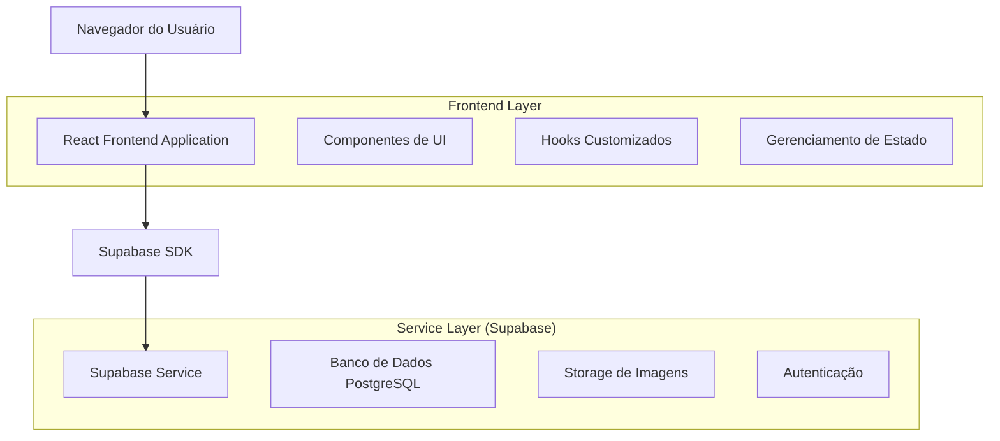
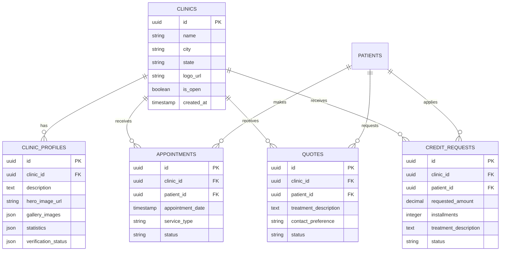

# Redesign do Perfil das Clínicas - Documento de Arquitetura Técnica

## 1. Arquitetura do Sistema



## 2. Descrição das Tecnologias

* **Frontend**: React\@18 + TypeScript + Tailwind CSS\@3 + Vite

* **Backend**: Supabase (PostgreSQL + Storage + Auth)

* **UI Components**: shadcn/ui + Lucide React (ícones)

* **Styling**: Tailwind CSS com classes customizadas para gradientes

## 3. Definições de Rotas

| Rota                  | Propósito                                             |
| --------------------- | ----------------------------------------------------- |
| `/clinic/:id`         | Página principal do perfil da clínica com novo design |
| `/clinic/:id/booking` | Modal/página de agendamento integrada                 |
| `/clinic/:id/quote`   | Modal/página de solicitação de orçamento              |
| `/clinic/:id/credit`  | Modal/página de solicitação de crédito                |

## 4. Definições de API

### 4.1 APIs Principais

**Buscar dados completos da clínica**

```
GET /api/clinics/:id/profile
```

Request:

| Parâmetro | Tipo   | Obrigatório | Descrição           |
| --------- | ------ | ----------- | ------------------- |
| id        | string | true        | ID único da clínica |

Response:

| Campo        | Tipo   | Descrição                                |
| ------------ | ------ | ---------------------------------------- |
| clinic       | object | Dados básicos da clínica                 |
| profile      | object | Perfil detalhado com descrição e imagens |
| statistics   | object | Estatísticas de avaliação e pacientes    |
| verification | object | Status de verificação e certificações    |

Exemplo de Response:

```json
{
  "clinic": {
    "id": "clinic-123",
    "name": "Clínica Sorriso Perfeito",
    "city": "São Paulo",
    "state": "SP",
    "logo_url": "https://...",
    "is_open": true
  },
  "profile": {
    "description": "Clínica odontológica moderna...",
    "hero_image_url": "https://...",
    "gallery_images": ["https://..."]
  },
  "statistics": {
    "rating": 4.8,
    "total_reviews": 247,
    "recommendation_rate": 94,
    "patients_served": 5000
  },
  "verification": {
    "is_verified": true,
    "has_ra1000": true,
    "years_in_market": 8
  }
}
```

**Criar agendamento**

```
POST /api/appointments
```

Request:

| Parâmetro         | Tipo   | Obrigatório | Descrição                  |
| ----------------- | ------ | ----------- | -------------------------- |
| clinic\_id        | string | true        | ID da clínica              |
| patient\_id       | string | true        | ID do paciente             |
| appointment\_date | string | true        | Data e hora do agendamento |
| service\_type     | string | true        | Tipo de serviço solicitado |

**Solicitar orçamento**

```
POST /api/quotes
```

Request:

| Parâmetro              | Tipo   | Obrigatório | Descrição                            |
| ---------------------- | ------ | ----------- | ------------------------------------ |
| clinic\_id             | string | true        | ID da clínica                        |
| patient\_id            | string | true        | ID do paciente                       |
| treatment\_description | string | true        | Descrição do tratamento desejado     |
| contact\_preference    | string | true        | Preferência de contato (phone/email) |

**Solicitar crédito odontológico**

```
POST /api/credit-requests
```

Request:

| Parâmetro              | Tipo   | Obrigatório | Descrição               |
| ---------------------- | ------ | ----------- | ----------------------- |
| clinic\_id             | string | true        | ID da clínica           |
| patient\_id            | string | true        | ID do paciente          |
| requested\_amount      | number | true        | Valor solicitado        |
| installments           | number | true        | Número de parcelas      |
| treatment\_description | string | true        | Descrição do tratamento |

## 5. Modelo de Dados

### 5.1 Definição do Modelo de Dados



### 5.2 Linguagem de Definição de Dados (DDL)

**Tabela de Perfis de Clínicas (clinic\_profiles)**

```sql
-- Criar tabela de perfis estendidos
CREATE TABLE clinic_profiles (
  id UUID PRIMARY KEY DEFAULT gen_random_uuid(),
  clinic_id UUID REFERENCES clinics(id) ON DELETE CASCADE,
  description TEXT,
  hero_image_url TEXT,
  gallery_images JSONB DEFAULT '[]'::jsonb,
  statistics JSONB DEFAULT '{
    "rating": 0,
    "total_reviews": 0,
    "recommendation_rate": 0,
    "patients_served": 0
  }'::jsonb,
  verification_status JSONB DEFAULT '{
    "is_verified": false,
    "has_ra1000": false,
    "years_in_market": 0
  }'::jsonb,
  created_at TIMESTAMP WITH TIME ZONE DEFAULT NOW(),
  updated_at TIMESTAMP WITH TIME ZONE DEFAULT NOW()
);

-- Criar índices
CREATE INDEX idx_clinic_profiles_clinic_id ON clinic_profiles(clinic_id);
CREATE INDEX idx_clinic_profiles_verification ON clinic_profiles USING GIN (verification_status);

-- Políticas RLS
ALTER TABLE clinic_profiles ENABLE ROW LEVEL SECURITY;

GRANT SELECT ON clinic_profiles TO anon;
GRANT ALL PRIVILEGES ON clinic_profiles TO authenticated;

-- Política para leitura pública
CREATE POLICY "Perfis de clínicas são públicos" ON clinic_profiles
  FOR SELECT USING (true);

-- Política para edição apenas pelo proprietário
CREATE POLICY "Apenas proprietários podem editar perfis" ON clinic_profiles
  FOR ALL USING (
    clinic_id IN (
      SELECT id FROM clinics 
      WHERE owner_id = auth.uid() OR master_user_id = auth.uid()
    )
  );
```

**Tabela de Agendamentos (appointments)**

```sql
-- Criar tabela de agendamentos
CREATE TABLE appointments (
  id UUID PRIMARY KEY DEFAULT gen_random_uuid(),
  clinic_id UUID REFERENCES clinics(id) ON DELETE CASCADE,
  patient_id UUID REFERENCES profiles(id) ON DELETE CASCADE,
  appointment_date TIMESTAMP WITH TIME ZONE NOT NULL,
  service_type VARCHAR(100) NOT NULL,
  status VARCHAR(20) DEFAULT 'pending' CHECK (status IN ('pending', 'confirmed', 'cancelled', 'completed')),
  notes TEXT,
  created_at TIMESTAMP WITH TIME ZONE DEFAULT NOW(),
  updated_at TIMESTAMP WITH TIME ZONE DEFAULT NOW()
);

-- Criar índices
CREATE INDEX idx_appointments_clinic_id ON appointments(clinic_id);
CREATE INDEX idx_appointments_patient_id ON appointments(patient_id);
CREATE INDEX idx_appointments_date ON appointments(appointment_date);
CREATE INDEX idx_appointments_status ON appointments(status);

-- Políticas RLS
ALTER TABLE appointments ENABLE ROW LEVEL SECURITY;

GRANT SELECT ON appointments TO anon;
GRANT ALL PRIVILEGES ON appointments TO authenticated;
```

**Dados Iniciais**

```sql
-- Inserir dados de exemplo para demonstração
INSERT INTO clinic_profiles (clinic_id, description, statistics, verification_status)
SELECT 
  id,
  'Clínica odontológica moderna com tecnologia de ponta e profissionais especializados. Atendimento humanizado e tratamentos de qualidade para toda a família.',
  '{
    "rating": 4.8,
    "total_reviews": 247,
    "recommendation_rate": 94,
    "patients_served": 5000
  }'::jsonb,
  '{
    "is_verified": true,
    "has_ra1000": true,
    "years_in_market": 8
  }'::jsonb
FROM clinics 
WHERE NOT EXISTS (
  SELECT 1 FROM clinic_profiles WHERE clinic_profiles.clinic_id = clinics.id
);
```

