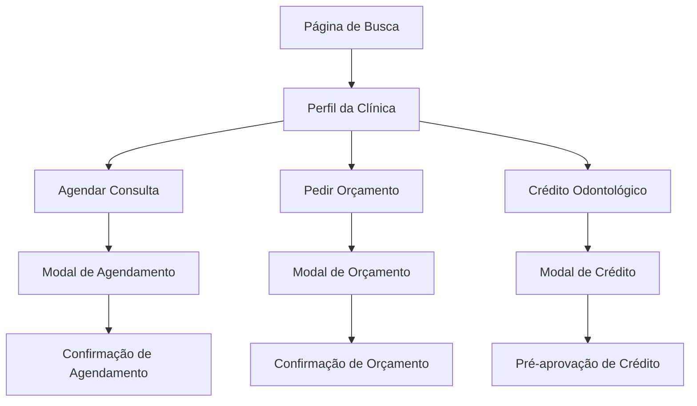

# Redesign do Perfil das Clínicas - Documento de Requisitos do Produto

## 1. Visão Geral do Produto

Redesign completo do perfil das clínicas para criar uma interface moderna, profissional e responsiva que inspire confiança nos pacientes e facilite o agendamento de consultas. O novo design é baseado em um layout elegante com gradiente azul, badges de verificação e cards de ação organizados.

- **Objetivo**: Aumentar a conversão de visitantes em agendamentos através de um design mais profissional e confiável
- **Público-alvo**: Pacientes em busca de tratamentos odontológicos e clínicas que desejam uma presença digital mais forte
- **Valor de mercado**: Diferenciação competitiva através de uma interface premium que transmite credibilidade e profissionalismo

## 2. Funcionalidades Principais

### 2.1 Módulos de Funcionalidade

Nosso redesign do perfil das clínicas consiste nas seguintes páginas principais:

1. **Página de Perfil da Clínica**: header com gradiente, informações organizadas, cards de ação, seção de confiança
2. **Modal de Agendamento**: interface integrada para seleção de horários disponíveis
3. **Modal de Orçamento**: formulário para solicitação de orçamentos com resposta rápida
4. **Modal de Crédito**: interface para solicitação de crédito odontológico

### 2.2 Detalhes das Páginas

| Página | Módulo | Descrição da Funcionalidade |
|--------|--------|------------------------------|
| Perfil da Clínica | Header com Gradiente | Fundo degradê azul elegante, logo da clínica posicionada à esquerda, badges de verificação "Verificada" e "RA1000" |
| Perfil da Clínica | Informações da Clínica | Nome da clínica, localização (São Paulo, SP), status "Aberto agora" com indicador verde, descrição profissional |
| Perfil da Clínica | Cards de Ação | Três cards principais: Agendar consulta (horários disponíveis hoje), Pedir orçamento (resposta até 2h), Crédito odontológico (até R$ 30.000 aprovados) |
| Perfil da Clínica | Estatísticas de Confiança | Avaliação 4.8 estrelas (247 avaliações), 94% recomendam a clínica, +5k pacientes atendidos |
| Perfil da Clínica | Seção "Por que confiar?" | Indicadores de credibilidade: Clínica verificada pelo Doutorizze, Certificação RA1000, Mais de 5 anos no mercado |
| Modal de Agendamento | Seleção de Horários | Interface para escolha de data e horário disponível, integração com agenda da clínica |
| Modal de Orçamento | Formulário de Solicitação | Campos para descrição do tratamento, dados de contato, promessa de resposta em até 2h |
| Modal de Crédito | Simulação de Crédito | Calculadora de parcelas, valores até R$ 30.000, formulário de pré-aprovação |

## 3. Fluxo Principal do Usuário

O usuário navega pelo perfil da clínica de forma intuitiva e pode realizar ações principais rapidamente:

**Fluxo do Paciente:**
1. Acessa o perfil da clínica através da busca ou link direto
2. Visualiza as informações de credibilidade (badges, avaliações, estatísticas)
3. Escolhe uma das ações principais: agendar, pedir orçamento ou solicitar crédito
4. Completa o processo através dos modais específicos
5. Recebe confirmação e acompanha o status da solicitação

## 4. Design da Interface do Usuário

### 4.1 Estilo de Design

**Cores Principais:**
- Azul primário: #3B82F6 (gradiente do header)
- Azul secundário: #60A5FA (tons mais claros)
- Verde de status: #10B981 (indicadores positivos)
- Cinza neutro: #6B7280 (textos secundários)
- Branco: #FFFFFF (fundo dos cards)

**Estilo dos Botões:**
- Botões primários: cantos arredondados (8px), gradiente azul, sombra sutil
- Botões secundários: borda azul, fundo transparente
- Botões de ação: cores específicas (azul para agendar, verde para crédito)

**Tipografia:**
- Fonte principal: Inter ou similar (moderna e legível)
- Títulos: 24px-32px, peso 600-700
- Textos: 14px-16px, peso 400-500
- Textos pequenos: 12px-14px, peso 400

**Layout:**
- Design baseado em cards com sombras suaves
- Espaçamento consistente (16px, 24px, 32px)
- Grid responsivo com breakpoints mobile-first
- Ícones da biblioteca Lucide React

### 4.2 Visão Geral do Design das Páginas

| Página | Módulo | Elementos da UI |
|--------|--------|-----------------|
| Perfil da Clínica | Header | Gradiente azul (#3B82F6 para #60A5FA), logo circular com borda branca, badges azuis com ícones |
| Perfil da Clínica | Informações | Título em fonte Inter 28px peso 700, localização com ícone de pin, status verde com ponto indicador |
| Perfil da Clínica | Cards de Ação | Cards brancos com sombra, ícones coloridos, botões com cores específicas, textos descritivos |
| Perfil da Clínica | Estatísticas | Cards horizontais com números grandes, ícones de estrelas, percentuais destacados |
| Perfil da Clínica | Confiança | Lista com ícones de verificação, textos em cores temáticas (verde, azul, roxo) |

### 4.3 Responsividade

**Desktop-first com adaptação mobile:**
- Layout de 3 colunas no desktop (informações + cards de ação)
- Layout de 1 coluna no mobile com cards empilhados
- Header mantém proporções em todas as telas
- Botões se adaptam ao tamanho da tela
- Textos reduzem tamanho proporcionalmente
- Touch-friendly com áreas de toque mínimas de 44px