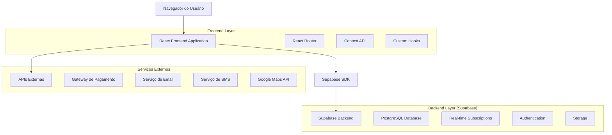
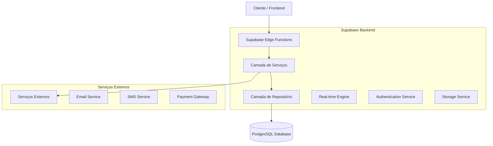
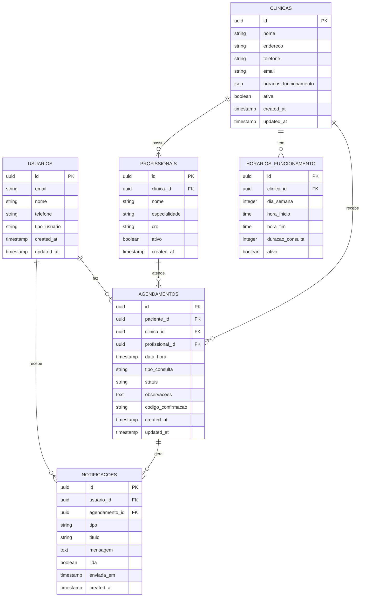

# Sistema de Agendamento Doutorizze - Arquitetura Técnica

## 1. Arquitetura do Sistema



## 2. Descrição das Tecnologias

* **Frontend**: React\@18 + TypeScript + Tailwind CSS + Vite

* **Backend**: Supabase (PostgreSQL + Real-time + Auth)

* **Estado Global**: Context API + Custom Hooks

* **Roteamento**: React Router DOM\@6

* **UI Components**: Radix UI + Shadcn/ui

* **Notificações**: React Hot Toast + Supabase Real-time

* **Validação**: Zod + React Hook Form

## 3. Definições de Rotas

| Rota                     | Propósito                                          |
| ------------------------ | -------------------------------------------------- |
| /agendamento             | Página principal de busca e seleção de clínicas    |
| /agendamento/clinica/:id | Página de agendamento específica da clínica        |
| /agendamento/confirmacao | Página de confirmação do agendamento               |
| /dashboard/paciente      | Dashboard do paciente com histórico e agendamentos |
| /dashboard/clinica       | Dashboard da clínica para gestão de agenda         |
| /agendamentos/:id        | Detalhes específicos de um agendamento             |
| /notificacoes            | Centro de notificações do usuário                  |

## 4. Definições de API

### 4.1 APIs Principais

**Agendamentos**

```
POST /api/agendamentos
```

Request:

| Nome do Parâmetro | Tipo     | Obrigatório | Descrição                                  |
| ----------------- | -------- | ----------- | ------------------------------------------ |
| clinica\_id       | string   | true        | ID da clínica selecionada                  |
| paciente\_id      | string   | true        | ID do paciente                             |
| data\_hora        | datetime | true        | Data e hora do agendamento                 |
| profissional\_id  | string   | false       | ID do profissional específico              |
| observacoes       | string   | false       | Observações do paciente                    |
| tipo\_consulta    | string   | true        | Tipo de consulta (consulta, limpeza, etc.) |

Response:

| Nome do Parâmetro   | Tipo   | Descrição                                               |
| ------------------- | ------ | ------------------------------------------------------- |
| id                  | string | ID único do agendamento                                 |
| status              | string | Status do agendamento (pendente, confirmado, cancelado) |
| codigo\_confirmacao | string | Código para confirmação                                 |

Exemplo:

```json
{
  "clinica_id": "123e4567-e89b-12d3-a456-426614174000",
  "paciente_id": "987fcdeb-51a2-43d1-9f12-345678901234",
  "data_hora": "2024-02-15T14:30:00Z",
  "tipo_consulta": "consulta_geral",
  "observacoes": "Dor no dente superior direito"
}
```

**Horários Disponíveis**

```
GET /api/clinicas/:id/horarios-disponiveis
```

Request:

| Nome do Parâmetro | Tipo   | Obrigatório | Descrição                           |
| ----------------- | ------ | ----------- | ----------------------------------- |
| data\_inicio      | date   | true        | Data inicial para busca             |
| data\_fim         | date   | true        | Data final para busca               |
| profissional\_id  | string | false       | Filtrar por profissional específico |

Response:

| Nome do Parâmetro | Tipo   | Descrição                     |
| ----------------- | ------ | ----------------------------- |
| horarios          | array  | Lista de horários disponíveis |
| data              | date   | Data do horário               |
| hora\_inicio      | time   | Hora de início                |
| hora\_fim         | time   | Hora de fim                   |
| profissional      | object | Dados do profissional         |

**Notificações**

```
POST /api/notificacoes
```

Request:

| Nome do Parâmetro | Tipo   | Obrigatório | Descrição                              |
| ----------------- | ------ | ----------- | -------------------------------------- |
| usuario\_id       | string | true        | ID do usuário destinatário             |
| tipo              | string | true        | Tipo de notificação (email, sms, push) |
| titulo            | string | true        | Título da notificação                  |
| mensagem          | string | true        | Conteúdo da mensagem                   |
| agendamento\_id   | string | false       | ID do agendamento relacionado          |

## 5. Arquitetura do Servidor



## 6. Modelo de Dados

### 6.1 Definição do Modelo de Dados



### 6.2 Linguagem de Definição de Dados (DDL)

**Tabela de Usuários**

```sql
-- Criar tabela de usuários
CREATE TABLE usuarios (
    id UUID PRIMARY KEY DEFAULT gen_random_uuid(),
    email VARCHAR(255) UNIQUE NOT NULL,
    nome VARCHAR(100) NOT NULL,
    telefone VARCHAR(20),
    tipo_usuario VARCHAR(20) DEFAULT 'paciente' CHECK (tipo_usuario IN ('paciente', 'clinica', 'admin')),
    created_at TIMESTAMP WITH TIME ZONE DEFAULT NOW(),
    updated_at TIMESTAMP WITH TIME ZONE DEFAULT NOW()
);

-- Criar índices
CREATE INDEX idx_usuarios_email ON usuarios(email);
CREATE INDEX idx_usuarios_tipo ON usuarios(tipo_usuario);
```

**Tabela de Clínicas**

```sql
-- Criar tabela de clínicas
CREATE TABLE clinicas (
    id UUID PRIMARY KEY DEFAULT gen_random_uuid(),
    nome VARCHAR(200) NOT NULL,
    endereco TEXT NOT NULL,
    telefone VARCHAR(20),
    email VARCHAR(255),
    horarios_funcionamento JSONB,
    ativa BOOLEAN DEFAULT true,
    created_at TIMESTAMP WITH TIME ZONE DEFAULT NOW(),
    updated_at TIMESTAMP WITH TIME ZONE DEFAULT NOW()
);

-- Criar índices
CREATE INDEX idx_clinicas_ativa ON clinicas(ativa);
CREATE INDEX idx_clinicas_nome ON clinicas(nome);
```

**Tabela de Agendamentos**

```sql
-- Criar tabela de agendamentos
CREATE TABLE agendamentos (
    id UUID PRIMARY KEY DEFAULT gen_random_uuid(),
    paciente_id UUID NOT NULL,
    clinica_id UUID NOT NULL,
    profissional_id UUID,
    data_hora TIMESTAMP WITH TIME ZONE NOT NULL,
    tipo_consulta VARCHAR(50) NOT NULL,
    status VARCHAR(20) DEFAULT 'pendente' CHECK (status IN ('pendente', 'confirmado', 'cancelado', 'concluido')),
    observacoes TEXT,
    codigo_confirmacao VARCHAR(10) UNIQUE,
    created_at TIMESTAMP WITH TIME ZONE DEFAULT NOW(),
    updated_at TIMESTAMP WITH TIME ZONE DEFAULT NOW()
);

-- Criar índices
CREATE INDEX idx_agendamentos_paciente ON agendamentos(paciente_id);
CREATE INDEX idx_agendamentos_clinica ON agendamentos(clinica_id);
CREATE INDEX idx_agendamentos_data_hora ON agendamentos(data_hora);
CREATE INDEX idx_agendamentos_status ON agendamentos(status);

-- Criar função para gerar código de confirmação
CREATE OR REPLACE FUNCTION generate_confirmation_code()
RETURNS TEXT AS $$
BEGIN
    RETURN UPPER(SUBSTRING(MD5(RANDOM()::TEXT) FROM 1 FOR 6));
END;
$$ LANGUAGE plpgsql;

-- Trigger para gerar código automaticamente
CREATE OR REPLACE FUNCTION set_confirmation_code()
RETURNS TRIGGER AS $$
BEGIN
    IF NEW.codigo_confirmacao IS NULL THEN
        NEW.codigo_confirmacao := generate_confirmation_code();
    END IF;
    RETURN NEW;
END;
$$ LANGUAGE plpgsql;

CREATE TRIGGER trigger_set_confirmation_code
    BEFORE INSERT ON agendamentos
    FOR EACH ROW
    EXECUTE FUNCTION set_confirmation_code();
```

**Tabela de Notificações**

```sql
-- Criar tabela de notificações
CREATE TABLE notificacoes (
    id UUID PRIMARY KEY DEFAULT gen_random_uuid(),
    usuario_id UUID NOT NULL,
    agendamento_id UUID,
    tipo VARCHAR(20) NOT NULL CHECK (tipo IN ('email', 'sms', 'push', 'in_app')),
    titulo VARCHAR(200) NOT NULL,
    mensagem TEXT NOT NULL,
    lida BOOLEAN DEFAULT false,
    enviada_em TIMESTAMP WITH TIME ZONE,
    created_at TIMESTAMP WITH TIME ZONE DEFAULT NOW()
);

-- Criar índices
CREATE INDEX idx_notificacoes_usuario ON notificacoes(usuario_id);
CREATE INDEX idx_notificacoes_tipo ON notificacoes(tipo);
CREATE INDEX idx_notificacoes_lida ON notificacoes(lida);

-- Políticas RLS (Row Level Security)
ALTER TABLE agendamentos ENABLE ROW LEVEL SECURITY;
ALTER TABLE notificacoes ENABLE ROW LEVEL SECURITY;

-- Política para agendamentos
CREATE POLICY "Usuários podem ver seus próprios agendamentos" ON agendamentos
    FOR SELECT USING (auth.uid() = paciente_id);

CREATE POLICY "Usuários podem criar agendamentos" ON agendamentos
    FOR INSERT WITH CHECK (auth.uid() = paciente_id);

-- Política para notificações
CREATE POLICY "Usuários podem ver suas próprias notificações" ON notificacoes
    FOR SELECT USING (auth.uid() = usuario_id);

-- Dados iniciais
INSERT INTO usuarios (email, nome, tipo_usuario) VALUES
('admin@doutorizze.com', 'Administrador', 'admin'),
('clinica.exemplo@email.com', 'Clínica Exemplo', 'clinica');
```

## 7. Considerações de Implementação

### 7.1 Performance

* Implementar cache Redis para horários disponíveis

* Usar paginação para listas de agendamentos

* Otimizar queries com índices apropriados

* Implementar lazy loading para componentes pesados

### 7.2 Escalabilidade

* Usar Supabase Edge Functions para lógica complexa

* Implementar rate limiting para APIs

* Configurar auto-scaling no Supabase

* Monitoramento com métricas de performance

### 7.3 Segurança

* Validação rigorosa de dados no frontend e backend

* Sanitização de inputs para prevenir XSS

* Implementar CORS adequadamente

* Auditoria de ações sensíveis

### 7.4 Integração com Sistema Existente

* Usar hooks personalizados para isolamento de lógica

* Manter compatibilidade com autenticação existente

* Evitar conflitos com área Clinicorp

* Implementar migração gradual de funcionalidades

