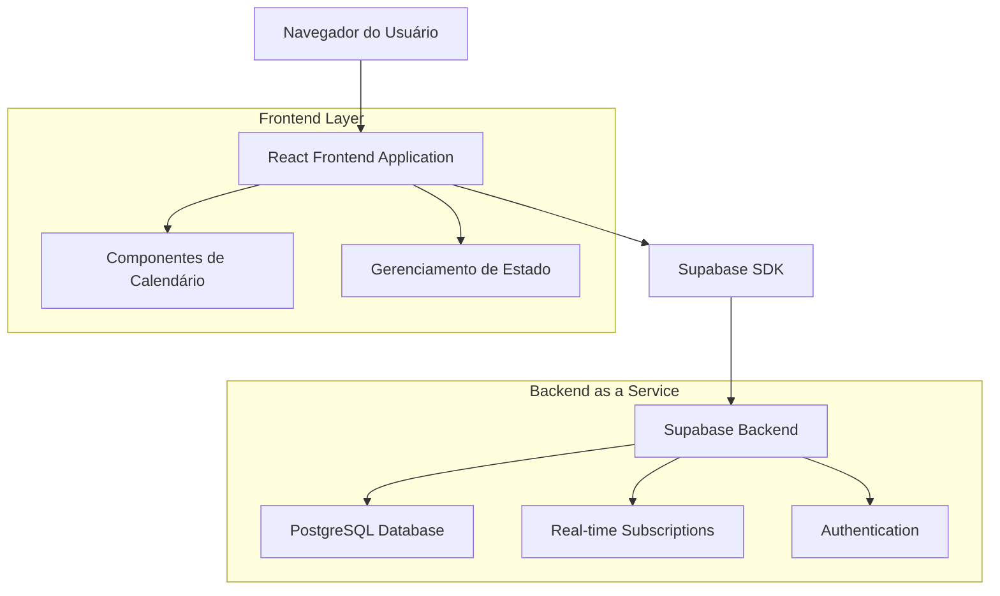
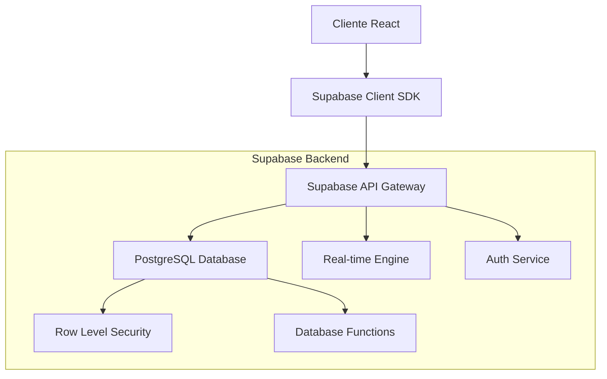
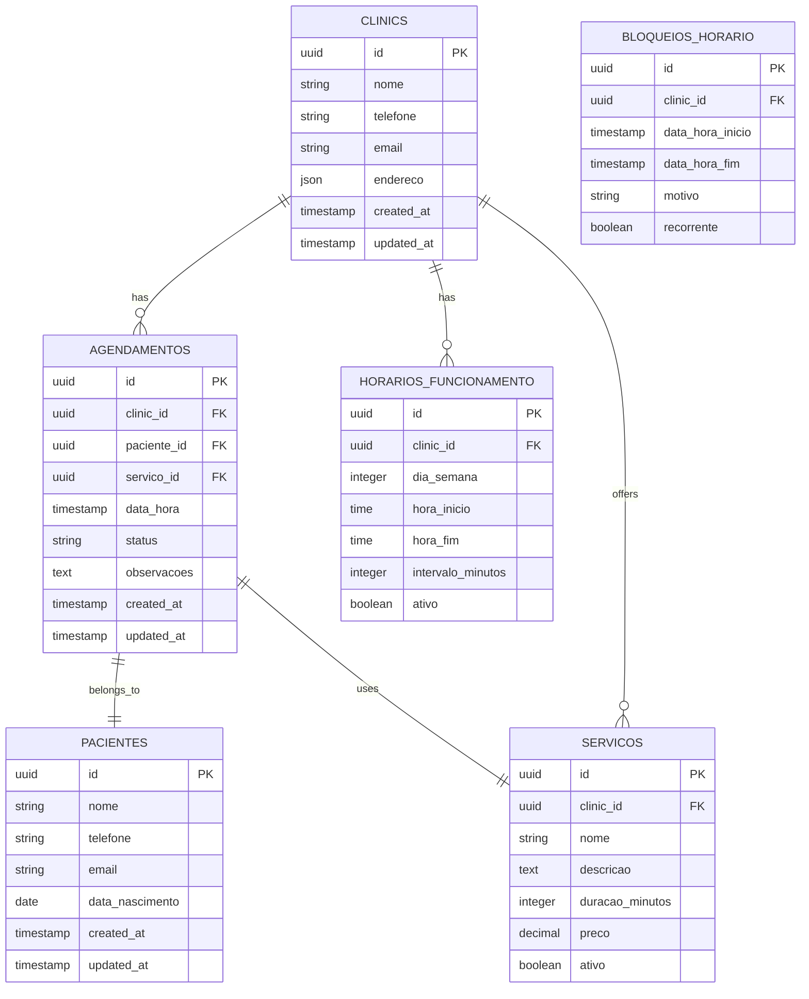

# Sistema de Agendamento Doutorizze - Arquitetura Técnica

## 1. Arquitetura do Sistema



## 2. Descrição das Tecnologias

* **Frontend**: React\@18 + TypeScript + Tailwind CSS + Vite

* **Backend**: Supabase (PostgreSQL + Real-time + Auth)

* **Calendário**: React Big Calendar + Date-fns

* **Estado**: React Context + Custom Hooks

* **UI Components**: Shadcn/ui + Lucide React

* **Notificações**: React Hot Toast

## 3. Definições de Rotas

| Rota                            | Propósito                                      |
| ------------------------------- | ---------------------------------------------- |
| /clinic/dashboard               | Dashboard principal da clínica com visão geral |
| /clinic/agendamentos            | Sistema completo de agendamento com calendário |
| /clinic/agendamentos/novo       | Formulário para criar novo agendamento         |
| /clinic/agendamentos/:id        | Detalhes e edição de agendamento específico    |
| /clinic/configuracoes/horarios  | Configuração de horários disponíveis           |
| /clinic/relatorios/agendamentos | Relatórios e estatísticas de agendamentos      |
| /agendamento/publico/:clinicId  | Interface pública para pacientes agendarem     |

## 4. Definições de API

### 4.1 APIs Principais

**Agendamentos**

```
GET /api/agendamentos
```

Request:

| Nome do Parâmetro | Tipo   | Obrigatório | Descrição             |
| ----------------- | ------ | ----------- | --------------------- |
| clinic\_id        | string | true        | ID da clínica         |
| data\_inicio      | string | false       | Data de início (ISO)  |
| data\_fim         | string | false       | Data de fim (ISO)     |
| status            | string | false       | Status do agendamento |

Response:

| Nome do Parâmetro | Tipo   | Descrição             |
| ----------------- | ------ | --------------------- |
| agendamentos      | array  | Lista de agendamentos |
| total             | number | Total de registros    |

Exemplo:

```json
{
  "agendamentos": [
    {
      "id": "uuid",
      "paciente_nome": "João Silva",
      "data_hora": "2024-01-15T14:00:00Z",
      "servico": "Limpeza",
      "status": "confirmado"
    }
  ],
  "total": 1
}
```

**Criar Agendamento**

```
POST /api/agendamentos
```

Request:

| Nome do Parâmetro  | Tipo   | Obrigatório | Descrição              |
| ------------------ | ------ | ----------- | ---------------------- |
| clinic\_id         | string | true        | ID da clínica          |
| paciente\_nome     | string | true        | Nome do paciente       |
| paciente\_telefone | string | true        | Telefone do paciente   |
| paciente\_email    | string | false       | Email do paciente      |
| data\_hora         | string | true        | Data e hora (ISO)      |
| servico            | string | true        | Tipo de serviço        |
| observacoes        | string | false       | Observações adicionais |

**Atualizar Agendamento**

```
PUT /api/agendamentos/:id
```

**Cancelar Agendamento**

```
DELETE /api/agendamentos/:id
```

**Horários Disponíveis**

```
GET /api/horarios-disponiveis
```

Request:

| Nome do Parâmetro | Tipo   | Obrigatório | Descrição         |
| ----------------- | ------ | ----------- | ----------------- |
| clinic\_id        | string | true        | ID da clínica     |
| data              | string | true        | Data (YYYY-MM-DD) |

## 5. Arquitetura do Servidor



## 6. Modelo de Dados

### 6.1 Definição do Modelo de Dados



### 6.2 Linguagem de Definição de Dados (DDL)

**Tabela de Agendamentos**

```sql
-- Criar tabela de agendamentos
CREATE TABLE agendamentos (
    id UUID PRIMARY KEY DEFAULT gen_random_uuid(),
    clinic_id UUID NOT NULL REFERENCES clinics(id),
    paciente_id UUID NOT NULL REFERENCES pacientes(id),
    servico_id UUID NOT NULL REFERENCES servicos(id),
    data_hora TIMESTAMP WITH TIME ZONE NOT NULL,
    status VARCHAR(20) DEFAULT 'pendente' CHECK (status IN ('pendente', 'confirmado', 'cancelado', 'concluido')),
    observacoes TEXT,
    created_at TIMESTAMP WITH TIME ZONE DEFAULT NOW(),
    updated_at TIMESTAMP WITH TIME ZONE DEFAULT NOW()
);

-- Criar índices
CREATE INDEX idx_agendamentos_clinic_id ON agendamentos(clinic_id);
CREATE INDEX idx_agendamentos_data_hora ON agendamentos(data_hora);
CREATE INDEX idx_agendamentos_status ON agendamentos(status);
CREATE INDEX idx_agendamentos_paciente_id ON agendamentos(paciente_id);

-- Tabela de Pacientes
CREATE TABLE pacientes (
    id UUID PRIMARY KEY DEFAULT gen_random_uuid(),
    nome VARCHAR(255) NOT NULL,
    telefone VARCHAR(20) NOT NULL,
    email VARCHAR(255),
    data_nascimento DATE,
    created_at TIMESTAMP WITH TIME ZONE DEFAULT NOW(),
    updated_at TIMESTAMP WITH TIME ZONE DEFAULT NOW()
);

-- Tabela de Serviços
CREATE TABLE servicos (
    id UUID PRIMARY KEY DEFAULT gen_random_uuid(),
    clinic_id UUID NOT NULL REFERENCES clinics(id),
    nome VARCHAR(255) NOT NULL,
    descricao TEXT,
    duracao_minutos INTEGER NOT NULL DEFAULT 30,
    preco DECIMAL(10,2),
    ativo BOOLEAN DEFAULT true,
    created_at TIMESTAMP WITH TIME ZONE DEFAULT NOW()
);

-- Tabela de Horários de Funcionamento
CREATE TABLE horarios_funcionamento (
    id UUID PRIMARY KEY DEFAULT gen_random_uuid(),
    clinic_id UUID NOT NULL REFERENCES clinics(id),
    dia_semana INTEGER NOT NULL CHECK (dia_semana BETWEEN 0 AND 6),
    hora_inicio TIME NOT NULL,
    hora_fim TIME NOT NULL,
    intervalo_minutos INTEGER DEFAULT 30,
    ativo BOOLEAN DEFAULT true
);

-- Tabela de Bloqueios de Horário
CREATE TABLE bloqueios_horario (
    id UUID PRIMARY KEY DEFAULT gen_random_uuid(),
    clinic_id UUID NOT NULL REFERENCES clinics(id),
    data_hora_inicio TIMESTAMP WITH TIME ZONE NOT NULL,
    data_hora_fim TIMESTAMP WITH TIME ZONE NOT NULL,
    motivo VARCHAR(255),
    recorrente BOOLEAN DEFAULT false,
    created_at TIMESTAMP WITH TIME ZONE DEFAULT NOW()
);

-- Políticas RLS (Row Level Security)
ALTER TABLE agendamentos ENABLE ROW LEVEL SECURITY;
ALTER TABLE pacientes ENABLE ROW LEVEL SECURITY;
ALTER TABLE servicos ENABLE ROW LEVEL SECURITY;
ALTER TABLE horarios_funcionamento ENABLE ROW LEVEL SECURITY;
ALTER TABLE bloqueios_horario ENABLE ROW LEVEL SECURITY;

-- Permissões para usuários autenticados
GRANT SELECT, INSERT, UPDATE, DELETE ON agendamentos TO authenticated;
GRANT SELECT, INSERT, UPDATE, DELETE ON pacientes TO authenticated;
GRANT SELECT, INSERT, UPDATE, DELETE ON servicos TO authenticated;
GRANT SELECT, INSERT, UPDATE, DELETE ON horarios_funcionamento TO authenticated;
GRANT SELECT, INSERT, UPDATE, DELETE ON bloqueios_horario TO authenticated;

-- Permissões básicas para usuários anônimos (consulta pública)
GRANT SELECT ON servicos TO anon;
GRANT SELECT ON horarios_funcionamento TO anon;

-- Função para buscar horários disponíveis
CREATE OR REPLACE FUNCTION buscar_horarios_disponiveis(
    p_clinic_id UUID,
    p_data DATE,
    p_servico_id UUID DEFAULT NULL
)
RETURNS TABLE(
    horario TIME,
    disponivel BOOLEAN
) AS $$
DECLARE
    r RECORD;
    duracao_servico INTEGER := 30;
BEGIN
    -- Buscar duração do serviço se fornecido
    IF p_servico_id IS NOT NULL THEN
        SELECT duracao_minutos INTO duracao_servico 
        FROM servicos 
        WHERE id = p_servico_id;
    END IF;
    
    -- Retornar horários disponíveis baseado no funcionamento da clínica
    FOR r IN (
        SELECT 
            generate_series(
                (p_data + hf.hora_inicio)::timestamp,
                (p_data + hf.hora_fim - (duracao_servico || ' minutes')::interval)::timestamp,
                (hf.intervalo_minutos || ' minutes')::interval
            ) AS slot_time
        FROM horarios_funcionamento hf
        WHERE hf.clinic_id = p_clinic_id
        AND hf.dia_semana = EXTRACT(DOW FROM p_data)
        AND hf.ativo = true
    ) LOOP
        -- Verificar se o horário está disponível
        horario := r.slot_time::time;
        disponivel := NOT EXISTS (
            SELECT 1 FROM agendamentos a
            WHERE a.clinic_id = p_clinic_id
            AND a.data_hora::date = p_data
            AND a.data_hora::time = horario
            AND a.status IN ('confirmado', 'pendente')
        ) AND NOT EXISTS (
            SELECT 1 FROM bloqueios_horario bh
            WHERE bh.clinic_id = p_clinic_id
            AND r.slot_time BETWEEN bh.data_hora_inicio AND bh.data_hora_fim
        );
        
        RETURN NEXT;
    END LOOP;
END;
$$ LANGUAGE plpgsql;

-- Dados iniciais para serviços padrão
INSERT INTO servicos (clinic_id, nome, descricao, duracao_minutos, preco) VALUES
('clinic-uuid-here', 'Consulta', 'Consulta odontológica geral', 30, 100.00),
('clinic-uuid-here', 'Limpeza', 'Limpeza e profilaxia dental', 45, 80.00),
('clinic-uuid-here', 'Restauração', 'Restauração dental', 60, 150.00),
('clinic-uuid-here', 'Canal', 'Tratamento de canal', 90, 300.00);
```

