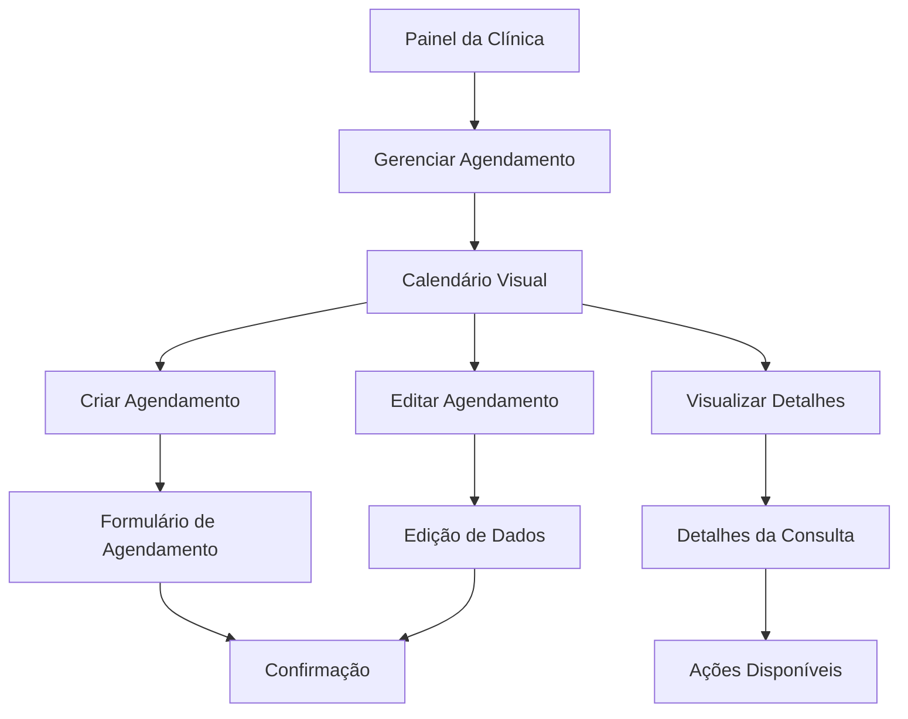

# Sistema de Agendamento Doutorizze - Requisitos do Produto

## 1. Visão Geral do Produto

O Sistema de Agendamento Doutorizze é uma solução completa para gestão de consultas odontológicas, oferecendo um calendário visual interativo que permite às clínicas gerenciar seus agendamentos de forma eficiente e intuitiva. O sistema integra-se ao painel existente da clínica, proporcionando uma experiência unificada e profissional.

## 2. Funcionalidades Principais

### 2.1 Papéis de Usuário

| Papel         | Método de Registro             | Permissões Principais                                              |
| ------------- | ------------------------------ | ------------------------------------------------------------------ |
| Clínica       | Login existente do sistema     | Gerenciar agendamentos, visualizar calendário, configurar horários |
| Paciente      | Registro por email ou telefone | Agendar consultas, visualizar seus agendamentos                    |
| Administrador | Acesso administrativo          | Gerenciar todas as clínicas e agendamentos                         |

### 2.2 Módulos Funcionais

Nosso sistema de agendamento consiste nas seguintes páginas principais:

1. **Calendário Visual**: interface principal com visualização mensal, semanal e diária dos agendamentos
2. **Gestão de Agendamentos**: criação, edição, cancelamento e visualização detalhada de consultas
3. **Configuração de Horários**: definição de horários disponíveis e bloqueios
4. **Relatórios**: análises e estatísticas dos agendamentos
5. **Notificações**: sistema de lembretes e alertas

### 2.3 Detalhes das Páginas

| Nome da Página           | Nome do Módulo         | Descrição da Funcionalidade                                                                                                   |
| ------------------------ | ---------------------- | ----------------------------------------------------------------------------------------------------------------------------- |
| Calendário Visual        | Visualização Principal | Exibir agendamentos em formato de calendário com cores por status, navegação entre períodos, filtros por profissional/serviço |
| Gestão de Agendamentos   | CRUD de Consultas      | Criar novos agendamentos com dados do paciente, editar consultas existentes, cancelar com motivos, reagendar consultas        |
| Configuração de Horários | Disponibilidade        | Definir horários de funcionamento, configurar intervalos, bloquear períodos específicos, gerenciar feriados                   |
| Busca e Filtros          | Sistema de Pesquisa    | Buscar por paciente, data, profissional, status do agendamento, filtros avançados                                             |
| Relatórios               | Analytics              | Relatórios de ocupação, cancelamentos, receita por período, estatísticas de agendamentos                                      |
| Notificações             | Sistema de Alertas     | Lembretes automáticos por email/SMS, notificações de confirmação, alertas de cancelamento                                     |
| Perfil do Paciente       | Gestão de Dados        | Visualizar histórico de consultas, dados pessoais, preferências de contato                                                    |

## 3. Fluxo Principal

### Fluxo da Clínica

1. Acesso ao painel da clínica
2. Navegação para "Gerenciar Agendamento" (Doutorizze)
3. Visualização do calendário com agendamentos existentes
4. Criação de novos agendamentos ou edição dos existentes
5. Configuração de horários disponíveis
6. Acompanhamento de relatórios e estatísticas

### Fluxo do Paciente

1. Acesso à plataforma de agendamento
2. Seleção da clínica e profissional
3. Escolha de data e horário disponível
4. Preenchimento de dados pessoais
5. Confirmação do agendamento
6. Recebimento de notificações de lembrete

## 4. Design da Interface

### 4.1 Estilo de Design

* **Cores Primárias**: Roxo (#8B5CF6) e Azul (#3B82F6) seguindo a identidade visual do Doutorizze

* **Cores Secundárias**: Verde para confirmados (#10B981), Amarelo para pendentes (#F59E0B), Vermelho para cancelados (#EF4444)

* **Estilo de Botões**: Arredondados com gradientes suaves

* **Tipografia**: Inter ou similar, tamanhos de 14px a 24px

* **Layout**: Design limpo baseado em cards com navegação lateral

* **Ícones**: Lucide React para consistência

### 4.2 Visão Geral das Páginas

| Nome da Página           | Nome do Módulo      | Elementos da UI                                                                                           |
| ------------------------ | ------------------- | --------------------------------------------------------------------------------------------------------- |
| Calendário Visual        | Interface Principal | Grid de calendário responsivo, botões de navegação, filtros dropdown, modal de detalhes, cores por status |
| Gestão de Agendamentos   | Formulários         | Formulário multi-step, seletor de data/hora, campos de paciente, botões de ação, validação em tempo real  |
| Configuração de Horários | Configurações       | Time picker, toggle switches, calendário de bloqueios, lista de horários configurados                     |
| Relatórios               | Dashboard           | Gráficos interativos, tabelas de dados, filtros de período, botões de exportação                          |

### 4.3 Responsividade

O sistema é mobile-first com adaptação para desktop, incluindo:

* Calendário responsivo que se adapta ao tamanho da tela

* Navegação otimizada para touch em dispositivos móveis

* Modais e formulários adaptáveis

* Tabelas com scroll horizontal em telas pequenas

