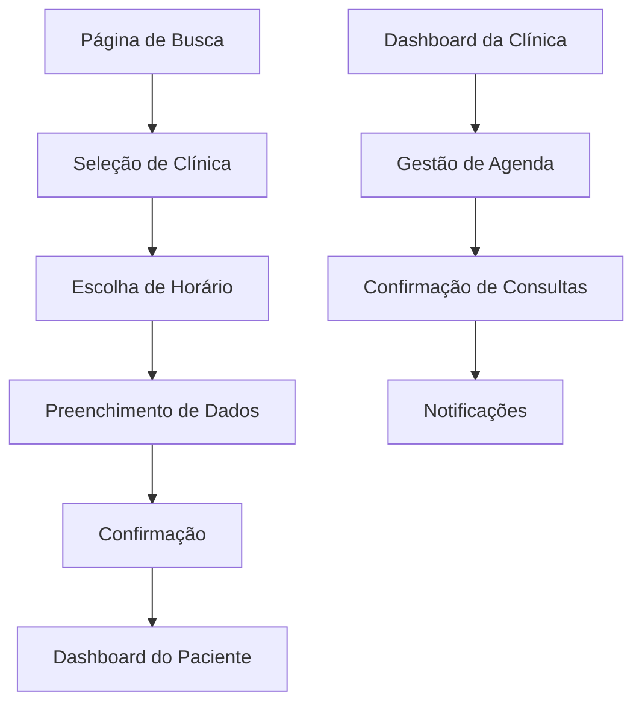

# Sistema de Agendamento Doutorizze - Requisitos de Produto

## 1. Visão Geral do Produto

O Sistema de Agendamento Doutorizze é uma plataforma independente e robusta que permite aos pacientes agendar consultas odontológicas de forma intuitiva e às clínicas gerenciar seus horários de atendimento de maneira eficiente. O sistema oferece funcionalidades completas de agendamento, confirmação, notificações e gestão de horários, integrado ao ecossistema Doutorizze sem interferir na área Clinicorp.

## 2. Funcionalidades Principais

### 2.1 Papéis de Usuário

| Papel | Método de Registro | Permissões Principais |
|-------|-------------------|----------------------|
| Paciente | Email/telefone ou redes sociais | Agendar consultas, visualizar histórico, cancelar/reagendar |
| Clínica | Convite ou cadastro validado | Gerenciar agenda, definir horários, confirmar consultas |
| Administrador | Acesso interno | Supervisionar sistema, relatórios, suporte |

### 2.2 Módulos Funcionais

Nosso sistema de agendamento consiste nas seguintes páginas principais:

1. **Página de Busca e Seleção**: busca de clínicas, filtros por especialidade, localização e disponibilidade
2. **Página de Agendamento**: seleção de horários, escolha de profissional, dados do paciente
3. **Página de Confirmação**: resumo do agendamento, opções de pagamento, confirmação final
4. **Dashboard do Paciente**: histórico de consultas, agendamentos futuros, opções de cancelamento
5. **Dashboard da Clínica**: gestão de agenda, configuração de horários, confirmação de consultas
6. **Página de Notificações**: centro de mensagens, lembretes, confirmações

### 2.3 Detalhes das Páginas

| Nome da Página | Nome do Módulo | Descrição da Funcionalidade |
|----------------|----------------|-----------------------------|
| Busca e Seleção | Filtro de Clínicas | Buscar clínicas por localização, especialidade, avaliação e disponibilidade de horários |
| Busca e Seleção | Lista de Resultados | Exibir clínicas disponíveis com informações básicas, avaliações e próximos horários |
| Agendamento | Calendário de Horários | Visualizar horários disponíveis em formato de calendário interativo |
| Agendamento | Seleção de Profissional | Escolher dentista específico quando disponível |
| Agendamento | Formulário de Dados | Coletar informações do paciente e motivo da consulta |
| Confirmação | Resumo do Agendamento | Exibir detalhes completos da consulta agendada |
| Confirmação | Opções de Pagamento | Integrar métodos de pagamento para consultas pagas |
| Dashboard Paciente | Histórico de Consultas | Listar consultas passadas com detalhes e avaliações |
| Dashboard Paciente | Agendamentos Futuros | Mostrar próximas consultas com opções de cancelar/reagendar |
| Dashboard Clínica | Gestão de Agenda | Configurar horários de funcionamento, bloqueios e disponibilidade |
| Dashboard Clínica | Lista de Agendamentos | Visualizar consultas agendadas com status e ações |
| Notificações | Centro de Mensagens | Exibir todas as notificações do sistema organizadas por tipo |

## 3. Fluxo Principal

### Fluxo do Paciente:
1. Paciente acessa a página de busca
2. Filtra clínicas por critérios desejados
3. Seleciona clínica e visualiza horários disponíveis
4. Escolhe data/hora e preenche dados
5. Confirma agendamento e recebe notificação
6. Recebe lembretes automáticos antes da consulta

### Fluxo da Clínica:
1. Clínica configura horários de funcionamento
2. Define disponibilidade de profissionais
3. Recebe notificações de novos agendamentos
4. Confirma ou rejeita solicitações
5. Gerencia agenda diária e semanal

## 4. Design da Interface

### 4.1 Estilo de Design
- **Cores Primárias**: Azul (#2563eb) e Verde (#16a34a) para ações principais
- **Cores Secundárias**: Cinza (#64748b) para textos e Branco (#ffffff) para fundos
- **Estilo de Botões**: Arredondados com sombra sutil, efeitos hover suaves
- **Tipografia**: Inter ou similar, tamanhos 14px-16px para texto, 24px-32px para títulos
- **Layout**: Design limpo baseado em cards, navegação superior fixa
- **Ícones**: Lucide React para consistência, estilo outline

### 4.2 Visão Geral do Design das Páginas

| Nome da Página | Nome do Módulo | Elementos de UI |
|----------------|----------------|----------------|
| Busca e Seleção | Filtro de Clínicas | Barra de busca, filtros dropdown, mapa interativo, cards de resultados |
| Agendamento | Calendário de Horários | Calendário responsivo, slots de tempo clicáveis, indicadores de disponibilidade |
| Confirmação | Resumo do Agendamento | Card de resumo, botões de ação primários, formulário de pagamento |
| Dashboard Paciente | Histórico de Consultas | Tabela responsiva, badges de status, botões de ação secundários |
| Dashboard Clínica | Gestão de Agenda | Interface de calendário avançada, modais de configuração, switches de disponibilidade |

### 4.3 Responsividade
O sistema é mobile-first com adaptação completa para desktop. Inclui otimização para touch em dispositivos móveis, navegação por gestos e interface simplificada para telas menores.

## 5. Requisitos Técnicos

### 5.1 Funcionalidades de Agendamento
- **Gestão de Horários**: Sistema flexível de configuração de horários por clínica
- **Disponibilidade em Tempo Real**: Sincronização instantânea de horários disponíveis
- **Conflito de Agendamentos**: Prevenção automática de duplos agendamentos
- **Reagendamento**: Funcionalidade completa de alteração de horários
- **Cancelamento**: Sistema de cancelamento com políticas configuráveis

### 5.2 Sistema de Notificações
- **Email**: Confirmações, lembretes e atualizações via email
- **SMS**: Notificações críticas por mensagem de texto
- **Push Notifications**: Alertas em tempo real na aplicação
- **In-App**: Centro de notificações interno

### 5.3 Integrações
- **Sistema de Pagamento**: Integração com gateways de pagamento
- **Calendário Externo**: Sincronização com Google Calendar e Outlook
- **Geolocalização**: Busca por proximidade e direções
- **Avaliações**: Sistema de feedback e avaliações pós-consulta

### 5.4 Requisitos de Performance
- **Tempo de Resposta**: Máximo 2 segundos para carregamento de páginas
- **Disponibilidade**: 99.9% de uptime
- **Escalabilidade**: Suporte a milhares de agendamentos simultâneos
- **Backup**: Backup automático de dados a cada 6 horas

### 5.5 Segurança e Privacidade
- **Criptografia**: Dados sensíveis criptografados em trânsito e repouso
- **LGPD**: Conformidade total com a Lei Geral de Proteção de Dados
- **Autenticação**: Sistema robusto de login com 2FA opcional
- **Auditoria**: Log completo de ações para rastreabilidade
